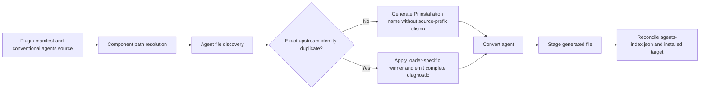

# Phase 3: Reachable Agent Collision Contract - Research

**Researched:** 2026-09-14
**Domain:** Claude Code plugin-agent discovery parity, generated-name identity, and reachable collision tests
**Confidence:** HIGH for the current repository and Claude Code v2.1.270 behavior; MEDIUM for any policy that tries to map Claude's file-list contract onto Pi's directory-list abstraction

## User Constraints

- Collision behavior must match whatever current Claude Code does. This supersedes the backlog's proposed blanket first-wins answer.
- Preserve 100% unit coverage and assertion strength. Do not weaken thresholds, add exclusions, add test-only exports, or replace complete assertions with partial assertions.
- Work on the existing `features/test-backlog` branch. Do not create a branch.
- Research must distinguish exact source-name duplicates from collisions manufactured by Pi's generated-name normalization.
- Phase 3 must reconcile the live discovery/staging path, AG-12, RN-1, RN-6, warnings, comments, and tests.

<phase_requirements>

## Phase Requirements

| ID | Description | Research Support |
|---|---|---|
| AGENT-01 | “Test collisions through real discovery/staging and implement the approved first-wins or hard-error contract.” [VERIFIED: `.planning/REQUIREMENTS.md:20`] | Current Claude does not hard-error on exact duplicate agent names. The research below identifies the loader-specific winners and the reachable Pi seam to test. |
| AGENT-02 | “Align AG-12, RN-6, duplicate warnings, comments, and collision tests with reachable production behavior.” [VERIFIED: `.planning/REQUIREMENTS.md:21`] | The research inventories each contradictory statement and gives exact replacement contracts for AG-12, RN-1, RN-6, code comments, warning content, and tests. |

</phase_requirements>

## Summary

Pi currently removes collisions before the stage-level hard-error gate can observe them. `discoverPluginAgents` stores each agent in `seenByGenerated`, and on a duplicate it appends a warning and executes `continue`; `prepareStagePluginAgents` then passes only those already-unique rows to `assertNoAgentCollisions`. [VERIFIED: `extensions/pi-claude-marketplace/bridges/agents/discover.ts:63-114`; `extensions/pi-claude-marketplace/bridges/agents/stage.ts:120-130`] The comment saying within-directory collisions are caught later is false. The direct `assertNoAgentCollisions` tests exercise a manufactured array, not an input reachable from discovery. [VERIFIED: `extensions/pi-claude-marketplace/bridges/agents/discover.ts:93-99`; `tests/bridges/agents/convert.test.ts:1262-1298`]

Claude Code v2.1.270 does not implement a single global “first wins” or “last wins” rule. For two exact names in a plugin's conventional `agents/` directory, the hermetic probe logged a duplicate and kept the first path found by its loader. For a manifest's ordered custom-agent **file** array, the last declared file became active; reversing the array reversed the winner. Neither case caused validation or startup to hard-error. [VERIFIED: official Claude Code v2.1.270 hermetic probes, 2026-09-14] Claude's public docs separately define scope priority—managed, CLI flag, project, user, plugin—for equal names from different scopes. [CITED: https://code.claude.com/docs/en/subagents#supported-scopes]

Claude has no ordered custom-agent-directory behavior for Pi to copy. The current manifest field accepts explicit files and replaces the default `agents/` directory; a v2.1.270 manifest containing `"agents":["./agents"]` failed validation with `agents.0: Invalid input`. [CITED: https://code.claude.com/docs/en/plugins-reference#custom-paths-for-plugin-components] [VERIFIED: official Claude Code v2.1.270 `plugin validate` probe, 2026-09-14] Therefore “later configured directory wins” would be a new Pi policy, not verified Claude parity.

The concrete parity decision for Pi's manufactured collision is to stop eliding the `<plugin>-` prefix for agents. Claude identifies plugin agents by their exact frontmatter `name` within plugin scope, so `normalize-probe-reviewer` and `reviewer` load as two distinct agents. Pi currently maps the analogous `acme-reviewer` and `reviewer` sources to one `pi-claude-marketplace-acme-reviewer` name. [CITED: https://code.claude.com/docs/en/subagents#supported-scopes] [VERIFIED: official Claude Code v2.1.270 normalization probe, 2026-09-14] [VERIFIED: `extensions/pi-claude-marketplace/domain/name.ts:156-172`] This RN-1 change requires lifecycle reconciliation for installed filenames and `agents-index.json`; it is broader than deleting the dead gate, but it is the only contract that actually preserves both upstream identities.

**Primary recommendation:** remove the unreachable hard-error gate, preserve exact duplicate behavior at discovery, remove agent prefix elision so normalization no longer manufactures a collision, and treat configured-directory precedence as an explicit product decision unless Phase 3 also changes Pi to Claude's ordered custom-file replacement model.

## Architectural Responsibility Map

| Capability | Primary Tier | Secondary Tier | Rationale |
|---|---|---|---|
| Source identity and Pi generated name | Domain | Bridge | `generatedAgentName` defines whether two valid Claude identities collapse before discovery decides precedence. [VERIFIED: `extensions/pi-claude-marketplace/domain/name.ts:156-172`] |
| File discovery and duplicate winner | Bridge | Filesystem | `discoverPluginAgents` owns traversal order, source-name extraction, generated-name indexing, warning creation, and the reachable skip. [VERIFIED: `extensions/pi-claude-marketplace/bridges/agents/discover.ts:46-115`] |
| Conversion and staging | Bridge | Persistence | Staging consumes discovery output; it must not invent a second collision policy over already-deduplicated data. [VERIFIED: `extensions/pi-claude-marketplace/bridges/agents/stage.ts:118-135`] |
| Installed-name migration | Persistence | Orchestrator | The index records the generated and target names, while lifecycle code reconciles indexed targets with staged output. [VERIFIED: `extensions/pi-claude-marketplace/persistence/agents-index-schema.ts:26-50`] |
| Contract documentation | Documentation | Tests | AG-12, RN-1, and RN-6 define the product behavior that reachable discovery and staging tests must prove. [VERIFIED: `docs/prd/pi-claude-marketplace-prd.md:449,578,583`] |

## Claude Code v2.1.270 Behavior Matrix

| Collision shape | Current Claude behavior | Confidence | Pi implication |
|---|---|---|---|
| Same exact frontmatter `name` in the conventional plugin `agents/` directory | No hard error. Debug output names both paths and retains the path already active when the duplicate is registered. The probe's first loader-discovered path remained active. | HIGH—signed release asset and hermetic runtime probe [VERIFIED: Claude Code v2.1.270 probe, 2026-09-14] | A real within-directory duplicate test should expect one active agent and a diagnostic. It must not claim Claude promises lexical ordering: the public docs do not specify traversal order. |
| Same exact frontmatter `name` in an ordered custom-agent file array | No hard error. The last declared file became active; reversing the array reversed the winner. | HIGH—two reciprocal hermetic probes [VERIFIED: Claude Code v2.1.270 probes, 2026-09-14] | Full parity requires Pi to model ordered files and replacement semantics. Calling a later-directory winner “Claude behavior” is unsupported. |
| Equal names from different documented scopes | Higher-priority location wins in the documented order: managed, CLI flag, project, user, plugin. In nested project directories, the closest `.claude/agents/` wins. | MEDIUM—official public documentation [CITED: https://code.claude.com/docs/en/subagents#supported-scopes] | This does not answer collisions among Pi `componentPaths.agents` entries inside one plugin. |
| `plugin-name-reviewer` and `reviewer` inside one plugin | Both load as distinct exact scoped identities. | HIGH—hermetic normalization probe [VERIFIED: Claude Code v2.1.270 probe, 2026-09-14] | Remove agent prefix elision; this is a Pi-only collision. |
| Manifest `agents` entry points to a directory | Rejected with `agents.0: Invalid input`. The field supports a file or array of files and replaces the default directory. | HIGH—official docs plus validation probe [CITED: https://code.claude.com/docs/en/plugins-reference#custom-paths-for-plugin-components] [VERIFIED: Claude Code v2.1.270 probe, 2026-09-14] | There is no upstream configured-directory precedence to copy. |

The exact duplicate diagnostic captured from the conventional-directory probe was:

```text
DATA_Q7M4V2PK_START
Duplicate agent name 'order-probe:duplicate-agent' ... — active: .../z-created-first.md
DATA_Q7M4V2PK_END
```

[VERIFIED: Claude Code v2.1.270 hermetic debug log, 2026-09-14] The ellipses redact temporary absolute paths; no semantic field was removed.

The reciprocal custom-file-array probe produced:

```text
DATA_H6T9C3WR_START
Duplicate agent name 'collision-probe:duplicate-agent' ... — active: .../agents-a/01-first.md
DATA_H6T9C3WR_END
```

[VERIFIED: Claude Code v2.1.270 hermetic debug log after reversing the manifest array, 2026-09-14] The earlier array order activated `03-third.md`, confirming that declaration order, rather than a fixed filename order, selected the custom-file winner.

## Standard Stack

### Core

| Library/tool | Version | Purpose | Why Standard Here |
|---|---:|---|---|
| TypeScript | Repository-pinned | Express the discovered-agent and nonempty-tool invariants | This is the existing production language; no dependency change is needed. [VERIFIED: `package.json:75-99`] |
| Node.js built-in `node:fs`, `node:path`, `node:crypto` | Node >=20.19 per project instructions | Hermetic discovery, containment, hashing, and filesystem tests | Discovery already uses built-ins; another filesystem package would add no contract value. [VERIFIED: `extensions/pi-claude-marketplace/bridges/agents/discover.ts:46-115`] |
| `node:test` and `node:assert/strict` | Node built-in | Reachable unit and staging tests | The repository's `test` script runs `node --test` over paired test trees. [VERIFIED: `package.json:84-95`] |
| Claude Code CLI | 2.1.270 | Current behavior oracle for this phase | The probe used the latest official GitHub release available on 2026-09-14 and verified its release SHA-256 before execution. [VERIFIED: https://github.com/anthropics/claude-code/releases/tag/v2.1.270] |

### Supporting

No new package is needed. The phase should use existing parsing, safe-name validation, path containment, index persistence, and lifecycle reconciliation code. [VERIFIED: `extensions/pi-claude-marketplace/bridges/agents/discover.ts:71-108`; `extensions/pi-claude-marketplace/persistence/locations.ts:38-54`]

## Architecture Patterns

### System Architecture Diagram



The decision must happen once, where both competing source paths and the loader's ordering context are available. [VERIFIED: `extensions/pi-claude-marketplace/bridges/agents/discover.ts:63-108`] Stage receives a canonical discovered set and should only convert and stage it. [VERIFIED: `extensions/pi-claude-marketplace/bridges/agents/stage.ts:118-135`]

### Recommended Project Structure

```text
extensions/pi-claude-marketplace/
├── domain/name.ts                         # generated installation identity
├── bridges/agents/discover.ts             # reachable duplicate decision and diagnostic
├── bridges/agents/stage.ts                # discovery -> conversion -> staging
├── bridges/agents/convert.ts              # conversion only; no post-discovery collision gate
├── persistence/agents-index-schema.ts     # stored ownership and target names
└── orchestrators/plugin/                  # update/reinstall reconciliation
tests/
├── domain/name.test.ts
├── bridges/agents/discover.test.ts
├── bridges/agents/stage.test.ts
└── orchestrators/plugin/*.test.ts
```

[VERIFIED: current repository paths and direct test-pair convention]

### Pattern 1: Preserve Upstream Identity Before Installation Naming

Claude's plugin agent identity is its exact frontmatter `name`, scoped to the plugin. The filename need not match the name, and plugin agents appear under a plugin-qualified name. [CITED: https://code.claude.com/docs/en/subagents#supported-scopes] Pi still needs its `pi-claude-marketplace-<plugin>-...` installation namespace, but it should append the exact source name rather than normalize away a leading plugin token. [RECOMMENDATION]

The current in-repo rule says:

```text
DATA_R8D2F5LX_START
Agent: `pi-claude-marketplace-<plugin>-<agent>` (with `<plugin>-` prefix on source elided).
DATA_R8D2F5LX_END
```

[VERIFIED: `docs/prd/pi-claude-marketplace-prd.md:578`] Replace only the parenthetical agent rule; skill and command rules remain governed by their own RN-6 behavior.

### Pattern 2: One Reachable Collision Decision

`discoverPluginAgents` already holds the first discovered row in a `Map` keyed by generated name and skips a later row. [VERIFIED: `extensions/pi-claude-marketplace/bridges/agents/discover.ts:63-108`] If exact identity deduplication remains inside discovery, its return type guarantees uniqueness. Delete `assertNoAgentCollisions`, its stage call, and the direct manufactured tests. Prove the chosen result through `discoverPluginAgents` and `prepareStagePluginAgents`. [RECOMMENDATION]

### Pattern 3: Diagnostic Names Both Competitors and the Winner

The present warning says:

```text
DATA_B3N7K4JQ_START
agent source "${sourceName}" in "${agentsDir}" elides to generated name "${generatedName}" already produced by an earlier componentPaths.agents entry; ignoring duplicate.
DATA_B3N7K4JQ_END
```

[VERIFIED: `extensions/pi-claude-marketplace/bridges/agents/discover.ts:38-43`] It cannot identify the winning source and falsely mentions an earlier component-path entry for two files in one directory. Store or retrieve the incumbent `DiscoveredAgent` and emit the winner's and loser's source names and source paths, the shared exact identity/generated target, and the active winner. [RECOMMENDATION]

### Pattern 4: Separate Default-Directory Loading From Custom-File Loading

Claude's custom `agents` field is `string | string[]` of files, is relative to the plugin root, and replaces the default directory. [CITED: https://code.claude.com/docs/en/plugins-reference#custom-paths-for-plugin-components] If Phase 3 expands to exact parity, resolve the manifest into ordered file candidates and let the last declared duplicate replace the incumbent. For the conventional directory, preserve the loader's discovered incumbent and do not promise a lexical rule in the PRD unless Pi intentionally defines a deterministic adapter policy. [RECOMMENDATION]

### Anti-Patterns to Avoid

- **Global first-wins claim:** it contradicts current custom-file-array behavior. [VERIFIED: Claude Code v2.1.270 reciprocal probes, 2026-09-14]
- **Global last-wins claim:** it contradicts the conventional-directory probe and invents a rule for unsupported configured directories. [VERIFIED: Claude Code v2.1.270 probes, 2026-09-14]
- **Post-discovery collision assertion:** the discovery map has already removed the evidence it needs. [VERIFIED: `extensions/pi-claude-marketplace/bridges/agents/discover.ts:63-114`; `extensions/pi-claude-marketplace/bridges/agents/stage.ts:120-130`]
- **Treating normalization and duplication as the same event:** Claude accepts the normalization pair as two identities; only Pi's RN-1 elision merges them. [VERIFIED: Claude Code v2.1.270 probe; `extensions/pi-claude-marketplace/domain/name.ts:164-172`]
- **Encoding undocumented lexical order as Claude parity:** the official docs do not define within-directory traversal order, and the hermetic probe did not select lexical-first. [VERIFIED: Claude Code v2.1.270 probe, 2026-09-14]

## Don't Hand-Roll

| Problem | Don't Build | Use Instead | Why |
|---|---|---|---|
| Collision reachability | A second grouping pass over synthetic `{sourceName, generatedName}` arrays | The discovery map and real files | Only discovery has real ordering and paths; a later grouping pass is unreachable for duplicate keys. [VERIFIED: `extensions/pi-claude-marketplace/bridges/agents/discover.ts:63-114`] |
| Identity normalization | Another special-case elision rule | Exact Claude source identity plus Pi's outer installation namespace | Exact names remain distinct upstream. [CITED: https://code.claude.com/docs/en/subagents#supported-scopes] |
| Custom-path parity | Directory precedence inferred from file-array results | Either implement Claude's explicit-file replacement contract or document a Pi extension | Claude rejects a manifest directory path. [VERIFIED: Claude Code v2.1.270 validation probe] |
| Coverage repair | Tests that invoke dead defensive branches directly | Type-level narrowing and reachable public behavior | The project requires meaningful direct-pair coverage and forbids test-only seams. [VERIFIED: project testing instructions; `package.json:84-95`] |

## Runtime State Inventory

This phase changes a generated installation name, so it is a naming migration for previously installed prefixed-source agents.

| Category | Items Found | Action Required |
|---|---|---|
| Stored data | `agents-index.json` rows contain the exact fields `"plugin", "marketplace", "sourceAgent", "generatedName", "sourcePath", "targetPath", "sourceHash", "originalModel", "droppedFields", "droppedTools", "warnings"`; the document has `"schemaVersion": 1` and `"agents"`. [VERIFIED: `extensions/pi-claude-marketplace/persistence/agents-index-schema.ts:26-50`] | During update/reinstall reconciliation, replace affected `generatedName` and `targetPath` values. This is a stored-data migration performed by normal lifecycle code, not a schema-version change. [RECOMMENDATION] |
| Live service config | No external service owns agent-name state in the repository architecture. [ASSUMED] | No action beyond the local lifecycle transaction. Validate this assumption in the implementation plan by tracing the update/reinstall orchestrator. |
| OS-registered state | No OS registration keyed by generated agent name was identified. [ASSUMED] | None expected; verify with a repository search before execution. |
| Secrets and environment variables | No secret key or environment-variable name tied to a generated agent name was identified. [ASSUMED] | None expected; do not rename unrelated configuration. |
| Build artifacts / installed files | The installed target is under `"<scopeRoot>/agents/"`, while ownership state is at `"<extensionRoot>/agents-index.json"`. [VERIFIED: `extensions/pi-claude-marketplace/persistence/locations.ts:41-54`] | Remove the old elided filename and install the new exact-source filename atomically during update/reinstall. Dormant installations need the next reconciliation event unless the phase adds an eager migration. [RECOMMENDATION] |

The migration example is concrete: plugin `acme`, source `acme-reviewer`, currently installs as `pi-claude-marketplace-acme-reviewer`; without elision it becomes `pi-claude-marketplace-acme-acme-reviewer`. [VERIFIED: current generator quoted below from `extensions/pi-claude-marketplace/domain/name.ts:167-172`] Existing source `reviewer` remains `pi-claude-marketplace-acme-reviewer`, so the two files become independently installable.

```text
DATA_C9P2S6MV_START
const prefix = `${plugin}-`;
const elided = source.startsWith(prefix) ? source.slice(prefix.length) : source;
const generated = `pi-claude-marketplace-${plugin}-${elided}`;
DATA_C9P2S6MV_END
```

## Documentation Contract Changes

The current exact wording is contradictory:

- AG-12: `Source-name collisions within a single plugin MUST throw with both source names listed.` [VERIFIED: `docs/prd/pi-claude-marketplace-prd.md:449`]
- RN-1: `Agent: pi-claude-marketplace-<plugin>-<agent> (with <plugin>- prefix on source elided).` [VERIFIED: `docs/prd/pi-claude-marketplace-prd.md:578`]
- RN-6 assigns first-wins-and-warning to skills and commands, then says `(For agents, see AG-12.)`. [VERIFIED: `docs/prd/pi-claude-marketplace-prd.md:583`]

Update them as follows. [RECOMMENDATION]

1. **AG-12:** An exact duplicate Claude agent identity in one plugin does not hard-error. The conventional-directory loader retains its incumbent; an ordered custom-file list uses the last declared duplicate. Diagnostics name both source paths and the active winner.
2. **RN-1:** Agent installation names are deterministic functions of `(plugin, exact source-name)` and do not elide a leading `<plugin>-` token. Keep the current skill and command clauses unchanged.
3. **RN-6:** Keep skill/command normalization-collision behavior. State explicitly that agent normalization does not collapse distinct exact source names and cross-reference the revised AG-12.
4. **Code comments:** Remove claims that a later gate catches within-directory duplicates and that every duplicate arose from an earlier component-path entry.

If the phase does not implement custom-file paths, AG-12 must omit the custom-file winner or label it as future compatibility behavior. It must not translate that winner into “later configured directory wins.” [RECOMMENDATION]

## Common Pitfalls

### Pitfall 1: Confusing Three Independent Orders

**What goes wrong:** scope priority, custom-file declaration order, and directory traversal order are compressed into one winner rule.
**Why it happens:** all three eventually register an agent under a name.
**How to avoid:** represent the source mode in discovery and test each mode separately. [RECOMMENDATION]
**Warning sign:** a test name says “cross-directory Claude parity” even though the manifest input contains directories.

### Pitfall 2: Fixing the Gate Without Fixing Identity

**What goes wrong:** deleting `assertNoAgentCollisions` makes the code reachable and documented, but still discards one of two agents that Claude loads distinctly.
**Why it happens:** Pi deduplicates after prefix elision, not on exact Claude identity. [VERIFIED: `extensions/pi-claude-marketplace/domain/name.ts:164-172`; `extensions/pi-claude-marketplace/bridges/agents/discover.ts:88-99`]
**How to avoid:** remove agent prefix elision before evaluating generated-name duplicates.
**Warning sign:** the pair `acme-reviewer` and `reviewer` still produces one discovered row.

### Pitfall 3: Incomplete Warning Assertions

**What goes wrong:** a warning test passes even if the active winner, source path, or duplicate path disappears.
**Why it happens:** substring assertions do not lock the actionable contract.
**How to avoid:** assert the complete warning array and the complete discovered/staged rows; include different file bodies so a winner reversal is observable. [RECOMMENDATION]
**Warning sign:** tests use only `includes("duplicate")` or assert only the result length.

### Pitfall 4: Leaving an Orphaned Installed File

**What goes wrong:** the new exact-source name is installed but the old elided target remains and can still be invoked.
**Why it happens:** the change is treated as a pure function rename rather than an index-owned target migration.
**How to avoid:** test update/reinstall against a seeded old index and target; assert the old file is gone, the new file exists, and the full index row is correct. [RECOMMENDATION]
**Warning sign:** only a fresh-install test is added.

### Pitfall 5: Restoring Coverage With an Unreachable Guard

**What goes wrong:** a direct unit test invokes a defensive state that production typing already excludes.
**Why it happens:** line coverage is pursued independently of the public invariant.
**How to avoid:** encode nonempty explicit tools as a tuple/assertion-narrowed type and keep the existing reachable AG-11 rejection test. The current `toolsFields` already returns `result.mapped` without a second runtime guard. [VERIFIED: `extensions/pi-claude-marketplace/bridges/agents/convert.ts:656-668`]
**Warning sign:** a new test-only export or cast exists solely to reach an impossible empty tuple.

## Code Examples

### Reachable Winner Test Shape

```typescript
// Proposed project pattern. Use real temporary files and the public discovery API.
// Arrange: write two markdown files with the same exact frontmatter name and distinct bodies.
// Act: call discoverPluginAgents, then prepareStagePluginAgents for the staging contract.
// Assert: compare the complete discovered/staged rows and the complete warning array.
```

[RECOMMENDATION] This follows the repository's paired `node:test` structure and exercises the production seam named by AGENT-01. [VERIFIED: `package.json:84-95`; `.planning/REQUIREMENTS.md:20`]

### Exact Installation-Name Rule

```typescript
// Proposed replacement; exact signature and safety checks already exist in the source.
const generated = `pi-claude-marketplace-${plugin}-${source}`;
```

The string form `pi-claude-marketplace-<plugin>-<agent>` is already the locked agent format; the recommended change removes only the source-prefix elision. [VERIFIED: `extensions/pi-claude-marketplace/domain/name.ts:156-172`; `docs/prd/pi-claude-marketplace-prd.md:578`]

## State of the Art

| Old/current Pi approach | Current Claude Code behavior | Impact |
|---|---|---|
| Generated-name first-wins for all discovered directories | No single global rule: incumbent for conventional-directory registration, last declaration for custom-file arrays, explicit scope priority across scopes. [VERIFIED: v2.1.270 probes] [CITED: https://code.claude.com/docs/en/subagents#supported-scopes] | Do not bless Pi's directory-array order as upstream parity. |
| Hard-error contract in AG-12 | Exact duplicates do not hard-error in v2.1.270 probes. [VERIFIED: v2.1.270 probes] | Remove the dead gate and rewrite AG-12. |
| Agent source-prefix elision | Exact scoped source names remain distinct upstream. [VERIFIED: v2.1.270 probe] | Remove agent elision and migrate indexed targets. |
| Additive manifest path plus default directory in Pi | Claude's custom file field replaces the default directory. [CITED: https://code.claude.com/docs/en/plugins-reference#custom-paths-for-plugin-components] | Exact parity would widen Phase 3 into component-path resolution and discovery input modeling. |

The probed release was v2.1.270, published 2026-09-12. [VERIFIED: https://github.com/anthropics/claude-code/releases/tag/v2.1.270] Revalidate the probe if planning or execution starts after 2026-09-21 because Claude Code is fast-moving.

## Assumptions Log

| # | Claim | Section | Risk if Wrong |
|---|---|---|---|
| A1 | No external live service stores generated agent names. | Runtime State Inventory | A renamed target could leave an external reference stale. |
| A2 | No OS registration embeds generated agent names. | Runtime State Inventory | A renamed target could leave an OS-level reference stale. |
| A3 | No secret or environment-variable key embeds a generated agent name. | Runtime State Inventory | Runtime configuration could refer to an old key. |

## Resolved Research Questions

1. **RESOLVED — Will Phase 3 implement Claude's custom-file replacement model or keep Pi's directory extension?**
   - What we know: Claude accepts custom agent files, replaces the default directory, and uses the last declared duplicate. It rejects the directory form tested. [CITED: https://code.claude.com/docs/en/plugins-reference#custom-paths-for-plugin-components] [VERIFIED: v2.1.270 probes]
   - Resolution (D-03): keep the existing directory adapter. This phase matches exact agent identity and incumbent duplicate handling; custom-file replacement is a separate resolver change.
   - Recommendation: make the scope decision explicit. If directories remain, keep current deterministic first-discovered behavior as a Pi extension and do not call it Claude parity. If exact parity is required, add resolver, preview, stage, docs, and migration tasks for ordered files and replacement semantics.

2. **RESOLVED — Should Pi deliberately guarantee lexical-first within its conventional directory?**
   - What we know: Pi sorts filenames with `localeCompare`; the Claude probe retained the loader incumbent, but that incumbent was not lexical-first. [VERIFIED: `extensions/pi-claude-marketplace/bridges/agents/discover.ts:66-71`; v2.1.270 probe]
   - Resolution (D-03): preserve deterministic per-directory traversal as a Pi adapter guarantee; do not attribute lexical ordering to Claude.
   - Recommendation: preserve Pi's deterministic lexical traversal as an adapter guarantee, while documenting only incumbent-on-discovery semantics as upstream parity.

3. **RESOLVED — When should already-installed elided filenames migrate?**
   - What we know: the ownership index stores both generated and target names, and installed files live under the scoped agents directory. [VERIFIED: `extensions/pi-claude-marketplace/persistence/agents-index-schema.ts:26-50`; `extensions/pi-claude-marketplace/persistence/locations.ts:41-54`]
   - Resolution (D-02, explicit user approval): migrate owned names during update/reinstall; do not eagerly sweep dormant installations.
   - Recommendation: migrate on the existing transactional update/reinstall path unless the product requires an eager one-time sweep; add a lifecycle test with old indexed state either way.

## Environment Availability

| Dependency | Required By | Available | Version | Fallback |
|---|---|---:|---:|---|
| Node.js | Unit tests and build | Yes | 26.8.2 | Repository minimum is >=20.19. [VERIFIED: local `node --version`, 2026-09-14; project instructions] |
| npm | Script runner | Yes | 11.19.1 | None needed. [VERIFIED: local `npm --version`, 2026-09-14] |
| Claude Code official binary | Behavior oracle | Yes | 2.1.270 in `/tmp` | Re-download the signed release asset and verify SHA-256 if the temporary copy is gone. [VERIFIED: official release probe, 2026-09-14] |

No external package or service is required for implementation. [VERIFIED: repository architecture and proposed change surface]

## Validation Architecture

### Test Framework

| Property | Value |
|---|---|
| Framework | Node built-in `node:test` with `node:assert/strict` [VERIFIED: repository test files and `package.json:84-95`] |
| Config file | None; scripts are declared in `package.json`. [VERIFIED: `package.json:75-99`] |
| Quick run command | `node --test tests/domain/name.test.ts tests/bridges/agents/discover.test.ts tests/bridges/agents/stage.test.ts` [RECOMMENDATION] |
| Full unit command | `npm run test:coverage:unit` [VERIFIED: `package.json:95`] |
| Full quality command | `npm run check` [VERIFIED: `package.json:76`] |

### Phase Requirements to Test Map

| Req ID | Behavior | Test Type | Automated Command | File Exists? |
|---|---|---|---|---|
| AGENT-01 | Real same-directory exact duplicate reaches discovery/staging, does not throw, selects the chosen incumbent, and emits the complete diagnostic. | Unit | `node --test tests/bridges/agents/discover.test.ts tests/bridges/agents/stage.test.ts` | Yes—extend existing files. [VERIFIED: current test tree] |
| AGENT-01 | Plugin-prefixed and unprefixed source names both survive with distinct generated names. | Domain + bridge unit | `node --test tests/domain/name.test.ts tests/bridges/agents/discover.test.ts tests/bridges/agents/stage.test.ts` | Yes—extend existing files. [VERIFIED: current test tree] |
| AGENT-02 | AG-12, RN-1, RN-6, warning text, and comments match reachable behavior. | Contract/unit review | `npm run check` | Existing validation; add focused complete assertions. [VERIFIED: `package.json:76`] |
| AGENT-02 | Old indexed elided target reconciles to new exact-source target. | Orchestrator unit/integration | Focused `node --test` command for the owning update/reinstall test file selected during planning | Existing lifecycle tests; exact owner must be confirmed during planning. |

### Sampling Rate

- **Per task:** run the affected direct pair plus `npm run test:coverage:direct -- <production-file>` if supported by the script's CLI. [RECOMMENDATION]
- **Per wave:** run `npm run test:coverage:unit` and `npm run test:coverage:direct:all`. [RECOMMENDATION]
- **Phase gate:** run `npm run check`, then confirm aggregate production coverage remains 100% and no complete assertion was weakened. [RECOMMENDATION]

### Current Baseline and Wave 0 Gaps

The live unsandboxed baseline reported by the orchestrator passed 6003/6003 unit tests over 227 production LCOV records. Before the concurrent tuple-narrowing repair, aggregate production coverage was 63,345/63,349 lines, 9,112/9,113 branches, and 1,851/1,851 functions; the only zero-count lines were the former nonempty-tools defensive guard in `convert.ts`. [VERIFIED: orchestrator live baseline, 2026-09-14] The current source has already removed that second runtime guard and returns `result.mapped` directly. [VERIFIED: `extensions/pi-claude-marketplace/bridges/agents/convert.ts:656-668`] Phase 3 should re-run the baseline before changing collision code and should not add a collision-coverage workaround for an unrelated tools branch.

Wave 0 requires no new framework or fixture. Add cases to the existing direct test pairs and delete direct tests for the removed `assertNoAgentCollisions` export. [RECOMMENDATION]

## Security Domain

### Applicable ASVS Categories

| ASVS Category | Applies | Standard Control |
|---|---:|---|
| V2 Authentication | No | This phase reads local plugin files and writes scoped local artifacts; it adds no authentication boundary. [VERIFIED: phase architecture] |
| V3 Session Management | No | No session state is involved. [VERIFIED: phase architecture] |
| V4 Access Control | No new control | Preserve existing scoped-location and ownership-index enforcement. [VERIFIED: `extensions/pi-claude-marketplace/persistence/locations.ts:35-54`] |
| V5 Input Validation | Yes | Preserve `assertSafeName`, plain-file checks, symlink refusal, and path containment; removing prefix elision must not bypass validation. [VERIFIED: `extensions/pi-claude-marketplace/bridges/agents/discover.ts:71-91`; `extensions/pi-claude-marketplace/domain/name.ts:164-171`] |
| V6 Cryptography | No new control | Continue hashing source bytes with SHA-256; this phase does not introduce cryptography. [VERIFIED: `extensions/pi-claude-marketplace/bridges/agents/discover.ts:80-84`] |

OWASP lists ASVS 5.0.0 as the latest stable ASVS release. [CITED: https://owasp.org/www-project-application-security-verification-standard/] The phase's material threat is filesystem input tampering: a malicious plugin may attempt unsafe names, symlinks, or escaping paths. Preserve the current safe-name, plain-markdown-file, no-symlink, and scoped-path controls while changing identity and precedence. [VERIFIED: `extensions/pi-claude-marketplace/bridges/agents/discover.ts:71-91`; `extensions/pi-claude-marketplace/persistence/locations.ts:35-54`]

## Project Constraints (from AGENTS.md and CLAUDE.md)

- Use CodeGraph before grep/find/read when locating or understanding code because `.codegraph/` exists. This research did so for the discovery-to-stage call path. [VERIFIED: `AGENTS.md`]
- Use Node.js >=20.19 and strict TypeScript. [VERIFIED: `CLAUDE.md`]
- Preserve safe path handling, atomic file behavior, deterministic output, and existing security boundaries. [VERIFIED: `CLAUDE.md`]
- Run `npm run check` for the complete quality gate and maintain 100% coverage. [VERIFIED: `CLAUDE.md`; `package.json:76`]
- Tests use built-in `node:test` and `node:assert/strict`, Arrange/Act/Assert structure, real temporary files with cleanup, complete whole-value assertions, meaningful negative controls, and production-facing seams. [VERIFIED: project unit-testing instructions]
- Do not add a test-only production export or weaken assertions to make coverage pass. [VERIFIED: project unit-testing instructions; user constraints]

## Sources

### Primary (HIGH confidence)

- [Claude Code v2.1.270 release](https://github.com/anthropics/claude-code/releases/tag/v2.1.270) — official binary version and release asset used for hermetic probes.
- `extensions/pi-claude-marketplace/bridges/agents/discover.ts:38-115` — current warning, traversal, generated-name map, and reachable skip.
- `extensions/pi-claude-marketplace/bridges/agents/stage.ts:118-135` — discovery-to-dead-gate call path.
- `extensions/pi-claude-marketplace/bridges/agents/convert.ts:725-748` — manufactured collision assertion slated for removal.
- `extensions/pi-claude-marketplace/domain/name.ts:156-172` — current agent prefix-elision rule.
- `extensions/pi-claude-marketplace/persistence/agents-index-schema.ts:26-50` and `persistence/locations.ts:38-54` — migration state and installed locations.
- `docs/prd/pi-claude-marketplace-prd.md:449,578,583` — AG-12, RN-1, and RN-6.
- `.planning/BACKLOG.md:1931-1982` — complete AGCOL-01 diagnosis and historical proposed resolution.

### Official Documentation (MEDIUM confidence)

- [Create custom subagents](https://code.claude.com/docs/en/subagents) — exact name identity, scope precedence, recursive discovery, and plugin-qualified names.
- [Plugins reference](https://code.claude.com/docs/en/plugins-reference) — custom agent files, replacement semantics, and path rules.
- [OWASP ASVS](https://owasp.org/www-project-application-security-verification-standard/) — current ASVS release context.

### Research Cache

- `05aa9a33ca16f6e59e9846110bf6029b0bd0ab6574aa71ac7a14f7c9ae97b99d` — collision behavior digest.
- `81d4e29da248d6b7a8a70cff0338dabbf6d3105b0b3369e4f171d30bd42ee08f` — custom-path and normalization digest.

## Metadata

**Confidence breakdown:**

- Claude conventional-directory exact duplicates: HIGH—reproduced with the official v2.1.270 binary; traversal order remains intentionally undocumented.
- Claude custom-file-array duplicates: HIGH—reciprocal array-order probes reversed the active winner.
- Pi reachability and normalization: HIGH—read current source and tests through CodeGraph and direct source inspection.
- Configured-directory policy: MEDIUM—high confidence that Claude rejects the probed directory form, but any Pi directory policy is a product extension.
- Migration mechanism: MEDIUM—the stored fields and paths are verified; the exact lifecycle trigger should be confirmed during planning.

**Research date:** 2026-09-14
**Valid until:** 2026-09-21 for Claude behavior; repository findings remain valid until the relevant source changes.
