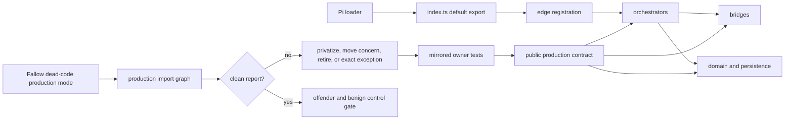

# Phase 5: Production Export Ownership - Research

**Researched:** 2026-09-14
**Domain:** TypeScript export ownership, public-contract unit tests, and Fallow production-mode dead-code analysis
**Confidence:** HIGH for the current inventory and proven call sites; MEDIUM for candidate refactors that still need an edit-time typecheck

## User Constraints

The project requirements state, verbatim:

> - Preserve the current 100% aggregate unit coverage baseline and assertion strength.
> - Do not lower thresholds, exclude production code, or create test-only production exports.
> - Unit/Sonar aggregate coverage and the existing direct-pair pin are distinct measurements.
> - Keep this branch and preserve archived milestones and unrelated local edits.
> - All items in the user handoff are in scope; prior scope exclusions are historical.

[VERIFIED: .planning/REQUIREMENTS.md:5-11]

The phase goal is, verbatim, **“Each current production-mode finding has an evidence-backed disposition and public-contract tests.”** Its second success criterion is, verbatim, **“Fallow runs in production mode with offender and benign controls; no test-only exports or mechanical helper modules are introduced.”** [VERIFIED: .planning/ROADMAP.md:67-75]

The task-specific constraint is to write only this research artifact, make no source/test/config changes, and make no commit. [VERIFIED: orchestrator task]

<phase_requirements>
## Phase Requirements

| ID | Description | Research Support |
|---|---|---|
| EXPORT-01 | Triage all current Fallow production findings; remove ordinary test-only exports through coherent ownership and public tests. | The finding census, candidate-disposition tables, false-positive evidence, and ownership batches below cover every current category. [VERIFIED: .planning/REQUIREMENTS.md:25] |
| EXPORT-02 | Enable and validate Fallow production mode while retaining completed explicit-seam protections. | The configuration end state and validation architecture below preserve the existing no-test-only-surface gate and add live offender/benign controls. [VERIFIED: .planning/REQUIREMENTS.md:26; .planning/BACKLOG.md:646-663] |
</phase_requirements>

## Summary

The current no-cache probe returns exactly **111** findings: **93** unused value exports, **12** unused type exports, **1** unused file, **1** unused class member, and **4** duplicate-export groups. The backlog explicitly says these are analyzer findings for triage rather than 111 confirmed defects. [VERIFIED: /tmp/test-backlog-fallow-before.json; .planning/BACKLOG.md:638-644] The existing production-only census test passes all three cases outside the sandbox; it pins the 93 value exports but does not pin the other 18 findings. [VERIFIED: tests/architecture/unowned-exports-census.test.ts:1-30,44-58,160-192; command `node tests/architecture/unowned-exports-census.test.ts`, 3 passed]

The correct cleanup unit is a production concern plus its mirrored owner test. Most findings should lose export visibility and keep their assertions through the module's public behavior. Re-export conveniences should disappear. Stateful factories should gain a real composition consumer or move as a whole concern; they should not become one helper per file. A small set is analyzer limitation or intentional compile-time/public-contract surface and needs exact, local evidence rather than a broad exclusion. [VERIFIED: .planning/BACKLOG.md:685-707; tests/architecture/no-test-only-production-surface.test.ts:127-132]

Fallow should run production mode for **dead-code only**, while health and duplication continue to inspect the whole repository. The installed schema expressly supports `production: { deadCode, health, dupes }`. [VERIFIED: node_modules/fallow/schema.json:289-292,1945-1975] Set `includeEntryExports` to `false` and replace that lost entry-file typo check with an exact module-surface test that asserts the entry exports only `default`; Fallow otherwise deliberately reports the externally loaded default export. [VERIFIED: node_modules/fallow/schema.json:360-363; package.json:65-68; extensions/pi-claude-marketplace/index.ts:30-36; Fallow trace for `index.ts:default`]

**Primary recommendation:** drain the census concern by concern, preserve or strengthen the relocated assertions, then land the production-mode config and a clean-report gate with planted offender and benign fixtures.

## Architectural Responsibility Map

| Capability | Primary Tier | Secondary Tier | Rationale |
|---|---|---|---|
| Export ownership | The module that implements the production concern | Composition root | A symbol is public only when another production module or external loader owns a dependency on it. [VERIFIED: tests/architecture/unowned-exports-census.test.ts:1-25] |
| Public-contract unit coverage | Mirrored `tests/<tier>/<module>.test.ts` owner | Architecture gates | Each changed source keeps its direct owner and assertions move to observable results/state. [VERIFIED: package.json:84-95; project TypeScript unit-testing skill] |
| Dependency injection | Existing transaction/capability interface | Entry/composition module | The standing gate requires a production owner for test substitution surface. [VERIFIED: tests/architecture/no-test-only-production-surface.test.ts:127-132] |
| Dead-code enforcement | Fallow dead-code analysis | Architecture control test | Production reachability belongs to the analyzer; planted fixtures prove the configured behavior. [VERIFIED: node_modules/fallow/schema.json:289-292,1296-1304] |
| Pi extension entry | Pi loader | `index.ts` | The package manifest names `./extensions/pi-claude-marketplace/index.ts`, whose default function is the externally loaded extension. [VERIFIED: package.json:65-68; extensions/pi-claude-marketplace/index.ts:30-36] |

## Standard Stack

### Core

| Tool | Version | Purpose | Why Standard Here |
|---|---:|---|---|
| Node.js | 26.8.2 installed; project floor `>=20.19.0` | Native TypeScript execution and `node:test` | The repository scripts invoke Node directly and declare the floor verbatim as `"node": ">=20.19.0"`. [VERIFIED: environment probe; package.json:32-34,84-99] |
| TypeScript | `^6.0.3` | Strict typechecking and compile-time proof aliases | Existing project dependency; no replacement is needed. [VERIFIED: package.json:29-30,99] |
| Fallow | 3.22.0 installed; manifest range `^3.17.0` | Production-only unused code and duplicate-export analysis | This is the existing quality gate and the FLOW-09 instrument. [VERIFIED: environment probe; package.json:24,76-77; .planning/BACKLOG.md:640-644] |
| `node:test` + `node:assert/strict` | Node built-ins | Mirrored owner tests and discriminating controls | The existing census test uses these built-ins. [VERIFIED: tests/architecture/unowned-exports-census.test.ts:33-40] |

No package installation belongs in this phase. [VERIFIED: the required tools are already declared in package.json:8-30 and available in the environment]

## Architecture Patterns

### System Architecture Diagram



### Recommended Project Structure

Keep the existing mirrored tree. New production modules are justified only for a whole concern with a real production importer, such as an authentication-callback adapter; do not create a file for each helper. [VERIFIED: .planning/ROADMAP.md:69-74; project TypeScript unit-testing skill]

```text
extensions/pi-claude-marketplace/<tier>/<concern>.ts
tests/<tier>/<concern>.test.ts
tests/architecture/fallow-production-mode.test.ts
```

### Pattern 1: Privatize and preserve the behavioral assertion

Remove `export` from a same-file helper. Move its current cases to the exported operation that consumes it. Preserve whole-value, byte, error-class/field, and interaction assertions; remove a case only when an existing public case is demonstrably stronger. [VERIFIED: project TypeScript unit-testing skill; .planning/REQUIREMENTS.md:7-9]

### Pattern 2: Move a coherent concern to gain a production consumer

`buildAuthCallbacks` is used by `clone`, `fetch`, and `resolveRemoteRef`, and the returned `onAuth`/`onAuthFailure` functions are invoked by isomorphic-git. The export is unowned; the behavior is live. Move the complete callback state machine and its types together to one authentication-callback module imported by `git.ts`, then move the direct callback tests with it. [VERIFIED: extensions/pi-claude-marketplace/platform/git.ts:137-177,224-238,429-492]

### Pattern 3: Test a callback through registration

`createBeforeAgentStartHandler` creates a Pi callback used after registration. Make the helper private and invoke the captured registered callback through the public router/registration contract. This preserves the callback behavior and removes the test-only export. [VERIFIED: extensions/pi-claude-marketplace/bridges/hooks/event-router.ts:194-210; current production report]

### Pattern 4: Exact exception for a proven analyzer limitation

`RingBuffer.read()` is reported as an unused class member, but production calls `entry.stderrBuffer.read()` and `entry.stdoutBuffer.read()` while finalizing async rewake output. Keep the member and add only a source-local `unused-class-member` suppression with those call sites in its reason. Do not configure global `usedClassMembers: ["read"]`. [VERIFIED: extensions/pi-claude-marketplace/bridges/hooks/async-rewake/registry.ts:435-446; /tmp/test-backlog-fallow-before.json; node_modules/fallow/schema.json:123-126]

### Anti-Patterns to Avoid

- Do not set `ignoreExportsUsedInFile: true`; the schema says this blanket setting suppresses every same-file-used export and the default `false` suppresses nothing. [VERIFIED: node_modules/fallow/schema.json:111-114,821-843]
- Do not turn unused rules off or lower their severity. The defaults are errors and the user forbids lower thresholds/exclusions. [VERIFIED: node_modules/fallow/schema.json:193-228; .planning/REQUIREMENTS.md:7-10]
- Do not replace helper tests with existence, length, substring, snapshot, or call-only assertions. [VERIFIED: project TypeScript unit-testing skill]
- Do not delete a reported implementation until its same-file runtime calls and dynamic callback path have been traced. [VERIFIED: `RingBuffer.read` and `buildAuthCallbacks` counterexamples above]

## Finding Inventory and Candidate Dispositions

All names in the following tables come from the no-cache production report. These are candidate dispositions for planning; rows marked **PROVEN** have direct source evidence, while **EDIT-PROBE** rows require the implementing task to run typecheck and the direct owner before locking the disposition. [VERIFIED: /tmp/test-backlog-fallow-before.json]

### 14 re-export findings — REMOVE (PROVEN)

| Owners | Export names | Candidate disposition |
|---|---|---|
| `bridges/agents/frontmatter.ts`, `bridges/agents/index.ts` | `GENERATED_AGENT_MARKER`; `GENERATED_AGENT_MARKER`, `GENERATED_AGENT_MARKER_LEGACY` | Remove convenience re-exports; tests import the marker owner only when the marker itself remains public. |
| `bridges/hooks/if-field/index.ts` | `compileBashGlob`, `compilePathGlob`, `compilePowerShellGlob`, `bashSubcommandFires`, `parseBashSubcommands`, `compilePowerShellRule`, `parsePowerShellSubcommands`, `powerShellSubcommandFires` | Remove sibling-helper re-exports; sibling owner tests retain helper assertions, and `index.test.ts` tests compiled predicates. |
| `bridges/mcp/index.ts` | `resolvePluginMcpServers` | Remove the barrel convenience; use the parse/resolve concern's public behavior. |
| `domain/components/hooks.ts` | `HOOKS_CONFIG_SCHEMA`, `HOOKS_VALIDATOR` | Remove schema facade exports; parsing behavior owns validation. |

[VERIFIED: /tmp/test-backlog-fallow-before.json; Fallow reports each with `is_re_export: true`]

### 60 ordinary value exports — PRIVATIZE AND TEST PUBLIC BEHAVIOR (EDIT-PROBE)

| Concern | Exact reported exports |
|---|---|
| Agent bridge | `convert.ts`: `MODEL_MAP`, `TOOL_MAP`, `THINKING_VALUES`; `frontmatter.ts`: `emitYamlScalar`, `sanitizeProvenanceValue`; `marker.ts`: `GENERATED_AGENT_PREFIX`, `GENERATED_AGENT_MARKER_LEGACY` |
| Hook bridge | `pid-table.ts`: `ASYNC_REWAKE_PIDS_FILENAME`, `ASYNC_REWAKE_PID_TABLE_VERSION`; `registry.ts`: `MARKER_ENV`; `stage.ts`: `hookConfigPathFor`; MCP `collision-slots.ts`: `MCP_COLLISION_SLOTS`; `marker.ts`: `readMarker`; `parse.ts`: `parseMcpServers`, `resolvePluginMcpServers`; `stage.ts`: `MalformedMcpServersError`; `substitute.ts`: `deepSubstitute` |
| Domain | `auth-registry.ts`: `GITLAB_PROVIDER`; hooks `schema.ts`: `HOOKS_CONFIG_SCHEMA`; `plugin-resolver.ts`: `resolveLoose`; `unsupported-components.ts`: `SUPPORTED_COMPONENT_KINDS`, `UNSUPPORTED_COMPONENT_KINDS` |
| Edge | `completions/data.ts`: `buildItem`, `getPluginToMarketplacesMap`; `flag-catalog.ts`: `CATALOG_VERBS`; plugin fetch handler: `parseFetchTarget`; tools handler: `projectRowStatus`; router: `TOP_LEVEL_USAGE`, `MARKETPLACE_USAGE` |
| Import/marketplace orchestration | `import/marketplaces.ts`: `planMarketplaceSourcesForRefs`; `import/refs.ts`: `parseEnabledPluginRef`; `import/settings.ts`: `resolveClaudeSettingsPaths`, `mergeClaudeSettings`; `marketplace/shared.ts`: `resolveScopeFromState` |
| Plugin/reconcile orchestration | `install.messaging.ts`: `narrowResolverReasons`; `reinstall-replace.ts`: `replaceReinstalledPlugin`, `rollbackReinstalledPlugin`, `finalizeReinstalledPlugin`, `runPostSuccessMaintenance`; `reinstall.messaging.ts`: `outcomeToPluginMessage`; `plugin-path.ts`: `collectBinDirs`; `reconcile/backfill.ts`: `scanForceInstalledBackfills`; `reconcile.messaging.ts`: `PENDING_STATUSES` |
| Persistence/platform/shared | `config-io.ts`: `CONFIG_VALIDATOR`; `state-io.ts`: `PLUGIN_INSTALL_RECORD_SCHEMA`, `STATE_SCHEMA`, `STATE_VALIDATOR`; `git.ts`: `listBranches`, `listRemotes`; `pi-api.ts`: `hasLoadedPiSubagents`, `hasLoadedPiMcpAdapter`; completion-cache schemas: `MARKETPLACE_NAMES_CACHE_SCHEMA`, `PLUGIN_INDEX_CACHE_SCHEMA`; errors: `AgentForeignContentError`, `ConcurrentUninstallError`; `markers.ts`: `STATE_LOCK_HELD_PREFIX`; `notification-dispatch.ts`: `emitWithSummary`; grammar: `ICON_REMOTE`, `ICON_PARTIALLY_AVAILABLE`; path safety: `LexicalTraversalError` |

[VERIFIED: /tmp/test-backlog-fallow-before.json]

`CATALOG_VERBS` must be remeasured after Phase 4 because Phase 4 owns the flag catalog and drift gate. Do not plan a competing Phase 5 edit against a stale pre-Phase-4 row. [VERIFIED: .planning/ROADMAP.md:55-75; .planning/REQUIREMENTS.md:22-26]

### 12 factory/capability exports — GIVE THEM PRODUCTION COMPOSITION OWNERSHIP (EDIT-PROBE)

The exact factory set is `createBeforeAgentStartHandler`, `createWriteHookConfig`, `createUnstagePluginSkills`, `createSetPluginEnabled`, `createFetchPlugins`, `createGetPluginInfo`, `createInstallPlugin`, `createReinstallPlugin`, `createUninstallPlugin`, `createApplyReconcile`, `createCredentialOps`, and `createPathSafetyGuard`. Each implementing task must either (a) have an existing production composition module import the factory, or (b) privatize it and preserve the same test through an already-public injected transaction/capability. It must not add twelve new modules. [VERIFIED: /tmp/test-backlog-fallow-before.json; tests/architecture/no-test-only-production-surface.test.ts:127-132]

Treat `buildAuthCallbacks` separately as the coherent auth-callback split described above. Its implementation is live and its export alone is unowned. [VERIFIED: extensions/pi-claude-marketplace/platform/git.ts:137-177,224-238,429-492]

### 5 intentional value contracts — RETAIN WITH EXACT LOCAL EVIDENCE (EDIT-PROBE)

`ResolvedPluginSchema`, `REASONS`, `STATUS_TOKENS`, `PLUGIN_STATUSES`, and `MARKETPLACE_STATUSES` are canonical schema/closed-vocabulary values used to derive exported types. The earlier cleanup explicitly identified the resolver schema and closed tuples as legitimate design. Before adding a local suppression, re-run the remove-export probe; if typecheck and the public owner remain green, privatize it instead. If the probe fails for the documented type/schema reason, keep the export with an exact inline `unused-export` reason and an architecture test that pins the exception's identity. [VERIFIED: .planning/BACKLOG.md:419-485; tests/architecture/gate-targets.ts:537-561; current production report]

### 12 unused type exports

| Exact exports | Candidate disposition |
|---|---|
| `bridges/hooks/index.ts`: `HooksFileReader`, `HooksHydration`, `HooksHydrationDeps`, `ReadAndCachePluginHooksOptions`, `HooksRuntime` | Remove five barrel-only type re-exports and repoint tests to their owning modules. **PROVEN.** |
| `persistence/state-io.ts`: `EnabledPluginRecord` | Remove the export and test `toDisabledRecord`/state behavior. **EDIT-PROBE.** |
| `_BucketAEventsCoverageProof`, `DroppedHookDriftCheck`, `DroppedHookArmKeysCheck`, `AddPrivateReason`, `RemovePrivateReason`, `_ReasonsCoverageProof` | These are compile-time proofs. Fold the constraint into the exported type it protects when possible; otherwise retain an exact local `unused-type` suppression whose reason names the typecheck failure. Never use a file/config-wide exclusion. **EDIT-PROBE.** |

[VERIFIED: /tmp/test-backlog-fallow-before.json; extensions/pi-claude-marketplace/domain/components/hook-events.ts:75-101; extensions/pi-claude-marketplace/domain/resolver-types.ts:35-65; extensions/pi-claude-marketplace/shared/notify-reasons.ts:260-271]

### 4 duplicate-export groups

| Group | Candidate disposition |
|---|---|
| `assertNever` in `bridges/hooks/exec-result.ts` and `shared/errors.ts` | Consolidate on `shared/errors.ts`; bridges may import shared. Move the direct assertion test to the canonical owner. **PROVEN duplicate concern.** |
| `CompileIfPredicateContext` in bridge compilation and domain hook parsing | Keep tier ownership explicit: rename the domain shape to `ResolveHookIfContext` and retain `CompileIfPredicateContext` for runtime bridge compilation, unless the edit-time caller trace proves one shared domain contract is exact. **EDIT-PROBE.** |
| `ToolEvent` in domain hook events and shared hook summaries | Rename by semantics (`HookConfigToolEvent`, `HookSummaryToolEvent`) rather than coupling two closed sets merely because their current literals coincide. **EDIT-PROBE.** |
| `translate` in ten hook payload modules | Keep the uniform callback name. Production imports every one with an event-specific alias; add exact per-file duplicate-export exemptions only for these ten paths, plus a planted extra duplicate proving an eleventh path still fails. **PROVEN intentional namespace pattern.** |

[VERIFIED: /tmp/test-backlog-fallow-before.json; extensions/pi-claude-marketplace/bridges/hooks/async-rewake/registry.ts:49-58; node_modules/fallow/schema.json:89-95,1436-1439]

### 1 unused class member — RETAIN (PROVEN FALSE POSITIVE)

Keep `RingBuffer.read`. Production reads both captured streams at `registry.ts:445-446`. Use one source-local suppression; a global member-name rule would excuse every unrelated `read` method. [VERIFIED: extensions/pi-claude-marketplace/bridges/hooks/async-rewake/registry.ts:435-446; /tmp/test-backlog-fallow-before.json]

### 1 unused file — RETIRE OR REGISTER, DO NOT SILENTLY DELETE (UNRESOLVED)

`scripts/check-phase-06-hub-ledger.mjs` has a paired test and archived planning references but no package-script or production importer. It survived the prior tooling-retirement change deliberately. The implementation task must first run its current CLI modes against the present tree: retire the script and paired test atomically if its ledgers are historical, or add an actual documented operator entry if the checker still guards live state. Do not add an unused-file suppression. [VERIFIED: /tmp/test-backlog-fallow-before.json; package.json:75-99; .planning/milestones/refine-unit-tests-quick/260912-pdh-retire-the-revalidation-tooling-with-the/260912-pdh-SUMMARY.md:1-28,120-138]

## Don't Hand-Roll

| Problem | Don't Build | Use Instead | Why |
|---|---|---|---|
| Production reachability | A grep/count gate | Fallow production dead-code report | The existing analyzer resolves entry points and emits typed categories. [VERIFIED: tests/architecture/unowned-exports-census.test.ts:17-25,42-58] |
| Export exception policy | A broad file/directory allow-list | Exact inline suppression or exact `ignoreExports` names with planted controls | Fallow supports per-name export rules; broad same-file suppression would hide the target defect. [VERIFIED: node_modules/fallow/schema.json:89-95,111-114] |
| Test access | `__test_*`, reset hook, bracket access, or test mode | Public operation, transaction port, or production-consumed factory | The standing architecture gate rejects test-only production surface. [VERIFIED: tests/architecture/no-test-only-production-surface.test.ts:127-132] |
| Helper organization | One new module per reported helper | One module per coherent concern | The phase success criterion explicitly forbids mechanical helper modules. [VERIFIED: .planning/ROADMAP.md:72-74] |

## Runtime State Inventory

This refactor changes TypeScript export visibility, module ownership, tests, and analyzer configuration. It does not change persisted literals or external identifiers unless an implementation task separately changes runtime behavior. [VERIFIED: .planning/REQUIREMENTS.md:25-26; current finding report]

| Category | Items Found | Action Required |
|---|---|---|
| Stored data | None. The candidate work leaves schema literals and serialized field names unchanged. | Run state/persistence owner tests after visibility moves; no data migration. [VERIFIED: candidate dispositions above] |
| Live service config | None. Fallow config is repository-local and Pi loader wiring stays in source. | No external service patch. [VERIFIED: .fallowrc.json:1-13; package.json:65-68] |
| OS-registered state | None. No service/unit/task name appears in the finding inventory. | None. [VERIFIED: /tmp/test-backlog-fallow-before.json] |
| Secrets/env vars | `MARKER_ENV` is a source constant whose string value remains unchanged; only export visibility is in scope. | Preserve exact spawned env behavior; no secret/env migration. [VERIFIED: current finding report and registry source] |
| Build artifacts / installed packages | Fallow's cache must not be used for final measurement. | Run `--no-cache` for the disposition census; no reinstall required. [VERIFIED: task probe contract; current no-cache report] |

## Common Pitfalls

### Weakening a test while removing its import

**What goes wrong:** a helper's exact cases disappear and the public test asserts only that the operation returned. **How to avoid:** transplant the independent expected value and full state/interaction assertion first, then remove the direct helper import. **Warning sign:** fewer asserted fields/bytes or a deleted error path. [VERIFIED: .planning/REQUIREMENTS.md:7-9; project TypeScript unit-testing skill]

### Treating every finding as dead behavior

**What goes wrong:** live callback or method behavior is deleted. **How to avoid:** trace same-file callers and dynamic SDK invocation. **Warning signs:** returned callbacks, registration handlers, interface methods, or values stored in transaction records. [VERIFIED: `buildAuthCallbacks` and `RingBuffer.read` evidence above]

### Updating the central census from parallel batches

**What goes wrong:** workers conflict in `gate-targets.ts`, or a one-in/one-out swap is hidden. **How to avoid:** one coordinator remeasures and updates the exact pin after each ownership batch until the final clean-report gate replaces the non-empty census. [VERIFIED: tests/architecture/unowned-exports-census.test.ts:9-15,143-170]

### Flipping production mode before the tree is clean

**What goes wrong:** `npm run check` becomes red for the whole cleanup window. **How to avoid:** drain findings first, then land config plus final controls in the last batch. [VERIFIED: package.json:76-77; current report total 111]

### Relying on type-aware analysis in this environment

**What goes wrong:** planning assumes a checker-backed result that cannot complete. The attempted Fallow type-aware class-member run timed out after 120 seconds. **How to avoid:** use CodeGraph/source call sites and normal typecheck; treat type-aware Fallow as optional follow-up only. [VERIFIED: positive probe output `Type-aware analysis failed: type-aware sidecar timed out after 120 seconds`]

## Recommended Execution Batches

1. **Remeasure after Phase 4.** Regenerate the no-cache JSON and diff it against this census; in particular, reclassify `CATALOG_VERBS`. [VERIFIED: Phase 5 depends on Phase 4 at .planning/ROADMAP.md:67-75]
2. **Barrels and type facades.** Remove the 14 value re-exports and five hook-index type re-exports; run every touched direct owner and the census test with a coordinator-owned pin update. [VERIFIED: current report]
3. **Leaf bridge/domain/edge helpers.** Privatize the 60 ordinary exports by concern, retaining exact public outcomes and direct-pair 100% coverage. Split into agent/hooks/MCP, domain/persistence, and edge/import batches with disjoint source/test ownership. [VERIFIED: current report; package.json:90-95]
4. **Composition and workflow contracts.** Resolve the twelve factories through existing transaction/capability owners; move the entire git authentication callback concern. Keep factory changes together with their composition caller. [VERIFIED: factory list and git call sites above]
5. **Proofs, schemas, and closed vocabularies.** Run remove-export/typecheck probes one symbol at a time; retain only proven load-bearing contracts with exact local reasons. [VERIFIED: historical FLOW-06 evidence at .planning/BACKLOG.md:419-485]
6. **Duplicates and analyzer limitations.** Consolidate `assertNever`, rename the two ambiguous type names, add exact payload `translate` exceptions, retain `RingBuffer.read`, and disposition the hub-ledger CLI. [VERIFIED: current report and production call evidence]
7. **Production-mode gate.** Set dead-code production mode, set `includeEntryExports: false`, add exact entry-module-surface coverage, replace the non-empty census expectation with a clean full-report assertion, and add temp-root offender/benign controls. Run direct coverage for every changed pair, aggregate unit coverage, then `npm run check`. [VERIFIED: Fallow schema and package scripts cited above]

## Validation Architecture

### Test Framework

| Property | Value |
|---|---|
| Framework | Node built-in `node:test` on Node 26.8.2 [VERIFIED: environment probe; existing census imports] |
| Config file | None; package scripts enumerate test roots. [VERIFIED: package.json:84-98] |
| Quick run | `node --test <changed-owner.test.ts>` [VERIFIED: package test model] |
| Direct pair | `npm run test:coverage:direct -- <source-path>` [VERIFIED: package.json:90-94; project unit-testing skill] |
| Full suite | `npm run check` [VERIFIED: package.json:75-99] |

### Phase Requirements → Test Map

| Req ID | Behavior | Test Type | Automated Command | File Exists? |
|---|---|---|---|---|
| EXPORT-01 | Every live finding has a disposition and no ordinary test-only exports remain | architecture + direct owner | `node tests/architecture/unowned-exports-census.test.ts` plus direct-pair commands | Existing census; revise in final batch [VERIFIED: tests/architecture/unowned-exports-census.test.ts:160-192] |
| EXPORT-02 | Shipping dead-code analysis uses production reachability and detects a planted export while accepting a benign fixture | architecture negative/benign control | `node --test tests/architecture/fallow-production-mode.test.ts` | ❌ Wave 0 |
| EXPORT-02 | Entry module exports exactly the externally loaded default | architecture/runtime module surface | `node --test tests/index.test.ts` | ✅ revise |

### Sampling Rate

- **Per task:** changed owner test plus `npm run test:coverage:direct -- <source-path>`. [VERIFIED: package.json:90-95]
- **Per batch:** remeasure Fallow with `--production --no-cache` and run the census/control test outside restricted child-process sandboxes. [VERIFIED: existing census implementation at tests/architecture/unowned-exports-census.test.ts:87-115]
- **Phase gate:** `npm run test:coverage:direct:all`, aggregate unit coverage at 100%, and `npm run check`. [VERIFIED: package.json:76-99; .planning/REQUIREMENTS.md:7-9]

### Wave 0 Gaps

- [ ] `tests/architecture/fallow-production-mode.test.ts` — temp-root offender and benign fixtures for full configured dead-code mode.
- [ ] Revise `tests/architecture/unowned-exports-census.test.ts` so the final assertion covers all dead-code categories and expects zero rather than requiring a non-empty census.
- [ ] Add an exact runtime/export-surface assertion for `index.ts` before disabling `includeEntryExports`.

## Security Domain

No new authentication, session, access-control, or cryptographic behavior belongs in this phase. The main security risk is deleting live validation/auth/callback behavior while treating an analyzer finding as proof. [VERIFIED: phase scope at .planning/REQUIREMENTS.md:25-26; `buildAuthCallbacks` evidence]

### Applicable ASVS Categories

| ASVS Category | Applies | Standard Control |
|---|---|---|
| V2 Authentication | Existing behavior only | Preserve `buildAuthCallbacks` success, rejection, cancellation, and credential-redaction assertions through the coherent auth owner. [VERIFIED: extensions/pi-claude-marketplace/platform/git.ts:429-492] |
| V3 Session Management | No new surface | Existing hook lifecycle tests only. [VERIFIED: phase scope] |
| V4 Access Control | No new surface | Existing path/scope public behavior only. [VERIFIED: phase scope] |
| V5 Input Validation | Yes, preservation | Schema/parser exports may become private only after malformed-input behavior remains covered through public operations. [VERIFIED: current schema/parser finding set] |
| V6 Cryptography | No | No cryptographic implementation changes. [VERIFIED: phase scope] |
| V12 Files and Resources | Yes, tests | Temp-root controls must use isolated temporary directories and cleanup; source path containment behavior stays unchanged. [VERIFIED: project unit-testing skill; path-safety finding is visibility-only] |

## Environment Availability

| Dependency | Required By | Available | Version | Fallback |
|---|---|---:|---:|---|
| Node | test and analyzer subprocesses | ✓ | 26.8.2 | Project floor is 20.19.0 [VERIFIED: environment probe; package.json:32-34] |
| npm | scripted gates | ✓ | 11.19.1 | — [VERIFIED: environment probe] |
| Fallow | census/config gate | ✓ | 3.22.0 signed binary | — [VERIFIED: environment probe] |
| CodeGraph | production caller tracing | ✓ | 1.6.0 | `rg` plus source read after CodeGraph [VERIFIED: environment probe; AGENTS.md] |

Restricted sandbox execution blocks the census test's nested `spawnSync` with `EPERM`; the same test passed 3/3 when run with the required child-process permission. [VERIFIED: command outputs]

## Assumptions Log

| # | Claim | Section | Risk if Wrong |
|---|---|---|---|
| A1 | [ASSUMED] The twelve factories can all be made production-owned without adding a new module for each. | Finding dispositions | Some factories may need public-behavior test rewrites instead; each is an edit-time trace checkpoint. |
| A2 | [ASSUMED] The two same-named context/event types should be renamed by semantic owner rather than unified. | Duplicate exports | A full caller trace may prove one canonical domain type is safe and cheaper. |
| A3 | [ASSUMED] The hub-ledger CLI is historical and can likely retire. | Unused file | It may still be an undocumented operator tool; the task must run it before deletion. |
| A4 | [ASSUMED] Exact local suppressions remain necessary for some compile-time proof/schema exports after a fresh remove-export probe. | Type/value contracts | Current TypeScript/Fallow versions may allow a cleaner formulation. |

## Open Questions

1. **Which proof/schema exports still fail after export removal on the current compiler?**
   - What we know: earlier work documented six load-bearing exceptions; the current report adds a Bucket-A proof. [VERIFIED: .planning/BACKLOG.md:419-485; current report]
   - What is unclear: whether TypeScript 6.0.3 and current inferred public shapes still require the exports. [ASSUMED]
   - Recommendation: one-symbol edit probe, `npm run typecheck`, direct owner, then revert or lock the exact disposition.
2. **Does Phase 4 consume `CATALOG_VERBS` in production?**
   - What we know: Phase 4 owns that catalog before Phase 5. [VERIFIED: .planning/ROADMAP.md:55-75]
   - Recommendation: regenerate the report at Phase 5 start.
3. **Is the hub-ledger CLI still an operator entry point?**
   - What we know: it is absent from package scripts and has only a test/archive references. [VERIFIED: package.json:75-99; current report]
   - Recommendation: execute its modes against current paths before choosing atomic retirement or explicit registration.

## Sources

### Primary (HIGH confidence)

- Current source and tests via CodeGraph-first tracing and targeted reads. [VERIFIED: AGENTS.md; source paths cited inline]
- `/tmp/test-backlog-fallow-before.json`, regenerated command behavior, and Fallow trace outputs. [VERIFIED: local tool runs]
- Installed Fallow 3.22.0 README/schema. [VERIFIED: node_modules/fallow/README.md; node_modules/fallow/schema.json]
- Phase requirements, roadmap, and full FLOW-09 backlog record. [VERIFIED: .planning/REQUIREMENTS.md; .planning/ROADMAP.md; .planning/BACKLOG.md]

### Secondary (MEDIUM confidence)

- None. The research-plan seam selected Context7, but Context7 and its CLI fallback were unavailable; local version-matched package documentation was used instead. [VERIFIED: tool availability checks]

## Metadata

**Confidence breakdown:**

- Inventory: HIGH — no-cache JSON and existing exact census agree on all 93 value exports; the full report supplies the remaining categories. [VERIFIED: local tool runs]
- Architecture: HIGH — production call sites and project gates were read directly. [VERIFIED: cited source]
- Candidate per-symbol refactors: MEDIUM — each EDIT-PROBE disposition deliberately remains contingent on typecheck/direct-owner evidence. [ASSUMED]
- False positives: HIGH for the entry default and `RingBuffer.read`; HIGH that `buildAuthCallbacks` behavior is live while its export is unowned. [VERIFIED: cited call sites and Fallow trace]

**Research date:** 2026-09-14
**Valid until:** 2026-09-21 or any Phase 4 export-surface change, whichever comes first.
