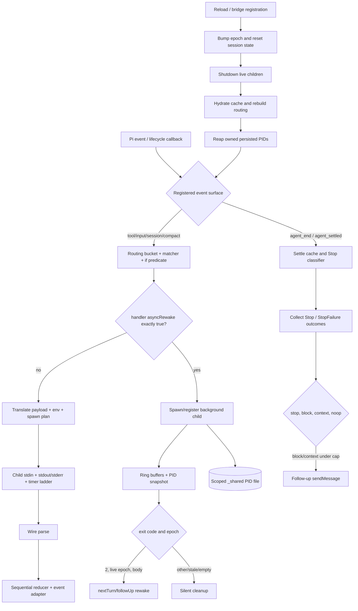

# Phase 112: Hook Runtime - Research

<user_constraints>
## User Constraints (from CONTEXT.md)

### Locked Decisions

### Milestone test contract carried forward

- **D-01:** Normalize and re-prove all 31 owners, including accepted-HEAD `PASS` tests.
  Baseline triage is input, not completion evidence.
- **D-02:** Every runtime case uses separate lowercase `// arrange`, `// act`, and
  `// assert` phases with the canonical blank lines. Lowercase `// act & assert` is
  limited to one `assert.throws()` or `assert.rejects()` expression. Data rows use
  separate phases.
- **D-03:** Type-only evidence stays at module scope through positive `satisfies` checks
  and targeted negative `@ts-expect-error` checks. Barrel owners prove intended public
  bindings without widening the production surface.
- **D-04:** Each case constructs complete, case-local inputs and independently authored
  complete expectations. Small concern-local factories may return fresh setup values but
  must not become shared scenario oracles.
- **D-05:** Each case owns and restores its filesystem, environment, process, session,
  router, registry, mock, stream, and timer state. Production modules gain no test-only
  exports, reset hooks, state readers, or test modes.
- **D-06:** Retain supplemental hook suites only for genuine cross-module proof. Absorb
  and remove cases that duplicate one mirrored owner's behavior. — **Reversibility:**
  costly — Restoring duplicated suites would weaken the milestone's one-source-to-one-owner
  structure and create competing contract authorities.

### Subprocess fidelity

- **D-07:** Use injected process doubles for controllable event sequences and a real
  subprocess only at the operating-system spawn boundary. Any real child is a small,
  portable `process.execPath` program in the owning direct test when the default spawn arm
  needs proof.
- **D-08:** Cover every behaviorally distinct child ordering that changes the result:
  normal close, spawn error, exit before pipe close, interleaved output, and relevant late
  terminal events. Do not enumerate orderings that are observably equivalent.
- **D-09:** Assert the complete subprocess boundary and outcome: command, arguments,
  shell, cwd, environment, stdin, returned result, signals, listener removal, timer
  cancellation, and cleanup.
- **D-10:** Stream proof is behaviorally complete at byte boundaries but not
  combinatorially exhaustive. Cover empty and zero-capacity input, exact limits,
  one-byte overflow, multiple chunks, wraparound, oversized chunks, independent stdout
  and stderr, UTF-8 sequences split across chunks, decoder flush, and overflow cleanup.
  Preserve order within each stream; do not invent a total ordering between stdout and
  stderr that Node does not guarantee.
- **D-11:** Assert the full stdin delivery and failure contract: exact serialized bytes,
  error-listener registration before `end`, normal delivery, EPIPE/error diagnostics,
  absent optional stdin in the async lane, and synchronous `end` failure containment.
- **D-12:** Use real Node `PassThrough` streams inside process doubles for buffering,
  UTF-8, `end`, and listener behavior. Use small custom emitters only for event orderings
  that real streams cannot stage.
- **D-13:** Subprocess diagnostics are asserted by contract-bearing meaning: failure
  category, plugin/event context, relevant stderr or error text, and destination. Do not
  freeze incidental punctuation or complete debug-log wording.

### Timer schedules

- **D-14:** Scheduling cases use the current `node:test` context's fake timers. Advance
  to just before and exactly at the SIGTERM deadline, then just before and exactly at the
  five-second SIGKILL deadline; prove cancellation suppresses both signals.
- **D-15:** Cover every timeout decision partition: configured positive and fractional
  values, zero, negative, non-numeric and non-finite inputs, event-specific blocking
  defaults, the background default, the maximum representable delay, and above-maximum
  clamping.
- **D-16:** Cover every distinct exit/cancellation race state: cancellation before either
  deadline, prior exit at SIGTERM time, exit between SIGTERM and SIGKILL, exit by code,
  exit by signal, repeated cancellation, and late callbacks against a finished child.
- **D-17:** Assert the complete timer lifecycle: two case-owned timers at exact delays,
  both unreferenced, exact handles cleared, idempotent cancellation, and no timers left
  after settlement.

### Runtime-state isolation

- **D-18:** Obtain clean state through existing production lifecycle APIs before and
  after each case. Each case owns every inserted entry and verifies cleanup; do not use
  module-cache reloads, hidden state readers, or new test-only seams.
- **D-19:** Cover behaviorally distinct registry interleavings without exhaustively
  permuting schedules: multiple live children within one scope and across scopes, one
  child settling while another remains, persistence snapshots during registration and
  removal, and reload shutdown without cross-entry deletion.
- **D-20:** Prefer injected probes for process-wide inputs. When mutation is unavoidable,
  capture exact property existence and value, register case-local restoration before
  acting, and serialize only cases that truly touch shared process state.
- **D-21:** Test PID-table persistence with fresh case-owned temporary roots, including
  atomic write/read/unlink, malformed and stale files, and scope separation. Use narrow
  existing doubles only for hard-to-stage I/O failures; add no production test seam.

### Payload and wire exactness

- **D-22:** Each translator owner deep-asserts its complete explicit envelope. Optional
  fields must be genuinely absent rather than present with `undefined`; unexpected keys
  are rejected; nested Pi input and output values pass through unchanged.
- **D-23:** Direct translator cases stay within their typed input contracts. Malformed
  values are tested where `dispatch-exec` accepts `unknown`: null, non-object, missing
  required fields, and wrong-shape containment, including diagnostics and the public
  never-throws outcome. Do not fuzz every translator with impossible values.
- **D-24:** Wire-protocol tests cover every decision and precedence partition with
  targeted conflicts: exit-code precedence, empty and malformed JSON, top-level stop
  before block, top-level decisions before nested output, nested deny before mutation,
  mutation before `suppressOutput`, wrong-type omission, and final noop fallback.
- **D-25:** Serialization tests cover the complete UTF-8 boundary contract: exact cap,
  one byte over, multibyte byte counting, top-level `_truncated: true` precedence over an
  input field of the same name, defensive wrapping of oversized non-object values,
  a final 256 KiB bound including truncation metadata, and no mutation of the source payload.

### the agent's Discretion

- Choose the exact case names, row grouping, and order within each owner while preserving
  independent cases and every locked behavior partition above.
- Choose the smallest custom child/stream emitter needed for an ordering that
  `PassThrough` cannot express.
- Choose the narrow mechanism for hard-to-stage PID-table I/O failures, provided it uses
  an existing production boundary and restores all changed state.
- Choose which existing architecture and integration cases provide genuine cross-module
  proof, and document the distinct contract for every retained supplemental case.

### Deferred Ideas (OUT OF SCOPE)

None — discussion stayed within phase scope.
</user_constraints>

**Researched:** 2026-08-30  
**Domain:** TypeScript hook routing, subprocess lifecycle, async registry, timers, persistence, and direct owner-test refactoring  
**Confidence:** HIGH for repository behavior and baseline coverage; MEDIUM for Node runtime documentation because the official pages were retrieved through web search rather than Context7. [VERIFIED: .planning/phases/112-hook-runtime/112-CONTEXT.md:1-249] [CITED: https://nodejs.org/api/test.html]

<phase_requirements>
## Phase Requirements

| ID | Description | Research Support |
|---|---|---|
| MOD-05 | “All 31 hook-runtime pairs complete the pair contract.” | The 31-row owner inventory below records the live mirror state, direct-coverage baseline, public branch partitions, source call paths, supplemental-suite disposition, and pair dependencies needed to plan one atomic plan per pair. [VERIFIED: .planning/REQUIREMENTS.md:108-120] |
</phase_requirements>

## Summary

Phase 112 is a normalization and ownership phase, not a hook redesign. The roadmap fixes exactly 31 source-test pairs and requires every owner to pass alone at 100% function, line, and branch coverage while preserving event, process, timer, lifecycle, matcher, routing, payload, and persistence behavior. [VERIFIED: .planning/ROADMAP.md:311-360]

The current tree has 21 mirrored owner files and ten missing owners. Fourteen existing owners currently pass direct coverage; seven fail with concrete branch or line gaps. Passing owners are still open because the current runtime tests contain no canonical lowercase phase markers and several owners use double assertions, module-level state readers, or global setup that conflicts with the locked case-local contract. [VERIFIED: focused `npm run test:coverage:direct` and `rg` audit on 2026-08-30] [VERIFIED: .claude/rules/typescript-unit-testing.md:24-42,182-200]

The planner should preserve one plan and one implementation commit per roadmap pair, move single-module evidence out of legacy architecture/bridge suites into the matching owner, and retain only named cross-module contracts. Process-heavy owners must use the existing dependency seams (`SpawnDeps`, `HookExecutor`, `OrphanProbes`) plus real `PassThrough` streams; timers must use the current test context; filesystem owners must use one real temporary root per case. [VERIFIED: extensions/pi-claude-marketplace/bridges/hooks/async-rewake/registry.ts:154-217,233-370] [VERIFIED: extensions/pi-claude-marketplace/bridges/hooks/dispatch.ts:91-96,319-378] [VERIFIED: .claude/rules/typescript-unit-testing.md:111-151,221-229]

**Primary recommendation:** Plan the phase as dependency-ordered owner waves, but keep every task, source edit, supplemental-test deletion, focused command, and commit scoped to one of the 31 roadmap pairs. [VERIFIED: .planning/REQUIREMENTS.md:94-106] [VERIFIED: .planning/ROADMAP.md:326-360]

## Architectural Responsibility Map

| Capability | Primary Tier | Secondary Tier | Rationale |
|---|---|---|---|
| Payload translation and wire decisions | API / Backend | — | Pure bridge functions translate Pi events into Claude envelopes and normalize child output into the four-arm result union. [VERIFIED: extensions/pi-claude-marketplace/bridges/hooks/exec-result.ts:39-59] [VERIFIED: extensions/pi-claude-marketplace/bridges/hooks/wire-protocol.ts:32-65] |
| Matcher evaluation and routing reduction | API / Backend | — | Compilation, predicate evaluation, sequential reduction, and event adaptation are bridge-runtime business logic. [VERIFIED: extensions/pi-claude-marketplace/bridges/hooks/if-field/index.ts:230-304,395-445] [VERIFIED: extensions/pi-claude-marketplace/bridges/hooks/dispatch.ts:167-220] |
| Blocking and async subprocess execution | API / Backend | OS process boundary | The runtime owns spawn plans, environment, stdin/stdout/stderr, signals, settlement, and injected child-process ports. [VERIFIED: extensions/pi-claude-marketplace/bridges/hooks/dispatch-exec.ts:293-425] [VERIFIED: extensions/pi-claude-marketplace/bridges/hooks/async-rewake/registry.ts:233-370] |
| Timer escalation | API / Backend | Node event loop | `installTimerLadder` owns two unreferenced timers and the `SIGTERM` then `SIGKILL` lifecycle. [VERIFIED: extensions/pi-claude-marketplace/bridges/hooks/exec-timer.ts:135-187] |
| Routing, epoch, pending context, and registry lifecycle | API / Backend | Database / Storage | In-memory maps/cells are runtime-owned; reload and persistence boundaries coordinate them with scoped disk state. [VERIFIED: extensions/pi-claude-marketplace/bridges/hooks/routing-state.ts:148-326] [VERIFIED: extensions/pi-claude-marketplace/bridges/hooks/event-router.ts:706-755] |
| PID-table and hook-config persistence | Database / Storage | API / Backend | Scoped `_shared` PID files and staged hook JSON are real filesystem contracts guarded by containment and atomic writes. [VERIFIED: extensions/pi-claude-marketplace/bridges/hooks/async-rewake/pid-table.ts:93-174] [VERIFIED: extensions/pi-claude-marketplace/bridges/hooks/stage.ts:176-237] |

## Project Constraints (from AGENTS.md)

- Because `.codegraph/` exists, use CodeGraph before grep/find or direct reads when locating or understanding code; shell `codegraph explore` is the always-available path. [VERIFIED: AGENTS.md:1-10]
- The repository-local `.claude/CLAUDE.md` repeats the same CodeGraph-first rule and adds no conflicting directive. [VERIFIED: .claude/CLAUDE.md:1-10]
- Tests must use `node:test`, `node:assert/strict`, test-context mocks/timers, `strong-mock` for strict interactions, exact direct coverage, lowercase phases, complete expectations, and no double assertions or test-only production surfaces. [VERIFIED: .claude/rules/typescript-unit-testing.md:12-42,89-151,182-229]

## Standard Stack

### Core

| Library / Runtime | Version | Purpose | Why Standard |
|---|---:|---|---|
| Node.js | `v26.7.0` installed; repository floor `>=20.19.0` | ESM execution, `node:test`, assertions, streams, child processes, timers, filesystem | It is the repository runtime and supplies every required process/test primitive without another dependency. [VERIFIED: environment probe, 2026-08-30] [VERIFIED: package.json:32-34,75-95] |
| `node:test` + `node:assert/strict` | Node built-ins | Runner, test-context mocks/timers, strict whole-value assertions | The project rule requires these built-ins and forbids another runner/assertion library. [VERIFIED: .claude/rules/typescript-unit-testing.md:12-22] |
| TypeScript | `6.0.3` installed | Strict type checking, `satisfies`, targeted `@ts-expect-error` owner evidence | The repository declares and installs this version; type-only and barrel owners are not exempt. [VERIFIED: package.json:27-30] [VERIFIED: environment probe, 2026-08-30] [VERIFIED: .claude/rules/typescript-unit-testing.md:24-32,211-221] |

### Supporting

| Library / Primitive | Version | Purpose | When to Use |
|---|---:|---|---|
| `strong-mock` | `9.2.2` installed | Exact interaction contracts | Use only when invoking a collaborator is itself public behavior; set `exactParams: true` and verify in the case. [VERIFIED: package.json:14-30] [VERIFIED: environment probe, 2026-08-30] [VERIFIED: .claude/rules/typescript-unit-testing.md:128-151] |
| `node:stream` `PassThrough` | Node built-in | Real buffering, `data`, `end`, and byte-boundary behavior inside child doubles | Use in `dispatch-exec` and async registry cases; reserve custom emitters for child event orders real streams cannot stage. [CITED: https://nodejs.org/api/stream.html#class-streampassthrough] [VERIFIED: .planning/phases/112-hook-runtime/112-CONTEXT.md:64-66] |
| `node:string_decoder` `StringDecoder` | Node built-in | Preserve split UTF-8 sequences and flush incomplete tails | Exercise it through `dispatchHookExec`; do not test the private helper directly. [CITED: https://nodejs.org/api/string_decoder.html] [VERIFIED: extensions/pi-claude-marketplace/bridges/hooks/dispatch-exec.ts:428-472] |
| Real temporary filesystem | Node built-ins | Atomic bytes, containment, symlink, permission/error, scope separation | Use a fresh `mkdtemp` root per case and `t.after()` cleanup for PID table and stage owners. [VERIFIED: .claude/rules/typescript-unit-testing.md:221-229] |

### Alternatives Considered

| Instead of | Could Use | Tradeoff |
|---|---|---|
| Test-context timers | Process-wide `mock.timers` or wall-clock waits | Rejected: process-wide state breaks case isolation and wall-clock waits are nondeterministic; the test context resets its timers after each case. [CITED: https://nodejs.org/api/test.html] [VERIFIED: .planning/phases/112-hook-runtime/112-CONTEXT.md:71-85] |
| Real `PassThrough` streams | Bespoke stream-shaped emitters everywhere | Rejected for byte behavior; custom emitters are allowed only for otherwise unstageable event order. [CITED: https://nodejs.org/api/stream.html#class-streampassthrough] [VERIFIED: .planning/phases/112-hook-runtime/112-CONTEXT.md:55-66] |
| Existing injected process/probe ports | Module replacement, cache reload, `_set*ForTest` hooks | Rejected: the production seams already expose the required roles, and the test contract forbids hidden test modes and module-loader substitution. [VERIFIED: extensions/pi-claude-marketplace/bridges/hooks/async-rewake/registry.ts:154-217] [VERIFIED: .claude/rules/typescript-unit-testing.md:151,194-209] |

**Installation:** No package installation is required. Use the existing lockfile and built-ins. [VERIFIED: package.json:8-30]

## Package Legitimacy Audit

Not applicable: Phase 112 introduces no external package. `strong-mock@9.2.2` and `typescript@6.0.3` are already declared and installed, so no legitimacy gate or install checkpoint is needed. [VERIFIED: package.json:14-30] [VERIFIED: environment probe, 2026-08-30]

## Live Baseline and Direct-Coverage Audit

| State | Owners | Evidence |
|---|---|---|
| Existing and 100% direct function/line/branch coverage | `async-rewake/ring-buffer`, `exec-timer`, all ten `payloads/*` owners, `timeout`, `translation-context` (14 owners) | Each focused direct command passed, but D-01 still requires normalization and re-proof. [VERIFIED: focused `npm run test:coverage:direct` audit, 2026-08-30] [VERIFIED: .planning/phases/112-hook-runtime/112-CONTEXT.md:23-24] |
| Existing but below direct threshold | `pid-table`, `dispatch-exec`, `event-router`, `routing-state`, `settle`, `stage`, `wire-protocol` (7 owners) | Exact metrics and uncovered lines appear below. [VERIFIED: focused `npm run test:coverage:direct` audit, 2026-08-30] |
| Missing mirrored owner | `async-rewake/registry`, `dispatch`, `event-adapters`, `exec-result`, `hook-env`, `if-field/bash`, `if-field/glob`, `if-field/index`, hook barrel `index`, `spawn-helpers` (10 owners) | These roadmap targets do not exist in the current filesystem. [VERIFIED: filesystem audit against .planning/ROADMAP.md:330-360, 2026-08-30] |

### Existing coverage gaps

| Pair | Current direct coverage (line / branch / function) | Uncovered source lines |
|---|---:|---|
| 112-01 `pid-table` | `97.14% / 88.24% / 100%` | `155-156`, `172-174`: write-failure and non-`ENOENT` unlink-failure diagnostics. [VERIFIED: focused direct-coverage LCOV audit, 2026-08-30] |
| 112-04 `dispatch-exec` | `87.08% / 73.53% / 76.47%` | `170-187`, `326-327`, `344-369`, `379`, `390`, `403-405`, `420-422`, `451-452`, `460-462`, `469-470`: async delegation, duplicate settlement, both overflow lanes/cleanup, stdin error, null streams, overflow, decoder tail. [VERIFIED: focused direct-coverage LCOV audit, 2026-08-30] |
| 112-07 `event-router` | `69.38% / 71.88% / 68.75%` | `158-196`, `226-246`, `350-351`, `391-393`, `439-470`, `486-487`, `502-503`, `542-546`, `556-560`, `566-570`, `577-579`, `635-639`, `652-662`, `707-823`: read/cache, context drain, defensive flatten arms, hydration failures/skips, project hydrate, shared-dir failure, full registration/reload path. [VERIFIED: focused direct-coverage LCOV audit, 2026-08-30] |
| 112-25 `routing-state` | `88.96% / 100% / 20%` | `212-217`, `225-226`, `234-235`, `242-243`, `251-252`, `258-260`, `267-268`, `276-277`, `287-291`, `297-299`, `307-308`, `322-326`: most state accessors/mutators are not directly called by the owner. [VERIFIED: focused direct-coverage LCOV audit, 2026-08-30] |
| 112-26 `settle` | `100% / 98.51% / 100%` | One missing switch branch: exact `case "pending":` at line `206`. [VERIFIED: focused direct-coverage LCOV audit, 2026-08-30] [VERIFIED: extensions/pi-claude-marketplace/bridges/hooks/settle.ts:186-219] |
| 112-28 `stage` | `76.47% / 61.54% / 71.43%` | `74-78`, `82-83`, `94-99`, `102-103`, `118-124`, `140-166`, `168-174`: unreachable pop guard plus directory skip, symlink boundary, nested directory, unexpected I/O, error translation/rethrow, unreadable link fallback. [VERIFIED: focused direct-coverage LCOV audit, 2026-08-30] |
| 112-31 `wire-protocol` | `91.12% / 73.17% / 100%` | `75-76`, `92-97`, `160-166`: primitive/null roots, `suppressOutput`, final noop, and `allow`/`ask` permission mutation fields. [VERIFIED: focused direct-coverage LCOV audit, 2026-08-30] |

## Complete 31-Pair Owner Audit

Every row below is an independently executable owner plan. “PASS” means only the current focused coverage baseline; it does not waive normalization, complete expectations, type evidence, state ownership, or supplemental-suite cleanup. [VERIFIED: .planning/phases/112-hook-runtime/112-CONTEXT.md:21-41]

| Plan / owner | Baseline | Public partitions the owner must prove | Dependencies and supplemental action |
|---|---|---|---|
| **112-01** `async-rewake/pid-table.ts` | FAIL: `97.14/88.24/100`; write/unlink error arms missing. | Quote exact persisted values: filename `"async-rewake-pids.json"`, version `1`, and entry fields `"pid"`, `"dispatchId"`, `"scope"`, `"marketplace"`, `"plugin"`, `"spawnedAt"`; prove path, absent/malformed/stale shape, atomic write/read, defensive array copy, `ENOENT`, non-`ENOENT`, scope separation, and never-throw diagnostics with fresh roots. [VERIFIED: extensions/pi-claude-marketplace/bridges/hooks/async-rewake/pid-table.ts:52-100,108-174] | Leaf; can run in Wave 1. Absorb PID-file-only cases from `hooks-async-rewake`; use an existing filesystem boundary for hard failures. [VERIFIED: .planning/phases/112-hook-runtime/112-CONTEXT.md:99-101,127-128] |
| **112-02** `async-rewake/registry.ts` | MISSING owner. | Prove non-dispatch skip, spawn throw, missing PID kill, complete spawn/env/stdin boundary, listener order, output capture, registration/persist snapshots, child error/duplicate terminal guard, stale epoch, summary, every exit result, stderr-over-stdout, truncation framing, idle lane `"nextTurn"` vs busy `"followUp"`, send failure, multi-child/scope interleavings, shutdown, PID liveness, Linux marker match/mismatch, non-Linux soft skip, and unlink. Exact private protocol values are `"PI_CLAUDE_MARKETPLACE_REWAKE_DISPATCH"`, `"[…truncated]\n"`, `"claude-hook-rewake"`, and `"\n\n"`. [VERIFIED: extensions/pi-claude-marketplace/bridges/hooks/async-rewake/registry.ts:76-109,233-370,383-518,525-593,641-718] | Depends on 01, 03, 09, 10, 15-24, 25, 27, 29, 30. Absorb module-local cases from `hooks-async-rewake`; retain only explicitly named cross-module reload/env-parity proof. [VERIFIED: source import/call-path audit via CodeGraph, 2026-08-30] |
| **112-03** `async-rewake/ring-buffer.ts` | PASS 100%. | Re-prove zero capacity, empty write, exact fill, one-byte and multi-write overflow, wraparound, oversized chunk tail, chronological read, latched truncation, arbitrary bytes, and accepted UTF-8 truncation boundary. Quote caps `65_536` stderr and `1_048_576` stdout. [VERIFIED: extensions/pi-claude-marketplace/bridges/hooks/async-rewake/ring-buffer.ts:41-45,61-148] | Leaf, Wave 1. Move no registry behavior into this owner; normalize all cases. [VERIFIED: .planning/phases/112-hook-runtime/112-CONTEXT.md:23-41,55-60] |
| **112-04** `dispatch-exec.ts` | FAIL: `87.08/73.53/76.47`. | Prove async `=== true` delegation/missing Pi/catch, unknown-shape diagnostics without throw, translator selection, complete spawn options, default real `process.execPath` spawn arm, normal/error/exit-before-close/late events, independent caps, exact/overflow bytes, split UTF-8 and flush, listener removal, immediate overflow ladder, stdin listener-before-end/EPIPE/synchronous end containment, duplicate settle, null streams, parse result, and cleanup. Quote translator keys `"SessionStart"`, `"UserPromptSubmit"`, `"PreToolUse"`, `"PostToolUse"`, `"PostToolUseFailure"`, `"PreCompact"`, `"PostCompact"`, `"SessionEnd"`, `"Stop"`, `"StopFailure"`; required fields are `[]`, `["text"]`, or `["toolName", "input"]` as defined. [VERIFIED: extensions/pi-claude-marketplace/bridges/hooks/dispatch-exec.ts:95-124,146-211,228-275,293-472] | Depends on 02-03, 09-10, 15-24, 27, 29-31. Absorb/remove `hooks-exec`; as the late sole carrier after all ten payload owners, prune only the byte-equal round-trip block plus `EVENT_FIXTURES`/`EXPECTED_JSON` from `hooks-translators`, retaining translator completeness and shared tool-name mapping. Keep full install→route→real-child proof in integration. [VERIFIED: source import/call-path and supplemental-suite audit, 2026-08-30] |
| **112-05** `dispatch.ts` | MISSING owner. | Prove matcher arms, closed-set raw values, matcher-and-`if` conjunction, sequential executor order, skip behavior, mutate visibility/composition, first terminal block/stop, noops, async-rewake degradation in collection, stale/empty composites, tool-result split, all per-event adaptations, provenance, and observation order. Quote composite exclusions `"PostToolUse" | "PostToolUseFailure" | "Stop" | "StopFailure"`. [VERIFIED: extensions/pi-claude-marketplace/bridges/hooks/dispatch.ts:109-134,167-220,251-298,319-424,470-492] | Depends on 04, 06, 08, 13, 25. Absorb `hooks-reducer` and runtime routing cases from `hooks-dispatch`; keep only repository-wide static constraints outside the owner. [VERIFIED: supplemental-suite audit, 2026-08-30] |
| **112-06** `event-adapters.ts` | MISSING owner. | Prove non-object drops; tool-call object-only patch; tool-result whitelist (`content` array and boolean `isError`) without routing-field overwrite; every `noop`/`block`/`mutate`/`stop` adapter arm; optional-key absence; SessionStart context capture with provenance; other observation drops; and diagnostics. [VERIFIED: extensions/pi-claude-marketplace/bridges/hooks/event-adapters.ts:90-144,158-274,313-357] | Depends on 08 and 25. Absorb and remove `tests/architecture/hooks-adapters.test.ts` plus adapter cases from `session-start-additional-context.test.ts`. The explicitly `@internal` legacy `adaptObservationResult` has no production dispatch caller, so do not create new reliance on it. [VERIFIED: extensions/pi-claude-marketplace/bridges/hooks/event-adapters.ts:359-405] [VERIFIED: call-site audit via CodeGraph and `rg`, 2026-08-30] |
| **112-07** `event-router.ts` | FAIL: `69.38/71.88/68.75`. | Prove cache key separation/idempotence, disk read/parse failures, context drain/epoch/one-shot order, all ten bucket rebuilds and ordering, both-scope hydrate including disabled/empty/containment/brand/read/parse failures, project-prefix replacement, shared-dir gate/failure, load-state degradation, reload order, orphan reap ordering, lazy SessionStart project hydrate, and exactly 11 registrations over ten event names with `"input"` twice. [VERIFIED: extensions/pi-claude-marketplace/bridges/hooks/event-router.ts:157-196,225-246,317-407,439-582,620-662,706-823] | Depends on 02, 05, 25-26. Absorb router/drain cases from `hooks-dispatch`, `hooks-exec`, and `session-start-additional-context`; retain cross-orchestrator lifecycle and end-to-end suites only. [VERIFIED: supplemental-suite audit, 2026-08-30] |
| **112-08** `exec-result.ts` | MISSING owner. | At module scope positively type every exact union arm and negatively reject missing/extra/invalid discriminants and permission values; runtime-prove `assertNever` throws with stable error type/content. Quote arms `"noop"`, `"block"`, `"mutate"`, `"stop"` and permission values `"allow" | "deny" | "ask"`. [VERIFIED: extensions/pi-claude-marketplace/bridges/hooks/exec-result.ts:39-59] | Leaf, Wave 1; type-only evidence must stay module-scope and production exports must not widen. [VERIFIED: .planning/phases/112-hook-runtime/112-CONTEXT.md:29-31] |
| **112-09** `exec-timer.ts` | PASS 100%. | Re-prove just-before/exact `SIGTERM`, just-before/exact five-second `SIGKILL`, zero, fractional, ceiling/clamp, negative/non-finite fail-open, prior exit by code/signal, exit between legs, cancellation before either leg, repeated cancel, late callbacks, exact two handles, `unref`, exact clears, and no timers left. [VERIFIED: extensions/pi-claude-marketplace/bridges/hooks/exec-timer.ts:26-40,69-113,135-187] | Leaf, Wave 1. Current coverage is insufficient evidence for D-14–D-17; use current test-context timers only. [VERIFIED: .planning/phases/112-hook-runtime/112-CONTEXT.md:71-85] [CITED: https://nodejs.org/api/test.html] |
| **112-10** `hook-env.ts` | MISSING owner. | Prove precedence `process.env` → `CLAUDE_PROJECT_DIR`/`CLAUDE_PLUGIN_ROOT`/`CLAUDE_PLUGIN_DATA` → extra marker → session env last; contained plugin data; SessionStart-only `CLAUDE_ENV_FILE`; exact absence of `CLAUDE_CODE_REMOTE`; inherited unknown keys; and restoration of every mutated property with existence/value distinction. [VERIFIED: extensions/pi-claude-marketplace/bridges/hooks/hook-env.ts:19-78] | Depends on 25 types/fixtures; Wave 1 after a local complete `RoutingEntry` constructor exists. Absorb env-only assertions from `dispatch-exec`/`hooks-async-rewake` while retaining a single cross-lane parity contract. [VERIFIED: supplemental-suite audit, 2026-08-30] |
| **112-11** `if-field/bash.ts` | MISSING owner. | Prove quote-aware separators, escapes, nested `$()`/backticks, unmatched input, recursion cap/fail-open, interpolation detection, deduplication, wrappers, wrapper arguments, `xargs` flags, empty pieces, direct glob and specificity override. Quote wrappers `"timeout"`, `"time"`, `"nice"`, `"nohup"`, `"stdbuf"`, `"xargs"`; recursion cap is `8`. [VERIFIED: extensions/pi-claude-marketplace/bridges/hooks/if-field/bash.ts:66-118,271-426,444-458] | Leaf over 12’s type shape; plan 12 first or share only exported types. Absorb Bash rows from `hooks-if-field`; do not retain duplicate truth tables. [VERIFIED: supplemental-suite audit, 2026-08-30] |
| **112-12** `if-field/glob.ts` | MISSING owner. | Prove tokens `"literal"`, `"star"`, `"globstar"`, `"slash"`; Bash command boundaries and `:*` sugar; path segment rules; exact six anchor precedence arms; containment miss; bare-name any-depth scanning; zero/multiple segment globstars; normalized bases; complete compiled metadata. [VERIFIED: extensions/pi-claude-marketplace/bridges/hooks/if-field/glob.ts:60-135,281-332,339-400,407-487] | Leaf, Wave 1. Absorb glob/path tables from `hooks-if-field`. [VERIFIED: supplemental-suite audit, 2026-08-30] |
| **112-13** `if-field/index.ts` | MISSING owner. | Type-prove re-exports and exact predicate arms `"match-all"`, `"bash"`, `"path-tool"`, `"mcp-literal"`, `"mcp-server-prefix"`; compile empty/non-tool/known/unknown/MCP forms; evaluate missing command, parser fail-open, path tool membership/cwd fallback, MCP equality/prefix, and exhaustive dispatch. [VERIFIED: extensions/pi-claude-marketplace/bridges/hooks/if-field/index.ts:55-112,230-304,395-445] | Depends on 11-12. Absorb compile/evaluate cases from `hooks-if-field`; retain only the cross-module `parseHooksConfig` side-map→`RoutingEntry` integration if still unique. [VERIFIED: supplemental-suite audit, 2026-08-30] |
| **112-14** `hooks/index.ts` | MISSING owner. | Assert binding identity for exactly seven runtime exports: `hydrateProjectScopeForCwd`, `readAndCachePluginHooks`, `registerHooksBridge`, `rebuildRoutingTables`, `removePluginConfigFromCache`, `writeHookConfig`, `removeHookConfig`; negatively type-check internal symbols are not exposed without changing the barrel. [VERIFIED: extensions/pi-claude-marketplace/bridges/hooks/index.ts:13-24] | Depends on 07 and 28; place last. No supplemental runtime suite should substitute for binding identity. [VERIFIED: .claude/rules/typescript-unit-testing.md:211-221] |
| **112-15** `payloads/post-compact.ts` | PASS 100%. | Complete five-key envelope, exact `"PostCompact"`, exact `"auto"`, context pass-through, no unexpected keys, typed event only. [VERIFIED: extensions/pi-claude-marketplace/bridges/hooks/payloads/post-compact.ts:15-30] | Leaf, Wave 1. Normalize phases/typed values; architecture translator suite keeps only cross-module completeness. [VERIFIED: .planning/phases/112-hook-runtime/112-CONTEXT.md:103-111] |
| **112-16** `payloads/post-tool-use-failure.ts` | PASS 100%. | Complete seven-key envelope, exact `"PostToolUseFailure"`, tool-name mapping/custom pass-through, nested input/response identity, no unexpected keys. [VERIFIED: extensions/pi-claude-marketplace/bridges/hooks/payloads/post-tool-use-failure.ts:18-40] | Leaf, Wave 1; malformed event shapes belong to 112-04. [VERIFIED: .planning/phases/112-hook-runtime/112-CONTEXT.md:103-111] |
| **112-17** `payloads/post-tool-use.ts` | PASS 100%. | Complete seven-key envelope, exact `"PostToolUse"`, tool-name mapping/custom pass-through, nested input/response identity, no unexpected keys. [VERIFIED: extensions/pi-claude-marketplace/bridges/hooks/payloads/post-tool-use.ts:22-41] | Leaf, Wave 1; malformed event shapes belong to 112-04. [VERIFIED: .planning/phases/112-hook-runtime/112-CONTEXT.md:103-111] |
| **112-18** `payloads/pre-compact.ts` | PASS 100%. | Complete five-key envelope, exact `"PreCompact"`, exact `"auto"`, context pass-through, no unexpected keys, typed event only. [VERIFIED: extensions/pi-claude-marketplace/bridges/hooks/payloads/pre-compact.ts:19-37] | Leaf, Wave 1. Normalize complete typed input instead of double assertions. [VERIFIED: .claude/rules/typescript-unit-testing.md:182-188] |
| **112-19** `payloads/pre-tool-use.ts` | PASS 100%. | Complete six-key envelope, exact `"PreToolUse"`, built-in tool mapping/custom pass-through, nested input identity, no unexpected keys. [VERIFIED: extensions/pi-claude-marketplace/bridges/hooks/payloads/pre-tool-use.ts:19-36] | Leaf, Wave 1; malformed event shapes belong to 112-04. [VERIFIED: .planning/phases/112-hook-runtime/112-CONTEXT.md:103-111] |
| **112-20** `payloads/session-end.ts` | PASS 100%. | Complete five-key envelope, exact `"SessionEnd"`, reason pass-through, context pass-through, no unexpected keys. [VERIFIED: extensions/pi-claude-marketplace/bridges/hooks/payloads/session-end.ts:16-31] | Leaf, Wave 1. Keep event reason expectations independently authored. [VERIFIED: .claude/rules/typescript-unit-testing.md:89-109] |
| **112-21** `payloads/session-start.ts` | PASS 100%. | Complete five-key envelope, exact `"SessionStart"`, source/reason pass-through, context pass-through, no unexpected keys. [VERIFIED: extensions/pi-claude-marketplace/bridges/hooks/payloads/session-start.ts:17-32] | Leaf, Wave 1; additional-context routing belongs to 06/07. [VERIFIED: source call-path audit via CodeGraph, 2026-08-30] |
| **112-22** `payloads/stop-failure.ts` | PASS 100%. | Complete envelope with exact `"StopFailure"`; optional `error_details` genuinely absent/present; classifier precedence for billing/rate/overload/auth/server/model/invalid; bounded status codes; exact `"length" → "max_output_tokens"`; `"unknown"` fallback; module-scope type negatives. [VERIFIED: extensions/pi-claude-marketplace/bridges/hooks/payloads/stop-failure.ts:16-48,68-106,118-134] | Leaf, Wave 1; StopFailure routing/decision discard belongs to 26. [VERIFIED: source call-path audit via CodeGraph, 2026-08-30] |
| **112-23** `payloads/stop.ts` | PASS 100%. | Complete six-key envelope, exact `"Stop"`, assistant text and boolean pass-through, no unexpected keys, type evidence for synthetic event. [VERIFIED: extensions/pi-claude-marketplace/bridges/hooks/payloads/stop.ts:14-41] | Leaf, Wave 1; re-entry and loop state belong to 26. [VERIFIED: source call-path audit via CodeGraph, 2026-08-30] |
| **112-24** `payloads/user-prompt-submit.ts` | PASS 100%. | Complete five-key envelope, exact `"UserPromptSubmit"`, raw prompt pass-through including empty/non-ASCII, context pass-through, no unexpected keys. [VERIFIED: extensions/pi-claude-marketplace/bridges/hooks/payloads/user-prompt-submit.ts:13-28] | Leaf, Wave 1; malformed shapes belong to 04. [VERIFIED: .planning/phases/112-hook-runtime/112-CONTEXT.md:103-111] |
| **112-25** `routing-state.ts` | FAIL: `88.96/100/20`. | Directly prove all exported state verbs: epoch current/bump/reset; pending empty skip/append/order/read/clear; parsed cache set/overwrite/delete/missing/read; bucket default/set/replace/read/all; composite reset. Quote private cell inventory as `parsedConfigCache`, `routingTable`, `liveEpoch`, `pendingSessionStartContext`; do not expose cells. [VERIFIED: extensions/pi-claude-marketplace/bridges/hooks/routing-state.ts:141-164,172-326] | Leaf after 13’s predicate shape; operational Wave 4. Replace global `beforeEach` with case-owned lifecycle cleanup. Absorb routing-state cases from `session-start-additional-context`. [VERIFIED: tests/bridges/hooks/routing-state.test.ts:1-18] [VERIFIED: .planning/phases/112-hook-runtime/112-CONTEXT.md:87-101] |
| **112-26** `settle.ts` | FAIL: only `"pending"` branch uncovered, but current tests depend on hidden readers. | Prove epoch/cache one-shot behavior, every exact stop reason (`"stop"`, `"error"`, `"length"`, `"pending"`, `"aborted"`, `"toolUse"`, `"deferred"`), Stop aggregate precedence, every matching StopFailure observer in declared order, discard of noop/block/mutate/stop results with no decision/re-entry/message/short-circuit effect, post-await epoch guard, message rendering, bounded shared block/context re-entry, exact eighth suppression, one-shot notify, genuine-input reset, send failure, and full cleanup through outputs and lifecycle. Exact custom type is `"claude-hook-stop-block"`; cap is `8`. [VERIFIED: extensions/pi-claude-marketplace/bridges/hooks/settle.ts:38-119,141-220,238-433] | Depends on 05, 22-23, 25. Rewrite proof through `sendMessage`, executor events, next payloads, and existing reset lifecycle instead of `settleCacheSnapshot`/`loopProtectionState`; do not add another reader. [VERIFIED: extensions/pi-claude-marketplace/bridges/hooks/settle.ts:435-457] [VERIFIED: .planning/phases/112-hook-runtime/112-CONTEXT.md:87-101] |
| **112-27** `spawn-helpers.ts` | MISSING owner. | Prove args-present exec form including `[]`, mixed argument stringification, args-absent shell form, string shell, missing command, serialization below/exact cap/one byte over/multibyte, marker overwrite, object no-mutation, oversized object/primitive/array bounding, and final output at or below the cap. Exact cap is `256 * 1024` bytes and marker is `"_truncated": true`. [VERIFIED: extensions/pi-claude-marketplace/bridges/hooks/spawn-helpers.ts:16-47,50-223] | Leaf with 25 type input; Wave 1. Absorb serialization/spawn-plan assertions from `dispatch-exec`, `hooks-exec`, and `hooks-async-rewake`. [VERIFIED: supplemental-suite audit, 2026-08-30] |
| **112-28** `stage.ts` | FAIL: `76.47/61.54/71.43`. | Real-FS cases for missing/non-directory subtrees, regular/nested dirs, in-tree symlink boundary, escaping direct/buried symlink, portable root/target normalization through independent `realpath`, exact typed containment fields, unexpected I/O propagation, and deterministic unreadable readlink fallback `"<unreadable>"` through the existing Node filesystem binding mock with restoration; safe-name rejection, atomic write bytes/idempotence, containment, remove existing/missing. Remove the provably unreachable `stack.pop()` guard rather than manufacturing an impossible state; retain the TOCTOU fallback and add no production seam. [VERIFIED: extensions/pi-claude-marketplace/bridges/hooks/stage.ts:40-174,176-237] | Leaf, Wave 1. Absorb and remove `tests/bridges/hooks/symlink-escape.test.ts`; no `skip`-gated duplicate suite. [VERIFIED: supplemental-suite audit, 2026-08-30] [VERIFIED: .claude/rules/typescript-unit-testing.md:36-42,221-224] |
| **112-29** `timeout.ts` | PASS 100%. | Re-prove configured positive/fractional; absent/zero/negative/string/NaN/infinities; blocking defaults exact `"UserPromptSubmit": 30`, `"SessionEnd": 1.5`, others `600`; background always `600`; diagnostic only for declared unusable values; no upper clamp here. [VERIFIED: extensions/pi-claude-marketplace/bridges/hooks/timeout.ts:31-72,100-124] | Leaf, Wave 1. Upper-bound behavior belongs to 09, not this owner. [VERIFIED: source call-path audit via CodeGraph, 2026-08-30] |
| **112-30** `translation-context.ts` | PASS 100%. | Snapshot exact `sessionId`, `transcriptPath`, `cwd`; empty-string session-file fallback; access counts/order only if contract-bearing; module-scope readonly/type negatives; confirm barrel non-export without widening. [VERIFIED: extensions/pi-claude-marketplace/bridges/hooks/translation-context.ts:21-59] | Leaf, Wave 1. Replace double-asserted partial `ExtensionContext` with a complete typed literal or a production-shaped narrow collaborator. [VERIFIED: tests/bridges/hooks/translation-context.test.ts:1-59] [VERIFIED: .claude/rules/typescript-unit-testing.md:182-200] |
| **112-31** `wire-protocol.ts` | FAIL: `91.12/73.17/100`. | Exhaustive precedence matrix: exit `2`; all other nonzero and `null`; zero empty/malformed/primitive/null/object; top stop before top block; top before nested; nested deny before mutation; each mutation field and conflicts; `allow`/`ask` reason typing; mutation before top `suppressOutput`; wrong-type omission; final noop; diagnostics never throw. [VERIFIED: extensions/pi-claude-marketplace/bridges/hooks/wire-protocol.ts:32-65,73-168] | Leaf over the already-existing 08 result type; operational Wave 1. Keep parser pure and test it directly; child/stream integration stays in 04. [VERIFIED: .planning/phases/112-hook-runtime/112-CONTEXT.md:112-119] |

## Architecture Patterns

### System Architecture Diagram

The primary flow below is the live runtime path the owner plans must preserve; arrows show data and lifecycle order, not file layout. [VERIFIED: CodeGraph call-path exploration of `registerHooksBridge`, `dispatchHookExec`, `spawnAndRegister`, and `settleHandlerFor`, 2026-08-30]



### Recommended Project Structure

Preserve the current source topology and create only the ten missing mirrors; no generic helper directory or production pair split is needed. [VERIFIED: .planning/ROADMAP.md:330-360] [VERIFIED: .planning/REQUIREMENTS.md:79-88,145-164]

```text
extensions/pi-claude-marketplace/bridges/hooks/
├── async-rewake/              # registry, PID table, bounded byte buffer
├── if-field/                  # Bash parser, glob compiler, predicate composition
├── payloads/                  # one translator source per owner
├── dispatch-exec.ts           # blocking process boundary
├── dispatch.ts                # routing reduction
├── event-adapters.ts          # Pi-side result adaptation
├── event-router.ts            # cache/hydrate/register lifecycle
├── routing-state.ts           # private cells and lifecycle verbs
├── settle.ts                  # Stop / StopFailure lifecycle
└── ...                        # leaf env/timer/stage/wire/type/barrel modules

tests/bridges/hooks/
├── async-rewake/              # exact mirrors
├── if-field/                  # exact mirrors
├── payloads/                  # exact mirrors
└── ...                        # one owner per top-level source
```

### Pattern 1: Public-boundary branch partitions

Write one sibling case for each behaviorally distinct public branch; exercise private helpers only through their export. When a source branch is provably impossible from its exported type and runtime admission path, simplify the owning production module instead of injecting an invalid double-cast value. [VERIFIED: .claude/rules/typescript-unit-testing.md:24-42,194-209]

Examples of currently suspicious defensive arms are the `stack.pop()` undefined guard under `while (stack.length > 0)`, an undefined handler after an index-bounded loop, and unknown routing buckets after parser filtering. Each must be either reached through a valid public input or removed by its owning pair with callers and typecheck preserved. [VERIFIED: extensions/pi-claude-marketplace/bridges/hooks/stage.ts:67-83] [VERIFIED: extensions/pi-claude-marketplace/bridges/hooks/event-router.ts:335-405]

### Pattern 2: Role-correct process doubles

Use real `PassThrough` instances for stdin/stdout/stderr byte behavior, a narrow child-shaped emitter for event order, and the existing injected `spawnImpl` for the process boundary. Assert the complete spawn call and public outcome; do not assert incidental listener implementation unless cleanup/order is the contract. [VERIFIED: extensions/pi-claude-marketplace/bridges/hooks/dispatch-exec.ts:293-425] [VERIFIED: extensions/pi-claude-marketplace/bridges/hooks/async-rewake/registry.ts:209-217,233-370] [CITED: https://nodejs.org/api/stream.html#class-streampassthrough]

Node guarantees `close` after process termination and stdio closure; `error` may or may not be followed by `exit`, so each owner must prove its duplicate-settlement guard without assuming a single terminal event. [CITED: https://nodejs.org/api/child_process.html#event-close] [CITED: https://nodejs.org/api/child_process.html#event-error]

### Pattern 3: Lifecycle-owned mutable state

Arrange clean state with existing production lifecycle functions, register `t.after()` restoration before acting, insert only case-owned entries, and assert cleanup through later public effects. Do not reload the ESM cache or add readers. [VERIFIED: .planning/phases/112-hook-runtime/112-CONTEXT.md:87-101] [VERIFIED: .claude/rules/typescript-unit-testing.md:151,182-200]

`resetRoutingState`, `shutdownInMemoryChildren`, `resetSettleState`, child exit/error, and PID unlink are the existing cleanup paths. Current test-only observations (`asyncRewakeEntries`, `awaitPidTablePersist`, `settleCacheSnapshot`, `loopProtectionState`) must not become dependencies of new owner design; use them only if preserving an already-exported boundary is unavoidable, and do not add analogous exports. [VERIFIED: extensions/pi-claude-marketplace/bridges/hooks/routing-state.ts:310-326] [VERIFIED: extensions/pi-claude-marketplace/bridges/hooks/async-rewake/registry.ts:178-203,525-543] [VERIFIED: extensions/pi-claude-marketplace/bridges/hooks/settle.ts:75-85,435-457]

### Pattern 4: Exact payload and type evidence

Translator owners construct a complete typed event and context, deep-compare the complete independently written output object, check optional key absence with `Object.hasOwn`, and retain nested object identity where pass-through is promised. Type-only negatives live at module scope. [VERIFIED: .planning/phases/112-hook-runtime/112-CONTEXT.md:103-119] [VERIFIED: .claude/rules/typescript-unit-testing.md:89-109,211-221]

### Pattern 5: Pair-atomic supplemental migration

When a legacy suite duplicates one owner, the owner plan absorbs the contract and is the sole carrier that edits/removes that supplemental file. If cases in one supplemental suite feed multiple owners, make the final carrier depend on the prerequisite owners so no two parallel plans edit the same file. [VERIFIED: .planning/REQUIREMENTS.md:94-106] [VERIFIED: .planning/phases/112-hook-runtime/112-CONTEXT.md:38-41]

### Code example: exact timer boundary with canonical phases

This pattern uses the exact project-required phase spelling and the current test context; `"SIGTERM"` is a production signal value and the five-second second leg is owned by `installTimerLadder`. [VERIFIED: .planning/phases/112-hook-runtime/112-CONTEXT.md:25-28,71-85] [VERIFIED: extensions/pi-claude-marketplace/bridges/hooks/exec-timer.ts:26-27,135-187]

```typescript
// Sources:
// - https://nodejs.org/api/test.html#class-mocktimers
// - extensions/pi-claude-marketplace/bridges/hooks/exec-timer.ts:135-187
test("sends SIGTERM exactly at the configured deadline", (t) => {
  // arrange
  t.mock.timers.enable({ apis: ["setTimeout"] });
  const signals: NodeJS.Signals[] = [];
  const child = {
    exitCode: null,
    signalCode: null,
    kill(signal?: NodeJS.Signals): boolean {
      if (signal !== undefined) signals.push(signal);
      return true;
    },
  } satisfies ChildLike;
  const ladder = installTimerLadder(child, 1, "plugin/PreToolUse");
  t.after(() => ladder.cancel());

  // act
  t.mock.timers.tick(999);

  // assert
  assert.deepStrictEqual(signals, []);

  // act
  t.mock.timers.tick(1);

  // assert
  assert.deepStrictEqual(signals, ["SIGTERM"]);
});
```

### Anti-Patterns to Avoid

- **Coverage by impossible input:** Current tests cast `"SubagentStop" as unknown as BucketAEvent`; replace this with valid public input or remove a provably dead production branch. [VERIFIED: tests/bridges/hooks/dispatch-exec.test.ts:585-600] [VERIFIED: .claude/rules/typescript-unit-testing.md:182-200]
- **One architecture suite as contract authority:** `hooks-adapters`, `hooks-reducer`, `hooks-exec`, and large portions of `hooks-if-field`/`hooks-async-rewake` directly test one source and must be absorbed. [VERIFIED: supplemental-suite import and title audit, 2026-08-30]
- **Global reset setup:** Current router/routing-state/context tests use `beforeEach`; each rewritten case must arrange and restore only its own state. [VERIFIED: tests/bridges/hooks/event-router.test.ts:1-64] [VERIFIED: tests/bridges/hooks/routing-state.test.ts:1-18] [VERIFIED: tests/bridges/hooks/session-start-additional-context.test.ts:1-58]
- **Hidden-reader assertions:** Current settle and async suites often inspect module cells directly; prove behavior through outputs, later payloads, filesystem snapshots, and lifecycle cleanup. [VERIFIED: tests/bridges/hooks/settle.test.ts:28-29,345-380] [VERIFIED: tests/architecture/hooks-async-rewake.test.ts:46-47,563-670]
- **Generic child fixtures as oracles:** A helper may construct fresh streams/emitters, but expected spawn calls, bytes, signals, and results stay in each case. [VERIFIED: .planning/phases/112-hook-runtime/112-CONTEXT.md:32-34,123-130]

## Plan Dependencies and Execution Waves

The source graph contains no required production redesign, but ordering avoids simultaneous supplemental-suite edits and lets composition owners build on normalized leaves. Every plan still owns exactly one roadmap pair. [VERIFIED: CodeGraph dependency exploration, 2026-08-30] [VERIFIED: .planning/REQUIREMENTS.md:94-106]

| Wave | Pair plans | Rationale / dependency |
|---|---|---|
| 1 — independent leaves and storage | 01, 03, 08, 09, 10, 12, 15-24, 27, 28, 29, 30, 31 | These can be normalized independently; 31 imports the existing result type but need not edit 08. Give 28 sole ownership of deleting `symlink-escape.test.ts`. [VERIFIED: source import graph via CodeGraph, 2026-08-30] |
| 2 — Bash matcher | 11 after 12 | The Bash owner consumes the glob type shape without file overlap. [VERIFIED: extensions/pi-claude-marketplace/bridges/hooks/if-field/bash.ts:444-458] |
| 3 — predicate composition | 13 after 11/12 | The index owner composes Bash/glob and is the sole `hooks-if-field.test.ts` carrier. [VERIFIED: extensions/pi-claude-marketplace/bridges/hooks/if-field/index.ts:55-112] |
| 4 — routing state | 25 after 13 | Routing entries store the settled `IfPredicate` shape before state tests execute. [VERIFIED: extensions/pi-claude-marketplace/bridges/hooks/routing-state.ts:75-87] |
| 5 — adapters and async engine | 06 after 08/25; 02 after 01/03/09/10/15-24/25/27/29/30 | Adapters append routing state; registry composes process leaves. Sole supplemental ownership remains 06 for `hooks-adapters` and 02 for `hooks-async-rewake`. |
| 6 — blocking execution | 04 after 02/03/09/10/15-24/27/29-31 | Blocking execution consumes the completed registry/process/payload/wire leaves; 04 alone removes `hooks-exec` and prunes byte-equal `hooks-translators` cases after all payload owners. |
| 7 — ordered reduction | 05 after 04/06/08/13/25 | Reduction composes execution, predicates, adapters, and routing state; 05 alone removes `hooks-reducer`. |
| 8 — settlement | 26 after 05/22/23/25 | Settlement consumes the completed reducer and stop payload contracts. |
| 9 — bridge registration | 07 after 02/05/25/26 | Router owns final lifecycle wiring plus its two supplemental carrier actions. |
| 10 — barrel and phase gates | 14 after 07/28 | Binding identity is proven only after final public sources settle; then run all-pair correspondence/direct coverage and `npm run check`. [VERIFIED: extensions/pi-claude-marketplace/bridges/hooks/index.ts:13-24] [VERIFIED: package.json:75-95] |

## Supplemental Suite Disposition

| Supplemental file / family | Disposition | Distinct retained contract or owner carrier |
|---|---|---|
| `tests/architecture/hooks-adapters.test.ts` | Absorb and remove | All behavior belongs to 112-06, including mutation whitelists and adapter arms. [VERIFIED: supplemental-suite import/title audit, 2026-08-30] |
| `tests/architecture/hooks-reducer.test.ts` | Absorb and remove | All reducer/order/adaptation behavior belongs to 112-05. [VERIFIED: supplemental-suite import/title audit, 2026-08-30] |
| `tests/architecture/hooks-exec.test.ts` | Absorb and remove | Direct spawn/env/timer/wire behavior belongs to 112-04 and leaf owners; end-to-end OS spawn remains in integration. [VERIFIED: supplemental-suite import/title audit, 2026-08-30] |
| `tests/bridges/hooks/session-start-additional-context.test.ts` | Split into 06/07/25, then remove under 07 | Adapter capture, router drain, and state buffer each move to their mirror. [VERIFIED: tests/bridges/hooks/session-start-additional-context.test.ts:68-220] |
| `tests/bridges/hooks/symlink-escape.test.ts` | Absorb and remove under 28 | It duplicates the stage subtree walker and currently uses skip-gated cases. [VERIFIED: tests/bridges/hooks/symlink-escape.test.ts:50-205] |
| `tests/architecture/hooks-if-field.test.ts` | Prune under 13 | Leaf parser/glob/predicate cases move to 11-13; retain only the genuine `parseHooksConfig` side-map→`RoutingEntry` cross-module chain if no integration suite proves it. [VERIFIED: supplemental-suite import/title audit, 2026-08-30] |
| `tests/architecture/hooks-async-rewake.test.ts` | Prune under 02 | Registry/PID/ring/timer/dispatch leaf cases move to owners; retain only explicitly named cross-lane env parity and bridge-reload lifecycle contracts that cross modules. [VERIFIED: supplemental-suite import/title audit, 2026-08-30] |
| `tests/architecture/hooks-dispatch.test.ts` | Prune under 07 | Registration/rebuild/dispatch cases move to 05/07; retain repository-wide OBS-01 static logging constraints that no owner can prove alone. [VERIFIED: tests/architecture/hooks-dispatch.test.ts:181-578] |
| `tests/architecture/hooks-translators.test.ts` | Prune under 04, then retain narrowly | Remove only the byte-equal per-translator round-trip block and its `EVENT_FIXTURES`/`EXPECTED_JSON`; retain cross-module completeness and shared tool-name mapping. [VERIFIED: tests/architecture/hooks-translators.test.ts:172-270] |
| `hooks-lifecycle`, `hooks-foundation`, `hooks-cap-notify`, `no-hooks-strict-additional-properties` | Retain | These span orchestrator cache/rebuild lockstep, schema/resolver foundations, code↔documentation notify bytes, or repository-wide schema policy. Document the distinct contract in each retained case title. [VERIFIED: supplemental-suite import/title audit, 2026-08-30] |
| Four `tests/integration/hooks-*.test.ts` suites | Retain | They prove install/register/real-spawn, project lazy hydrate, cross-scope reconcile, and SessionStart additional-context end-to-end chains rather than a private branch of one source. [VERIFIED: tests/integration/hooks-spawn-end-to-end.test.ts:123-342] [VERIFIED: tests/integration/hooks-dispatch-end-to-end.test.ts:178-413] [VERIFIED: tests/integration/hooks-cross-scope-reconcile.test.ts:86-190] [VERIFIED: tests/integration/hooks-additionalcontext-end-to-end.test.ts:139-319] |

## Don't Hand-Roll

| Problem | Don't Build | Use Instead | Why |
|---|---|---|---|
| Timer control | Custom scheduler or wall-clock polling | Current test context’s `t.mock.timers` | It advances/clears the same timer APIs and resets per case. [CITED: https://nodejs.org/api/test.html] |
| Stream semantics | A fake object for byte splitting, decoding, `end`, and buffering | `PassThrough` plus the production `StringDecoder` path | Node already defines those semantics, including incomplete multibyte buffering. [CITED: https://nodejs.org/api/stream.html#class-streampassthrough] [CITED: https://nodejs.org/api/string_decoder.html] |
| Process substitution | Module-loader rewrites or global spawn setter | `SpawnDeps.spawnImpl` / `HookExecutor` and one portable `process.execPath` boundary case | These are current production seams and preserve ESM/module state. [VERIFIED: extensions/pi-claude-marketplace/bridges/hooks/async-rewake/registry.ts:209-217] [VERIFIED: extensions/pi-claude-marketplace/bridges/hooks/dispatch.ts:91-96] |
| PID ownership | Real arbitrary PID killing in unit tests | `OrphanProbes` with exact liveness/marker/kill expectations | It prevents unsafe signals and exists specifically at the process-wide boundary. [VERIFIED: extensions/pi-claude-marketplace/bridges/hooks/async-rewake/registry.ts:154-176,559-593] |
| Filesystem model | In-memory mock graph for paths/symlinks/atomic bytes | Fresh real temporary roots | Paths, symlink resolution, error codes, and bytes are the behavior. [VERIFIED: .claude/rules/typescript-unit-testing.md:221-224] |
| Matchers or wire protocol | Duplicate parsers inside tests | Independent input/output truth tables against exported compilers/parser | A second implementation becomes an oracle that can share the same bug. [VERIFIED: .claude/rules/typescript-unit-testing.md:89-109] |
| State reset | New `_resetForTest`, state reader, cache reload | Existing lifecycle APIs and observable outputs | The phase expressly forbids production test surfaces. [VERIFIED: .planning/phases/112-hook-runtime/112-CONTEXT.md:35-37,87-101] |

**Key insight:** This phase’s complexity is in ordering and state ownership, not missing libraries. The reliable plan uses existing runtime seams and real local Node boundaries, then removes duplicated test authorities. [VERIFIED: CodeGraph call-path and supplemental-suite audit, 2026-08-30]

## Runtime State Inventory

| Category | Items Found | Action Required |
|---|---|---|
| Stored data | Scoped PID snapshots are stored at `<dataRoot>/_shared/async-rewake-pids.json`; the exact created suffix is `"_shared"` + `"async-rewake-pids.json"`. Hook routing also hydrates from scoped state and staged `hooks.json`. [VERIFIED: extensions/pi-claude-marketplace/bridges/hooks/async-rewake/pid-table.ts:52-100,142-174] [VERIFIED: extensions/pi-claude-marketplace/bridges/hooks/event-router.ts:439-581] | No schema/data migration: Phase 112 does not rename or change the version `1` envelope. Tests must use fresh roots, await/observe writes, unlink, and never touch a user’s live table. [VERIFIED: .planning/phases/112-hook-runtime/112-CONTEXT.md:7-14,99-101] |
| Live service config | None found: the audited hook runtime reads local state/config and Node process boundaries; no external UI- or service-owned configuration is in the call paths. [VERIFIED: CodeGraph and import audit of all 31 sources, 2026-08-30] | No external patch or migration. Preserve offline execution. [VERIFIED: .planning/REQUIREMENTS.md:145-151] |
| OS-registered state | No systemd/launchd/task-scheduler registration was found. Live child PIDs, signals, and timer handles exist only while the runtime is active. [VERIFIED: CodeGraph and repository search audit, 2026-08-30] | Every process/timer case must cancel ladders, settle/kill its child, drain listeners, and leave no live handle. Reload cases use `shutdownInMemoryChildren` and orphan reap. [VERIFIED: extensions/pi-claude-marketplace/bridges/hooks/async-rewake/registry.ts:525-593] |
| Secrets / env vars | The process boundary emits exact keys `"CLAUDE_PROJECT_DIR"`, `"CLAUDE_PLUGIN_ROOT"`, `"CLAUDE_PLUGIN_DATA"`, optional `"CLAUDE_ENV_FILE"`, session env, and async marker `"PI_CLAUDE_MARKETPLACE_REWAKE_DISPATCH"`; exact `"CLAUDE_CODE_REMOTE"` absence is contractual. [VERIFIED: extensions/pi-claude-marketplace/bridges/hooks/hook-env.ts:41-78] [VERIFIED: extensions/pi-claude-marketplace/bridges/hooks/async-rewake/registry.ts:76-81,620-627] | No key rename or secret migration. Cases that touch `process.env` capture both prior property existence and value, register restoration before act, and do not run concurrently. [VERIFIED: .planning/phases/112-hook-runtime/112-CONTEXT.md:96-98] |
| Build artifacts / installed packages | No renamed package, generated binding, Docker image, or installed artifact is part of this phase; TypeScript tests execute from source under Node. [VERIFIED: package.json:32-40,75-98] | No rebuild migration. Focused coverage may write temporary LCOV output; keep it outside the owning contract and do not commit it. [VERIFIED: package.json:85-91] |

## Common Pitfalls

### Pitfall 1: Treating 100% coverage as completed ownership

**What goes wrong:** A PASS owner keeps weak names, missing phase comments, impossible casts, partial inputs, or supplemental duplicate authority.  
**Why it happens:** The direct tool measures executed statements/branches, not the milestone’s case and design rules.  
**How to avoid:** Re-author and re-prove all 31 owners, including the 14 baseline passes, then run lint/typecheck/correspondence.  
**Warning signs:** No lowercase phase markers, `as unknown as`, plan IDs in titles, partial property assertions, or a direct behavior case living only under `tests/architecture`. [VERIFIED: .planning/phases/112-hook-runtime/112-CONTEXT.md:21-41] [VERIFIED: focused test-style audit, 2026-08-30]

### Pitfall 2: Assuming one child terminal ordering

**What goes wrong:** Both `error` and a late exit/close settle twice, timers remain live, or output is parsed before pipes drain.  
**Why it happens:** Node allows `error` with or without a later `exit`, while `close` follows exit/error and stdio closure.  
**How to avoid:** Stage every behaviorally distinct order, guard settlement, and assert timer/listener cleanup.  
**Warning signs:** A double resolves without testing the late terminal event, or a test emits only `close` for all paths. [CITED: https://nodejs.org/api/child_process.html#event-error] [CITED: https://nodejs.org/api/child_process.html#event-close]

### Pitfall 3: Counting characters instead of UTF-8 bytes

**What goes wrong:** Multibyte payloads exceed the documented cap or split characters become replacement glyphs.  
**Why it happens:** JavaScript string length is UTF-16 code units; process limits are bytes, and chunks need stateful decoding.  
**How to avoid:** Use exact-cap/one-byte-over multibyte cases through `Buffer.byteLength` and the public `StringDecoder` path, including `end()` flush.  
**Warning signs:** Tests call `.length` for byte promises or convert each `Buffer` independently. [VERIFIED: extensions/pi-claude-marketplace/bridges/hooks/spawn-helpers.ts:48-85] [VERIFIED: extensions/pi-claude-marketplace/bridges/hooks/dispatch-exec.ts:428-472] [CITED: https://nodejs.org/api/string_decoder.html]

### Pitfall 4: Sharing process, router, or registry state

**What goes wrong:** Cases pass alone but fail in a different order or concurrently; live children/files remain after failure.  
**Why it happens:** Global `beforeEach`, shared temp roots, direct state readers, and cleanup registered after acting hide ownership.  
**How to avoid:** Arrange lifecycle cleanup and `t.after()` first, use one root/child/entry per case, and serialize only unavoidable process-global mutations.  
**Warning signs:** Module-scope mutable fixtures, `beforeEach(reset...)`, a fixed `/tmp` path, or test cache reload. [VERIFIED: .planning/phases/112-hook-runtime/112-CONTEXT.md:87-101] [VERIFIED: .claude/rules/typescript-unit-testing.md:36-42,151,182-192]

### Pitfall 5: Forcing dead defensive branches with invalid types

**What goes wrong:** Tests encode events or states no production caller can construct and freeze unreachable code instead of public behavior.  
**Why it happens:** The 100% branch gate exposes guards introduced only for local narrowing.  
**How to avoid:** Trace callers first; if the state is impossible under the exported boundary, remove/simplify the owning branch and typecheck callers.  
**Warning signs:** Double assertions to an impossible event, direct private-helper access, or a custom collection that violates the source invariant. [VERIFIED: .planning/REQUIREMENTS.md:79-106] [VERIFIED: .claude/rules/typescript-unit-testing.md:182-209]

### Pitfall 6: Losing optional-key absence

**What goes wrong:** An expected optional field is emitted as `undefined`, survives serialization differently, or an unexpected key slips into an envelope.  
**Why it happens:** Property-by-property assertions do not compare exact object shape.  
**How to avoid:** Deep-compare the whole explicit envelope and use `Object.hasOwn` when absence itself is promised.  
**Warning signs:** `assert.equal(payload.field, undefined)` without a key-set assertion. [VERIFIED: .planning/phases/112-hook-runtime/112-CONTEXT.md:103-119]

### Pitfall 7: Editing one supplemental suite from multiple parallel plans

**What goes wrong:** Pair commits overlap, cases disappear before their owner lands, or two plans retain different authorities.  
**Why it happens:** Large legacy suites combine several owners.  
**How to avoid:** Assign one final carrier per supplemental file and add explicit dependencies on every owner that must absorb evidence first.  
**Warning signs:** Two plan file lists name the same architecture test. [VERIFIED: .planning/REQUIREMENTS.md:94-106] [VERIFIED: supplemental-suite audit, 2026-08-30]

### Pitfall 8: Unsafe orphan testing

**What goes wrong:** A unit test signals a real or recycled PID, especially on non-Linux systems where `/proc` ownership cannot be verified.  
**Why it happens:** Orphan behavior is process-wide and tempting to test with the live process table.  
**How to avoid:** Use `OrphanProbes`; assert Linux marker equality before `SIGKILL` and non-Linux soft skip; never pass a real arbitrary PID.  
**Warning signs:** Direct `process.kill` outside the default probe or a non-Linux test expecting a kill. [VERIFIED: extensions/pi-claude-marketplace/bridges/hooks/async-rewake/registry.ts:154-176,545-593,659-718]

## Code Examples

### Type-only owner evidence at module scope

The exact union arms are `"noop"`, `"block"`, `"mutate"`, `"stop"`; the exact permission values are `"allow"`, `"deny"`, `"ask"`. [VERIFIED: extensions/pi-claude-marketplace/bridges/hooks/exec-result.ts:39-50]

```typescript
// Source: .claude/rules/typescript-unit-testing.md:211-219
void ({ kind: "noop" } satisfies HookExecResult);
void ({ kind: "mutate", permissionDecision: "ask" } satisfies HookExecResult);

// @ts-expect-error a result arm requires its discriminant
void ({ permissionDecision: "ask" } satisfies HookExecResult);
```

### Barrel binding identity

The hook barrel’s first runtime binding is exactly `hydrateProjectScopeForCwd`; owner assertions compare the exported binding itself, not behavior through the barrel. [VERIFIED: extensions/pi-claude-marketplace/bridges/hooks/index.ts:13-24]

```typescript
// Source: .claude/rules/typescript-unit-testing.md:221
test("re-exports the project-scope hydrator binding", () => {
  // arrange
  const expectedHydrator = eventRouter.hydrateProjectScopeForCwd;

  // act
  const exportedHydrator = hooks.hydrateProjectScopeForCwd;

  // assert
  assert.strictEqual(exportedHydrator, expectedHydrator);
});
```

## State of the Art

| Old approach in current tests | Required Phase 112 approach | When changed | Impact |
|---|---|---|---|
| Large architecture suites directly own adapter/reducer/exec/matcher behavior | Mirrored direct owner is authoritative; supplemental suites retain named cross-module contracts only | Locked in Phase 112 context on 2026-08-30 | Removes competing assertions and lets correspondence/direct coverage prove every source pair. [VERIFIED: .planning/phases/112-hook-runtime/112-CONTEXT.md:38-41] |
| Broad/double-asserted child and event objects | Complete typed data; narrow structural ports; `PassThrough` for byte streams | Milestone rule carried into Phase 112 | Prevents impossible runtime states and makes stream/process contracts realistic. [VERIFIED: .claude/rules/typescript-unit-testing.md:111-151,182-200] |
| Coverage success accepted as evidence | Every accepted-HEAD PASS owner normalized and re-proved | D-01 | The 14 passing owners remain executable work. [VERIFIED: .planning/phases/112-hook-runtime/112-CONTEXT.md:23-24] |
| Hidden module-state observations and global resets | Existing lifecycle APIs plus externally visible effects and case-local cleanup | D-05/D-18 | Tests stop shaping production surfaces around internal cells. [VERIFIED: .planning/phases/112-hook-runtime/112-CONTEXT.md:35-37,87-101] |
| Generic stream emitters | Real `PassThrough` for data/end/UTF-8; custom emitter only for terminal ordering | D-12 | Byte behavior follows Node and event-order behavior remains controllable. [VERIFIED: .planning/phases/112-hook-runtime/112-CONTEXT.md:64-66] [CITED: https://nodejs.org/api/stream.html#class-streampassthrough] |
| Implicit timer assertions at/after a deadline | Just-before and exact ticks, handle/unref/clear/no-leftover proof | D-14–D-17 | Distinguishes early firing, exact scheduling, races, and leaks. [VERIFIED: .planning/phases/112-hook-runtime/112-CONTEXT.md:71-85] |

**Deprecated/outdated in this phase:** plan/requirement prefixes in case titles, uppercase or missing phase comments, `as unknown as` to fabricate production events, `skip`-gated owner evidence, architecture-only direct behavior, module-cache reloads, and new test-only readers/mutators. [VERIFIED: .planning/phases/112-hook-runtime/112-CONTEXT.md:21-41,87-101] [VERIFIED: .claude/rules/typescript-unit-testing.md:34-42,182-209]

## Assumptions Log

| # | Claim | Section | Risk if Wrong |
|---|---|---|---|
| — | None. All implementation claims are grounded in files read this session, focused direct coverage, CodeGraph call paths, environment probes, or official Node documentation. | — | — |

## Open Questions (RESOLVED)

1. **Resolved — remove already-exported test-oriented readers after production-caller proof.**
   - CodeGraph and call-site audit found no production consumers of `asyncRewakeEntries`, `awaitPidTablePersist`, `settleCacheSnapshot`, or `loopProtectionState`. Plan 112-02 removes the registry readers and plan 112-26 removes the settle readers, then proves behavior through public effects, filesystem state, events, and lifecycle cleanup. Neither plan adds a replacement export or test seam. [VERIFIED: extensions/pi-claude-marketplace/bridges/hooks/async-rewake/registry.ts:178-203] [VERIFIED: extensions/pi-claude-marketplace/bridges/hooks/settle.ts:435-457] [VERIFIED: CodeGraph call-site audit, 2026-08-30]

2. **Resolved — stage PID-table write and non-`ENOENT` unlink failures through a real case-owned filesystem shape.**
   - Plan 112-01 creates the scoped data root with `_shared` as a regular file. Any child-table write or unlink traversal through `_shared/async-rewake-pids.json` deterministically fails with `ENOTDIR`, covering both persistence diagnostics without permission assumptions, filesystem injection, or a production parameter. [VERIFIED: extensions/pi-claude-marketplace/bridges/hooks/async-rewake/pid-table.ts:142-174] [VERIFIED: .planning/phases/112-hook-runtime/112-CONTEXT.md:99-101,127-128]

## Environment Availability

| Dependency | Required By | Available | Version | Fallback |
|---|---|---:|---:|---|
| Node.js | All focused tests, built-in streams/process/timers | ✓ | `v26.7.0` | Repository minimum is `>=20.19.0`; avoid v26-only behavior in cases. [VERIFIED: environment probe, 2026-08-30] [VERIFIED: package.json:32-34] |
| npm | Script entrypoints | ✓ | `11.19.0` | Invoke the Node scripts directly only for diagnosis; acceptance uses package scripts. [VERIFIED: environment probe, 2026-08-30] [VERIFIED: package.json:75-95] |
| TypeScript | Type-only owners and phase typecheck | ✓ | `6.0.3` | None required. [VERIFIED: environment probe, 2026-08-30] |
| `strong-mock` | Strict collaborator interactions | ✓ | `9.2.2` | A role-correct plain stub/recorder is preferred when strict interaction is not the promise. [VERIFIED: environment probe, 2026-08-30] [VERIFIED: .claude/rules/typescript-unit-testing.md:111-151] |
| Git | Pair-atomic commits | ✓ | `2.55.0` | None required. [VERIFIED: environment probe, 2026-08-30] |
| Linux `/proc` | Default orphan marker verification | ✓ on current host | Linux | Unit cases use `OrphanProbes`; non-Linux behavior is a soft-skip branch, not an unavailable test. [VERIFIED: environment probe, 2026-08-30] [VERIFIED: extensions/pi-claude-marketplace/bridges/hooks/async-rewake/registry.ts:559-593,684-718] |

**Missing dependencies with no fallback:** None. [VERIFIED: environment probe, 2026-08-30]

**Missing dependencies with fallback:** None; OS-specific orphan logic is covered through the existing probe port. [VERIFIED: extensions/pi-claude-marketplace/bridges/hooks/async-rewake/registry.ts:154-176]

## Validation Architecture

### Test Framework

| Property | Value |
|---|---|
| Framework | Node.js `node:test` under Node `v26.7.0`, `node:assert/strict`, `strong-mock@9.2.2`, native experimental coverage. [VERIFIED: package.json:14-30,75-95] [VERIFIED: environment probe, 2026-08-30] |
| Config file | No runner config; direct mapping/enforcement is implemented by `scripts/test-coverage-direct.mjs`, with correspondence in `scripts/check-corresponding-tests.mjs`. [VERIFIED: package.json:82-91] [VERIFIED: script inventory audit, 2026-08-30] |
| Quick run command | `node --test <owner-test-path>` while developing. [VERIFIED: .claude/rules/typescript-unit-testing.md:24-32] |
| Pair gate command | `npm run test:coverage:direct -- <owner-test-path>`; it must report 100% functions, lines, and branches for the paired source. [VERIFIED: package.json:88-90] [VERIFIED: .planning/REQUIREMENTS.md:61-77] |
| Full suite command | `npm run check` plus `npm run test:coverage:direct:all` and `npm run test:corresponding`. [VERIFIED: package.json:75-95] |

### Phase Requirements → Test Map

| Req ID | Behavior | Test Type | Automated Command | File Exists? |
|---|---|---|---|---|
| MOD-05 | Every one of the 31 roadmap pairs has a correct mirror and passes alone at 100% direct function/line/branch coverage. | 31 direct owner suites + correspondence | `npm run test:coverage:direct:all && npm run test:corresponding` | ❌ Wave 0: ten mirrors missing; seven current mirrors fail. [VERIFIED: filesystem/direct-coverage audit, 2026-08-30] |
| MOD-05 | Public payload, matcher, routing, result, process, timer, persistence, and lifecycle behavior is preserved. | Owner unit + retained architecture/integration | `npm test && npm run test:integration` | ✅ Infrastructure exists; cases require migration/pruning. [VERIFIED: package.json:82-94] |
| MOD-05 | Case structure, hermetic state, type/barrel ownership, no test-only surface, and pair-atomic delivery hold. | Typecheck/lint/fallow/format/correspondence + review | `npm run check` | ✅ Gates exist; current hook cases contain known style/design violations. [VERIFIED: package.json:75-95] [VERIFIED: focused test-style audit, 2026-08-30] |

### Sampling Rate

- **Per task commit:** run `node --test <owner-test-path>` during edits, then `npm run test:coverage:direct -- <owner-test-path>` before the pair commit. [VERIFIED: .claude/rules/typescript-unit-testing.md:24-32]
- **Per supplemental carrier:** also run the retained/edited architecture or integration file and every prerequisite owner that absorbed a case. [VERIFIED: .planning/phases/112-hook-runtime/112-CONTEXT.md:38-41]
- **Per wave merge:** run all owner paths completed in that wave, `npm run typecheck`, and the affected supplemental suites; run `:all` after any shared contract/harness edit. [VERIFIED: .claude/rules/typescript-unit-testing.md:24-32]
- **Phase gate:** `npm run test:corresponding`, `npm run test:coverage:direct:all`, and `npm run check` all green before `$gsd-verify-work`. [VERIFIED: .planning/REQUIREMENTS.md:160-164] [VERIFIED: package.json:75-95]

### Wave 0 Gaps

- [ ] Create `tests/bridges/hooks/async-rewake/registry.test.ts`. [VERIFIED: filesystem audit against .planning/ROADMAP.md:331, 2026-08-30]
- [ ] Create `tests/bridges/hooks/dispatch.test.ts`. [VERIFIED: filesystem audit against .planning/ROADMAP.md:334, 2026-08-30]
- [ ] Create `tests/bridges/hooks/event-adapters.test.ts`. [VERIFIED: filesystem audit against .planning/ROADMAP.md:335, 2026-08-30]
- [ ] Create `tests/bridges/hooks/exec-result.test.ts`. [VERIFIED: filesystem audit against .planning/ROADMAP.md:337, 2026-08-30]
- [ ] Create `tests/bridges/hooks/hook-env.test.ts`. [VERIFIED: filesystem audit against .planning/ROADMAP.md:339, 2026-08-30]
- [ ] Create `tests/bridges/hooks/if-field/bash.test.ts`. [VERIFIED: filesystem audit against .planning/ROADMAP.md:340, 2026-08-30]
- [ ] Create `tests/bridges/hooks/if-field/glob.test.ts`. [VERIFIED: filesystem audit against .planning/ROADMAP.md:341, 2026-08-30]
- [ ] Create `tests/bridges/hooks/if-field/index.test.ts`. [VERIFIED: filesystem audit against .planning/ROADMAP.md:342, 2026-08-30]
- [ ] Create `tests/bridges/hooks/index.test.ts`. [VERIFIED: filesystem audit against .planning/ROADMAP.md:343, 2026-08-30]
- [ ] Create `tests/bridges/hooks/spawn-helpers.test.ts`. [VERIFIED: filesystem audit against .planning/ROADMAP.md:356, 2026-08-30]
- [ ] Fill the seven measured direct-coverage gaps in 01, 04, 07, 25, 26, 28, and 31. [VERIFIED: focused direct-coverage audit, 2026-08-30]
- [ ] Normalize every existing owner, including the 14 passes, to lowercase separate phases, complete typed inputs/expectations, public-behavior titles, and case-local cleanup. [VERIFIED: .planning/phases/112-hook-runtime/112-CONTEXT.md:21-41]
- [ ] Assign each supplemental test file to exactly one carrier plan before parallel execution. [VERIFIED: .planning/REQUIREMENTS.md:94-106]

### Validation-document guidance

`112-VALIDATION.md` should list one row per owner rather than only MOD-05 as a group. Each row should include its focused command, direct-coverage expectation, required branch partitions from the 31-pair table, state cleanup assertion, supplemental carrier action, and prerequisite plan IDs. [VERIFIED: .planning/ROADMAP.md:326-360] [VERIFIED: .planning/REQUIREMENTS.md:61-77,94-106]

## Security Domain

Security enforcement is enabled because `.planning/config.json` does not set `security_enforcement: false`. [VERIFIED: .planning/config.json:1-53]

### Applicable ASVS Categories

| ASVS Category | Applies | Standard Control |
|---|---|---|
| V2 Authentication | No | This local bridge phase does not authenticate users or services. [VERIFIED: CodeGraph/import audit of all 31 hook sources, 2026-08-30] |
| V3 Session Management | No for authentication sessions | Hook `sessionId` is runtime routing context, not an auth/session token; lifecycle state still resets on reload/input through existing APIs. [VERIFIED: extensions/pi-claude-marketplace/bridges/hooks/translation-context.ts:34-59] [VERIFIED: extensions/pi-claude-marketplace/bridges/hooks/settle.ts:75-119] |
| V4 Access Control | No | No authorization policy is implemented in these modules; hook `permissionDecision` is wire outcome data adapted to Pi, not user access control. [VERIFIED: extensions/pi-claude-marketplace/bridges/hooks/exec-result.ts:39-50] [VERIFIED: extensions/pi-claude-marketplace/bridges/hooks/wire-protocol.ts:118-168] |
| V5 Input Validation | Yes | Existing typed/schema admission, fail-open matcher compiler, exact wire normalization, safe-name checks, branded/contained paths, symlink boundary, and mutation whitelist. [VERIFIED: extensions/pi-claude-marketplace/bridges/hooks/if-field/index.ts:230-304] [VERIFIED: extensions/pi-claude-marketplace/bridges/hooks/event-adapters.ts:90-144] [VERIFIED: extensions/pi-claude-marketplace/bridges/hooks/stage.ts:67-174,199-237] |
| V6 Cryptography | Limited | Dispatch IDs use Node `randomUUID`; they mark ownership and are not secrets. Do not hand-roll randomness or treat the marker as authentication. [VERIFIED: extensions/pi-claude-marketplace/bridges/hooks/async-rewake/registry.ts:233-257] |

### Known Threat Patterns for the Hook Runtime

| Pattern | STRIDE | Standard Mitigation |
|---|---|---|
| Shell command injection through plugin-declared command | Tampering / Elevation of privilege | Preserve the explicit exec-form discriminator (`args` present → `shell: false`) and shell-form contract only for declarations that omit args; assert exact command/args/shell and never interpolate test data into a shell command. Node warns that unsanitized input with shell enabled can execute metacharacters. [VERIFIED: extensions/pi-claude-marketplace/bridges/hooks/spawn-helpers.ts:27-48] [CITED: https://nodejs.org/api/child_process.html] |
| Path traversal or symlink escape while staging/hydrating hooks | Tampering / Information disclosure | `assertSafeName`, `assertPathInside`, branded absolute source, `lstat` boundary, `realpath`, typed `SymlinkRefusedError`, real-filesystem negative cases. [VERIFIED: extensions/pi-claude-marketplace/bridges/hooks/stage.ts:40-174,188-237] [VERIFIED: extensions/pi-claude-marketplace/bridges/hooks/event-router.ts:524-581] |
| PID reuse kills an unrelated process | Denial of service / Elevation of privilege | Probe liveness, require exact Linux marker equality, soft-skip non-Linux/mismatch/read failure, and inject `OrphanProbes` in tests. [VERIFIED: extensions/pi-claude-marketplace/bridges/hooks/async-rewake/registry.ts:545-593,659-718] |
| Unbounded hook output or hung child | Denial of service | Independent byte caps/ring buffers, timer ladder, overflow listener removal, `SIGTERM`/five-second `SIGKILL`, and complete cleanup assertions. [VERIFIED: extensions/pi-claude-marketplace/bridges/hooks/dispatch-exec.ts:95-98,316-425] [VERIFIED: extensions/pi-claude-marketplace/bridges/hooks/async-rewake/ring-buffer.ts:41-45,61-148] |
| Environment/session value leakage or precedence drift | Information disclosure / Tampering | Case-local env restoration; session values spread last; exact optional marker/`CLAUDE_ENV_FILE`; `CLAUDE_CODE_REMOTE` remains absent. [VERIFIED: extensions/pi-claude-marketplace/bridges/hooks/hook-env.ts:36-78] |
| Hook output overwrites routing fields | Tampering | Tool-result mutation whitelists only array `content` and boolean `isError`; non-object/array-invalid patches drop; owner asserts discriminator/tool name remain unchanged. [VERIFIED: extensions/pi-claude-marketplace/bridges/hooks/event-adapters.ts:109-144] |

## Sources

### Primary (HIGH confidence)

- `.planning/phases/112-hook-runtime/112-CONTEXT.md:1-249` — locked phase boundary, case/process/timer/state/payload decisions, discretion, and no deferred work. [VERIFIED: file read]
- `.planning/ROADMAP.md:311-360` — goal, dependency, success criteria, and exact 31 owner pairs. [VERIFIED: file read]
- `.planning/REQUIREMENTS.md:12-164` — pair, case, coverage, design, delivery, MOD-05, preservation, and suite gates. [VERIFIED: file read]
- `.claude/rules/typescript-unit-testing.md:1-256` — executable local testing rules. [VERIFIED: file read]
- All 31 production sources under `extensions/pi-claude-marketplace/bridges/hooks/` — exports, discrete values, branch partitions, state, and call boundaries. [VERIFIED: CodeGraph exploration followed by direct source reads, 2026-08-30]
- Existing owner, architecture, bridge-supplemental, and hook integration tests — live case inventory and duplication audit. [VERIFIED: direct test reads/`rg`, 2026-08-30]
- Focused direct-coverage executions and LCOV for all 21 existing owners — 14 pass / 7 fail baseline and exact gaps. [VERIFIED: `npm run test:coverage:direct` audit, 2026-08-30]

### Secondary (MEDIUM confidence)

- [Node.js test runner documentation](https://nodejs.org/api/test.html) — test-context mocks/timers, automatic reset, tick, and clear semantics. [CITED: https://nodejs.org/api/test.html]
- [Node.js child process documentation](https://nodejs.org/api/child_process.html) — `error`, `exit`, `close`, stdio, and shell safety semantics. [CITED: https://nodejs.org/api/child_process.html]
- [Node.js stream documentation](https://nodejs.org/api/stream.html#class-streampassthrough) — `PassThrough` as a testing/building-block transform. [CITED: https://nodejs.org/api/stream.html#class-streampassthrough]
- [Node.js StringDecoder documentation](https://nodejs.org/api/string_decoder.html) — incomplete multibyte buffering and `end()` flush. [CITED: https://nodejs.org/api/string_decoder.html]

### Tertiary (LOW confidence)

- None. No training-only or community-source claim is used. [VERIFIED: research provenance audit, 2026-08-30]

## Metadata

**Confidence breakdown:**

- Standard stack: HIGH — versions and scripts were read from `package.json` and probed locally. [VERIFIED: package.json:14-34,75-95] [VERIFIED: environment probe, 2026-08-30]
- Architecture: HIGH — CodeGraph was used before direct reads, then source/call paths for all 31 owners were inspected. [VERIFIED: AGENTS.md:1-10] [VERIFIED: CodeGraph/source audit, 2026-08-30]
- Coverage and gaps: HIGH — every existing owner ran through the focused direct command and failing LCOV was inspected. [VERIFIED: focused direct-coverage audit, 2026-08-30]
- Node runtime semantics: MEDIUM — official Node pages were retrieved via web search after Context7 was unavailable; the GSD confidence seam classified verified web search as MEDIUM. [CITED: https://nodejs.org/api/test.html] [CITED: https://nodejs.org/api/child_process.html]
- Pitfalls and plan dependencies: HIGH — derived from locked decisions, current tests, production imports, and measured gaps. [VERIFIED: .planning/phases/112-hook-runtime/112-CONTEXT.md:18-132] [VERIFIED: CodeGraph/test audit, 2026-08-30]

**Research date:** 2026-08-30  
**Valid until:** 2026-09-06 or the next hook-runtime source/test commit, whichever comes first. [VERIFIED: repository-state research policy for fast-moving live code]
