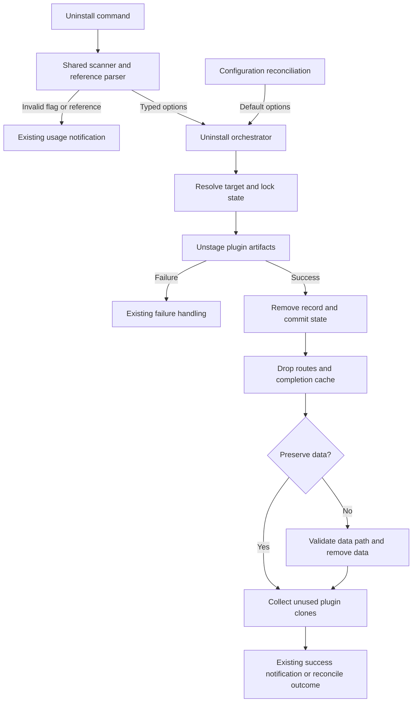

# Phase 02: Uninstall data disposition and the uninstall option seam - Research

**Researched:** 2026-09-14
**Domain:** Existing TypeScript command parsing and local uninstall lifecycle
**Confidence:** MEDIUM

<user_constraints>

## User Constraints (from CONTEXT.md)

The following decision text is copied verbatim from the phase context. [VERIFIED: .planning/phases/02-uninstall-data-disposition-and-the-uninstall-option-seam/02-CONTEXT.md]

<!-- DATA_r7T4b9Q2_START -->

### Output and help conventions

- **D-02-01:** Follow the existing option conventions for success output and
  help text. The user's instruction was: "keep output and help text in line
  with existing options". Preserve the current uninstall success format; do
  not introduce a separate retained-data report or path trailer.
- **D-02-02:** Add `--keep-data` to uninstall usage and completions using the
  same layout, concise descriptions, and flag-catalog conventions as existing
  options. Explain that the flag preserves plugin data. Document the default
  deletion behavior in the existing documentation style.

### Requirements already settled before this discussion

- **D-02-03:** `--keep-data` preserves the data directory and its contents;
  plugin artifacts and the installation record are still removed.
- **D-02-04:** Omitting the flag deletes data without confirmation. Reconcile
  takes this same default because it has no command line.
- **D-02-05:** Reject `--delete-data` and `-y` as unknown flags. Keep existing
  scope and write-target options. `--prune` belongs to Phase 5.
- **D-02-06:** Do not add cross-scope checks: data directories are already
  partitioned by scope. Retained-data garbage collection is outside this phase.

### Agent's Discretion

- Choose the smallest extension of existing option parsing and orchestration
  that gives Phase 5 a single place to add its uninstall option.
- Follow existing conventions for flag ordering, duplicate flags, errors,
  notifications, test structure, and documentation wording.
- Preserve existing post-commit cleanup failure behavior unless implementation
  uncovers a concrete conflict with DATA-01 through DATA-03.

### Deferred Ideas

- `--prune` remains Phase 5's responsibility.
- Garbage collection for data retained by `--keep-data` remains a follow-on.

### Reviewed Todos (not folded)

- `.planning/todos/pending/2026-09-02-detect-unused-code-and-type-members.md`
  matched generic planning words. It concerns a repository-wide unused-member
  gate and explicitly creates no work in this milestone; its prior deferred
  disposition remains in force.

<!-- DATA_r7T4b9Q2_END -->

</user_constraints>

## Summary

Extend the existing command scanner, flag catalog, and uninstall options bundle. Add an optional preservation boolean to the current options type and pass its effective value to post-commit cleanup. Guard only data deletion; completion-cache invalidation, hook routing updates, and clone collection must still run. The current orchestration already separates those effects and commits state before data cleanup. [VERIFIED: extensions/pi-claude-marketplace/orchestrators/plugin/uninstall.ts:131-168,438-495,721-788]

The main parsing defect to address is short-flag rejection. The scanner currently tests `tok.startsWith("--")`, while the positional schema reads only declared positions. Consequently, a trailing short flag can escape rejection. Explicitly cover the required rejected flag in both prefix and suffix positions. Preserve the scanner's treatment of scope values and duplicate booleans. [VERIFIED: extensions/pi-claude-marketplace/edge/handlers/shared.ts:49-81; extensions/pi-claude-marketplace/edge/args-schema.ts:75-95]

**Primary recommendation:** Keep one typed uninstall operation and one scanner path. Make preservation an opt-in property, so reconcile continues to use the default without introducing a separate policy.

## Architectural Responsibility Map

| Capability | Primary owner | Secondary owner | Planning direction and evidence |
|---|---|---|---|
| Flag recognition and usage errors | Command edge | Shared scanner | Extend the existing scan and reference-parse sequence. [VERIFIED: extensions/pi-claude-marketplace/edge/handlers/plugin/uninstall.ts:24-45] |
| Completion descriptions | Flag catalog | Completion provider | Use catalog entries; the drift guard compares emitted completions with that catalog. [VERIFIED: tests/architecture/flag-catalog-drift.test.ts:73-98] |
| Data disposition | Uninstall orchestrator | Persistence locations | Carry policy through the existing transaction's cleanup call. [VERIFIED: extensions/pi-claude-marketplace/orchestrators/plugin/uninstall.ts:460-495,788-788] |
| Config-driven uninstall | Reconcile orchestrator | Same uninstall operation | Continue calling the real uninstall operation with no preservation option. [VERIFIED: extensions/pi-claude-marketplace/orchestrators/reconcile/apply.ts:342-358] |
| Safe data path | Persistence | Shared path safety | Reuse safe-name and containment checks. [VERIFIED: extensions/pi-claude-marketplace/persistence/locations.ts:216-227] |

<phase_requirements>

## Phase Requirements

Descriptions below are copied from REQUIREMENTS.md. [VERIFIED: .planning/REQUIREMENTS.md]

| ID | Description | Research support |
|---|---|---|
| DATA-01 | `uninstall --keep-data` preserves the plugin's data directory. | Opt-in typed option; guard data cleanup; assert complete retained bytes and removed artifacts/record. |
| DATA-02 | `uninstall` without `--keep-data` deletes the data directory and does not prompt. | Omitted option follows current cleanup path; existing notify boundary requires no prompt interface. |
| DATA-03 | An uninstall driven by reconcile deletes the data directory, matching the promptless default, since it carries no command line. | Existing reconcile call omits the option; seed actual data in its uninstall case. |

The additional phase acceptance criterion covers usage, completion, and rejected flags. The final combined uninstall flag set remains Phase 5's responsibility. [VERIFIED: .planning/phases/02-uninstall-data-disposition-and-the-uninstall-option-seam/02-CONTEXT.md]

</phase_requirements>

## Project Constraints (from AGENTS.md)

- Use CodeGraph before searching or reading implementation code when the repository is indexed. The required CodeGraph exploration was run before implementation reads. [VERIFIED: AGENTS.md:1-13; research tool transcript]

Additional applicable project directives come from CLAUDE.md and the project skills:

- Read before editing; trace callers before changing a function. Stay inside the active GSD workflow. [VERIFIED: CLAUDE.md]
- Preserve atomic state/configuration writes, retry behavior, containment, and offline uninstall. Route user messages through the existing notification boundary. Do not introduce telemetry or localization work. [VERIFIED: CLAUDE.md]
- Keep strict TypeScript, named exports, relative TypeScript imports, documented public types, and cohesive dependencies. Avoid unrelated style churn or test-only exports. [VERIFIED: .agents/skills/typescript-google-style-review/SKILL.md]
- Use direct source-test ownership, independent expected values, real temporary files for filesystem behavior, and complete state/byte assertions. Each changed pair must reach full direct line, function, and branch coverage. Run the whole project gate. [VERIFIED: .agents/skills/typescript-unit-testing-review/SKILL.md]
- Commit only on a feature/release branch, with Conventional Commit titles and no phase references. Run pre-commit first; never skip all hooks or rewrite history. In a worktree use the documented trufflehog exception plus the orchestrator's filesystem scan. Coordinate exact research-file staging with the root agent. [VERIFIED: CLAUDE.md; orchestrator task instructions]
- Use plain documentation wording and preserve existing output grammar. No version bump or publishing work is part of this research. [VERIFIED: phase context; .agents/skills/simple-english/SKILL.md]

## Standard Stack

| Component | Existing declaration or observed version | Recommendation |
|---|---|---|
| Node runtime | `"node": ">=20.19.0"`; observed `v26.8.2` | Use the installed runtime for existing scripts. [VERIFIED: package.json:32-34; `node --version` probe] |
| TypeScript | `"typescript": "^6.0.3"` | Keep the current dependency and strict project setup. [VERIFIED: package.json:29-29] |
| Test runner | `node:test`; runtime `v26.8.2` | Extend existing paired tests. [VERIFIED: tests/orchestrators/plugin/uninstall.test.ts:1-6; runtime probe] |
| Assertions | `node:assert/strict` | Assert public outcomes and exact retained bytes. [VERIFIED: tests/orchestrators/plugin/uninstall.test.ts:1-2] |
| Filesystem removal | `rm` from `node:fs/promises` | Keep the existing guarded cleanup operation. [VERIFIED: extensions/pi-claude-marketplace/orchestrators/plugin/uninstall.ts:44-44,482-488] |

**Installation / Package Legitimacy Audit:** No package installation or upgrade is recommended. Registry freshness and package legitimacy checks are therefore not applicable; the table records existing declarations rather than recommended new package versions.

## Architecture Patterns



The diagram's preservation branch is the recommended change; the remaining flow is the existing orchestration. [VERIFIED: extensions/pi-claude-marketplace/orchestrators/plugin/uninstall.ts:573-844]

### Component responsibilities and recommended edits

| Existing component | Planned edit |
|---|---|
| `edge/handlers/shared.ts` | Extend the existing scanner to extract accepted extra booleans in one pass, while retaining existing callers' pass-through behavior. Keep scope-value handling ahead of flag detection. |
| `edge/handlers/plugin/uninstall.ts` | Use catalog-derived accepted extras; consume preservation before reference parsing; pass the typed property; update usage. |
| `edge/flag-catalog.ts` | Add preservation with parse/completion enabled and a concise imperative description. |
| `orchestrators/plugin/uninstall.ts` | Extend `UninstallPluginOptions`; pass policy through `runPostCommitCleanup`; guard only data-path resolution/removal. |
| `orchestrators/reconcile/apply.ts` | Prefer no production edit: default omission already expresses required behavior. Add direct consumer evidence in its owner test. |
| Existing docs | Describe preservation and default deletion near uninstall; preserve success bytes and the existing usage layout. |

These are proposed edits, not claims that the new property or flag already exists. Existing ownership is evidenced by the opened implementation files cited above.

### Rules for the option seam

Use an optional boolean on the existing uninstall options interface. Do not add an operation overload, command-specific uninstall implementation, or second cleanup strategy. Extend the shared scanner without changing unrelated handlers' semantics. Leave future pruning to a later property on the same operation options. [VERIFIED: phase context decisions D-02-03 through D-02-06; extensions/pi-claude-marketplace/orchestrators/plugin/uninstall.ts:131-168]

Keep data-path containment outside the removal-error catch when deletion is requested. When preservation is requested, skip the entire data-specific resolution/removal block: there is no data mutation to authorize, and unrelated cache/clone hygiene must still execute. This is a recommended implementation choice within the recorded discretion, not a new user policy. [VERIFIED: extensions/pi-claude-marketplace/orchestrators/plugin/uninstall.ts:477-494; phase context]

## Don't Hand-Roll

| Problem | Reuse | Reason |
|---|---|---|
| Accepted flag names and completions | Catalog derivations | Existing parser and completion contracts already share them. [VERIFIED: extensions/pi-claude-marketplace/edge/flag-catalog.ts:174-194] |
| Boolean scanning | Existing shared scanner | It already handles flag placement, duplicate booleans, and scope-value skipping. [VERIFIED: extensions/pi-claude-marketplace/edge/handlers/shared.ts:42-81] |
| Recursive data deletion | Existing removal call and locations method | They already separate containment refusal from tolerated cleanup failure. [VERIFIED: extensions/pi-claude-marketplace/orchestrators/plugin/uninstall.ts:477-488] |
| Persistence and uninstall reporting | Existing transaction and notification contracts | Reconcile consumes the same operation. [VERIFIED: extensions/pi-claude-marketplace/orchestrators/reconcile/apply.ts:342-381] |

## Runtime State Inventory

This small scanner/options refactor changes future behavior, not stored identifiers. Inventory scope is the inspected uninstall path; it is not a claim about unrelated machine services.

| Category | Items found / scope | Action |
|---|---|---|
| Stored data | Existing state, configuration, and plugin data. Data construction uses `const dataRoot = path.join(extensionRoot, "data");` and `const candidate = path.join(dataRoot, mp, plugin);`. [VERIFIED: extensions/pi-claude-marketplace/persistence/locations.ts:165-165,225-227] | No schema migration. Preserve or remove only the selected plugin data during future uninstalls. |
| Live service configuration | In-process hook routing and completion cache are updated after commit. [VERIFIED: extensions/pi-claude-marketplace/orchestrators/plugin/uninstall.ts:396-409,460-475,770-788] | Preserve those effects under both dispositions. No external service configuration is in the proposed edit set. |
| OS-registered state | None identified in the inspected call path; no OS registration is proposed. [VERIFIED: extensions/pi-claude-marketplace/orchestrators/plugin/uninstall.ts:573-844] | No re-registration task. |
| Secrets/env vars | Existing location selection honors `PI_CODING_AGENT_DIR`; its name is unchanged. [VERIFIED: extensions/pi-claude-marketplace/persistence/locations.ts:135-138] | No secret or environment migration. |
| Build artifacts / installed packages | Current test commands execute source TypeScript directly. [VERIFIED: package.json:84-99] | No package migration or new build step. Reload deployed extension code through the existing lifecycle. |

## Common Pitfalls

1. **Ignoring the short flag.** A scanner checking only long flags plus a schema ignoring extra positionals can silently accept the rejected short option. Test it before and after the reference, with a seeded installed record that must remain unchanged. [VERIFIED: extensions/pi-claude-marketplace/edge/handlers/shared.ts:69-81; extensions/pi-claude-marketplace/edge/args-schema.ts:75-95]
2. **Keeping all cleanup.** Guarding the whole cleanup call would leave stale completions and unused clones. Guard only data work. [VERIFIED: extensions/pi-claude-marketplace/orchestrators/plugin/uninstall.ts:460-495]
3. **Deleting before commit.** A refused cascade or save must retain data. Preserve the existing ordering and failure exits. [VERIFIED: extensions/pi-claude-marketplace/orchestrators/plugin/uninstall.ts:693-788]
4. **Missing a second flag pin.** Both the architecture drift table and the catalog owner currently assume uninstall has only the write-target flag. The exact quoted pin is `uninstall: ["--local"],`; the owner calls `completionFlagEntries("uninstall")` and expects one entry. Update both deliberately. [VERIFIED: tests/architecture/flag-catalog-drift.test.ts:112-125; tests/edge/flag-catalog.test.ts:95-112]
5. **Testing empty data.** Existing reconcile removal exercises state/artifacts but its case does not seed a persistent data file. Add distinct data bytes and inspect the data directory after the operation. [VERIFIED: tests/orchestrators/reconcile/apply.test.ts:1182-1277]
6. **Confusing future flag scope.** Do not advertise pruning now or add retained-data garbage collection. [VERIFIED: phase context D-02-05 and Deferred Ideas]

## Code Examples

Existing deletion boundary, quoted verbatim; retain it under the new preservation guard. [VERIFIED: extensions/pi-claude-marketplace/orchestrators/plugin/uninstall.ts:482-488]

<!-- DATA_k9N2p6V4_START -->

```typescript
const dataDir = await locations.pluginDataDir(marketplace, plugin);

try {
  await rm(dataDir, { recursive: true, force: true });
} catch {
  // D-19-01: hygienic cleanup never becomes the primary user-facing path.
}
```

<!-- DATA_k9N2p6V4_END -->

The existing reconcile call uses `notifications: { mode: "orchestrated" }`; preserve its omitted disposition so the same default applies. [VERIFIED: extensions/pi-claude-marketplace/orchestrators/reconcile/apply.ts:350-358]

## State of the Art

The current implementation deletes data unconditionally after commit. This phase adds the already-decided opt-out while leaving the default intact. No framework migration or dependency change is involved. [VERIFIED: extensions/pi-claude-marketplace/orchestrators/plugin/uninstall.ts:482-488; phase context]

## Environment Availability

| Dependency | Observation | Planning impact |
|---|---|---|
| Node | `v26.8.2` | Existing targeted suites execute. [VERIFIED: runtime probe] |
| npm | `11.19.1` | Existing package scripts available. [VERIFIED: runtime probe] |
| FIFO fixture subprocess | Sandboxed uninstall owner fails with `error: 'spawnSync mkfifo EPERM'`, `code: 'EPERM'`, at the concurrent-removal case. | Run the existing test outside the restricted sandbox; do not change product code or skip the case. [VERIFIED: /tmp/phase02-uninstall-noisolation.tap:152-169] |

No external service or package installation is required by the recommended change.

## Validation Architecture

Validation is enabled: `"nyquist_validation": true`. [VERIFIED: .planning/config.json:26-26]

### Test framework and commands

| Property | Value |
|---|---|
| Framework | Built-in Node test runner, observed runtime `v26.8.2`. [VERIFIED: runtime probe; tests/orchestrators/plugin/uninstall.test.ts:1-6] |
| Pair mapping | `const productionRoot = "extensions/pi-claude-marketplace";`, `const testRoot = "tests";`, and `return \`${testRoot}/${relativePath}.test.ts\`;`. [VERIFIED: scripts/test-coverage-direct.mjs:16-39] |
| Quick parser checks | `node --test tests/edge/handlers/shared.test.ts tests/edge/handlers/plugin/uninstall.test.ts tests/edge/flag-catalog.test.ts tests/architecture/flag-catalog-drift.test.ts` |
| Data lifecycle checks | `node --test tests/orchestrators/plugin/uninstall.test.ts tests/orchestrators/reconcile/apply.test.ts` |
| Direct pair gate | `npm run test:coverage:direct -- <changed-source-path>`; after shared contract/fake/harness changes, run `npm run test:coverage:direct:all`. [VERIFIED: package.json:90-93; testing skill] |
| Full gate | `npm run check` includes typecheck, lint, workflow-install guards, fallow, formatting, pairing guards, unit tests, and integration tests. [VERIFIED: package.json:76-76] |

The quick commands above are recommended invocations of the existing, opened test files. The six-file baseline completed in about 14 seconds; five file suites passed, and the uninstall owner hit the FIFO sandbox error. A diagnostic non-isolated uninstall run reported 60 passing cases and that one environment failure. The authorized run outside the sandbox then passed all 61 uninstall cases in about 4.2 seconds. No production change was needed. [VERIFIED: /tmp/phase02-baseline.tap; /tmp/phase02-uninstall-noisolation.tap; /tmp/phase02-uninstall-authorized.tap]

### Phase requirements → test map

| Requirement | Behavior to prove | Owner / test type | Command |
|---|---|---|---|
| DATA-01 | Preserve nested data bytes; remove artifacts, configuration entry, and install record; retain success output; still clear caches/routes and collect clones | Existing uninstall orchestrator owner; filesystem unit tests | `node --test tests/orchestrators/plugin/uninstall.test.ts` |
| DATA-01 | Flag reaches operation in either position, with scope/write-target flags; duplicate behavior follows existing booleans | Existing handler and scanner owners | Quick parser command above |
| DATA-02 | Omitted and explicit-false option delete non-empty data without prompting; missing data is harmless; failed uninstall does not delete data | Existing uninstall orchestrator owner | Data lifecycle command above |
| DATA-03 | Dropping a plugin declaration deletes seeded data and record; next reconcile is silent | Existing reconcile apply owner; consumer integration through real uninstall | `node --test tests/orchestrators/reconcile/apply.test.ts` |
| Phase criterion | Usage and completion show preservation; disallowed long/short flags and premature pruning reject without mutation; exact catalog pin remains strict | Catalog owner, drift guard, handler owner | Quick parser command above |

### Sampling and Wave 0 gaps

- Per task: changed owner suites and direct pair coverage. Per completed wave: full project gate. Phase completion requires the full gate to pass. [VERIFIED: CLAUDE.md; testing skill]
- No new framework or standalone test file is required by the recommended structure. Extend existing owners rather than create cross-module duplicates. Add the disposition cases and reconcile data fixture before declaring requirements covered. [VERIFIED: opened test owners; testing skill]
- Preserve existing containment-failure and cleanup-leak tests. Keep full output comparisons; do not add success trailers. [VERIFIED: tests/orchestrators/plugin/uninstall.test.ts:372-495; phase context D-02-01]

## Security Domain

Use ASVS 5.0 category names, not the older numbering in generic templates. OWASP identifies V2 as Validation and Business Logic, V5 as File Handling, V6 as Authentication, V7 as Session Management, V8 as Authorization, and V11 as Cryptography. [CITED: https://cheatsheetseries.owasp.org/IndexASVS.html]

| Category | Applicability to this change | Control |
|---|---|---|
| V2 Validation and Business Logic | Yes | Reject unsupported flag tokens before any uninstall work; preserve scope parsing. [VERIFIED: extensions/pi-claude-marketplace/edge/handlers/shared.ts:49-81] |
| V5 File Handling | Yes | Keep safe-name and symlink/containment checks before deletion. [VERIFIED: extensions/pi-claude-marketplace/persistence/locations.ts:216-227] |
| V8 Authorization | Local scope boundary only | Reuse current target resolution; do not introduce another cross-scope data lookup. [VERIFIED: extensions/pi-claude-marketplace/orchestrators/plugin/uninstall.ts:583-625; phase context] |
| V6 Authentication, V7 Session Management, V11 Cryptography | No new control surface in this feature | The proposed change is local flag parsing and cleanup policy; preserve the offline operation. [VERIFIED: phase scope; extensions/pi-claude-marketplace/orchestrators/plugin/uninstall.ts:28-30] |

Relevant threats are unintended deletion from accepted garbage arguments, tampering through unsafe paths, and stale runtime state if preservation bypasses all cleanup. Mitigate them with explicit rejection tests, the existing containment boundary, and observable cache/routing/clone behavior under preservation. [VERIFIED: cited parser, cleanup, and location implementations]

OWASP's file-storage guidance requires trusted path inputs or strict validation of supplied names. This supports retaining the existing path-safety helpers; it does not require a new library or a compliance certification claim. [CITED: https://cornucopia.owasp.org/taxonomy/asvs-5.0/05-file-handling/03-file-storage]

## Assumptions Log

No unverified package, external compatibility, or policy assumption is needed for this phase. Proposed implementation choices are explicitly recommendations within the recorded discretion. The FIFO restriction is observed failing output, not an inferred runtime incompatibility.

## Open Questions

No product decision is missing. The planner should select the smallest scanner API extension that preserves existing pass-through callers, then cover it in the scanner's own tests. The only environment issue found is the sandbox restriction on the existing FIFO fixture.

## Sources

- Current repository implementation, paired tests, package scripts, CLAUDE.md, AGENTS.md, and project skills: opened during this research; inline citations locate the relevant claims.
- Phase context, requirements, state, roadmap, backlog, architecture/conventions, output catalog, and messaging guide: local planning and output contracts.
- [OWASP ASVS index](https://cheatsheetseries.owasp.org/IndexASVS.html): category names.
- [OWASP file storage requirements](https://cornucopia.owasp.org/taxonomy/asvs-5.0/05-file-handling/03-file-storage): path input validation.

## Metadata

- Research-plan seam selected websearch for the sole external question, ASVS taxonomy. The digest was stored through research-store.
- The confidence seam returned MEDIUM for verified websearch. It returns LOW for unrecognized local-provider labels; those responses were not treated as evidence that directly opened repository source is uncertain. Overall confidence is conservatively MEDIUM; local claims carry explicit primary-source evidence.
- Standard stack: existing dependencies only. Architecture: current call paths and cleanup boundary read directly. Pitfalls: parser composition and exact test pins inspected, relevant baseline executed.
- Valid until the uninstall/scanner contracts change; recheck immediately if Phase 5 lands first.
- Research file commit is coordinated by the root orchestrator, which owns transition metadata and exact-path staging.
