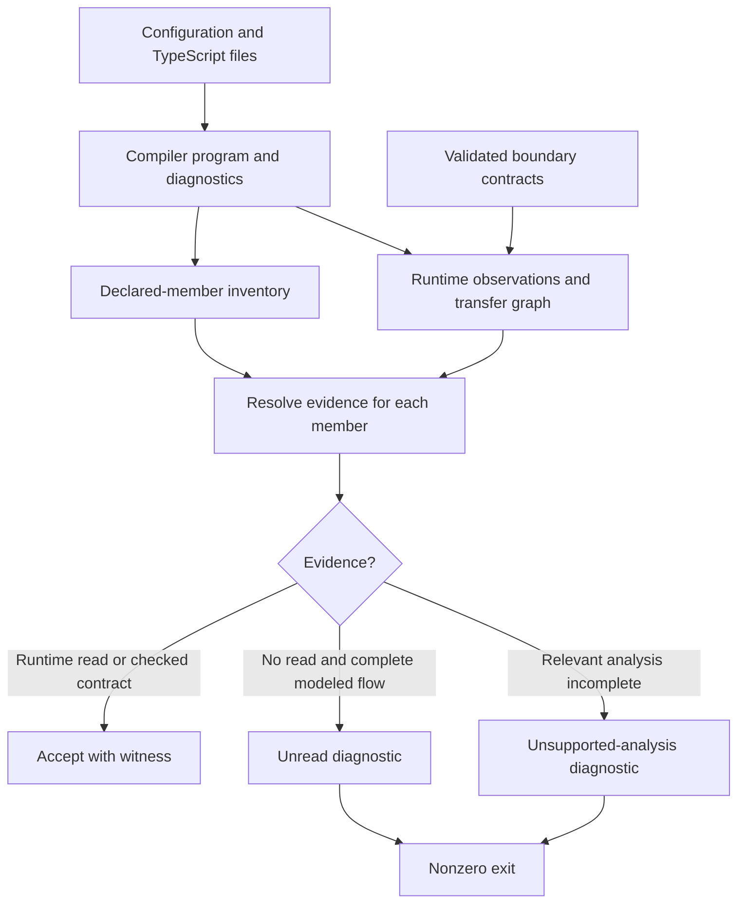

# Phase 6: Unused Type Member Gate — Research

**Researched:** 2026-09-14
**Domain:** TypeScript static analysis of runtime member observations
**Confidence:** MEDIUM — compiler primitives and counterexamples were measured; the complete analyzer remains implementation work.

<user_constraints>
## User Constraints

There is no phase CONTEXT document. The current orchestration instructions establish these constraints:

- Detect the planted `readonly neverReadAnywhere?: string` member on `EdgeDeps` with an automated static gate.
- Count actual runtime reads outside the declaration, including genuine reads in checked production and tests. Report reads found only in tests separately. Production-only export ownership belongs to Phase 5.
- Reject declaration references, type-only references, and declaration-enumeration tautologies as substitutes for useful consumers. Do not add tests merely to make unread declarations appear used.
- Exercise offender and benign controls through the executable gate. Cover read, write-only, structural, external-contract, type-only, alias, and computed-access behavior.
- Preserve 100% aggregate production unit coverage, direct-pair requirements, and assertion strength. Do not use broad production exclusions.
- Research the actual candidate population. Phase 5 changes exports and ownership; do not freeze today's counts as a baseline allowance.
- This research task owns this document and temporary probes only. The orchestrator owns committing it.

These are direct instructions, not assumptions. The todo's historical deferrals do not override its promotion into the current milestone.
</user_constraints>

<phase_requirements>
## Phase Requirements

| ID | Description | Research support |
|---|---|---|
| MEMBER-01 | Add a static gate that detects unused interface/type members, including an unread optional EdgeDeps member. | Declaration inventory, runtime classifier, structural propagation, exact plant. |
| MEMBER-02 | Validate read-site analysis with offender and benign controls and document justified external/structural contracts. | Control matrix, explicit boundary contracts, unknown-analysis failures, live-tree classification. |

Descriptions above are verbatim. [VERIFIED: .planning/REQUIREMENTS.md:27-28]
</phase_requirements>

## Summary

Use the installed TypeScript compiler API to build one checked program, collect declared members, and trace runtime observations back to those declarations. Keep an evidence path for each accepted member. The language-service shortcut is wrong: indexed access inside a type alias is reported as a non-write, destructuring is reported as a write, and object spread has no individual member reference. These counterexamples were reproduced against the installed compiler. [VERIFIED: /tmp/member-ls-probe.cjs execution; output under Code Examples]

The actual tree needs more than property-access scanning. The latest broad prototype run found **3,462 declarations including the plant**, **3,234 with a modeled observation**, **228 unresolved**, and **270 observed only by tests**. These are research measurements, not a defect list or allowed debt. Earlier runs differed as the model and shared tree changed. The prototype lacks complete nested structural flows, context classification, and precise bulk-operation rules; it is not suitable for installation as the gate. [VERIFIED: /tmp/member-gate-allreads.json:1-16, `"candidates": 3462`, `"read": 3234`, `"unread": 228`; Node count of its testOnly array returned `270`]

**Primary recommendation:** implement bounded member-observation analysis with explicit boundary summaries, then resolve every unexplained live-tree diagnostic before making the gate mandatory. Do not ship the reference-count sketch or suppress its output wholesale.

## Architectural Responsibility Map

Recommended design, using the compiler's separation of program, syntax trees, and checker. [CITED: https://github.com/microsoft/TypeScript/wiki/Using-the-Compiler-API]

| Capability | Primary tier | Secondary tier | Rationale |
|---|---|---|---|
| Load files and resolve symbols | Local static-analysis CLI | Installed compiler | Match the project's typecheck resolution. |
| Classify observations and transfers | Analyzer core | Compiler checker | Syntax identifies the operation; symbols identify the member. |
| Explain external consumers | Validated contract data and function summaries | Installed peer declarations | A dependency's consumers can be outside the checked sources. |
| Enforce failure | npm check, pre-commit, CI | CLI exit status | One implementation must control all verdicts. |
| Prove sensitivity | Hermetic fixtures and isolated project overlay | Executable CLI | Distinguish the intended violation from unrelated failures. |

## Project Constraints (from AGENTS.md)

- Use CodeGraph before grep/source reads to understand or locate code when its index exists. Either MCP exploration or its shell command is acceptable. Skip it if unindexed; do not create an index. This research used MCP exploration first. [VERIFIED: AGENTS.md:4-9]
- Read a file and trace callers before changing it; stay inside the GSD workflow. [VERIFIED: CLAUDE.md:7; CLAUDE.md, GSD Workflow Enforcement section]
- Never commit on main, rewrite history, or bypass hooks. Run pre-commit successfully before committing. Apply the worktree trufflehog override when applicable. Commit/PR titles follow Conventional Commits without phase terminology. [VERIFIED: CLAUDE.md:11-19]
- Keep strict TypeScript and existing quality checks. Compiler settings include `"strict": true`, `"noUnusedLocals": true`, `"noUnusedParameters": true`, `"noUncheckedIndexedAccess": true`, and `"exactOptionalPropertyTypes": true`. [VERIFIED: tsconfig.json:3-18]
- Use existing Node tests and strict assertions. Preserve independently built expected values, whole-result assertions, temporary-file isolation, cleanup, and coverage. Type-only paired tests need no artificial runtime cases. [VERIFIED: .agents/skills/typescript-unit-testing-review/SKILL.md:18-26,44-49,87-90,105-107]
- Apply the project TypeScript style and unit-testing skills during implementation, and plain-English/humanizer guidance to documentation. [VERIFIED: CLAUDE.md, Project Skills table]

Product disk-write, network, reload, notification, and security contracts remain binding if triage changes production code. Prefer correcting the analyzer over unrelated source edits. This is a scope recommendation.

## Standard Stack

| Component | Verified version/evidence | Purpose |
|---|---|---|
| Existing TypeScript | Installed `"version": "6.0.3"`; project declares `"typescript": "^6.0.3"`. [VERIFIED: node_modules/typescript/package.json:2-5; package.json:29] | AST, symbols, types, signatures, module resolution. |
| Existing Node | Runtime probe returned `v26.8.2`; CI selects `node-version: "24"`. [VERIFIED: runtime probe; .github/workflows/ci.yml:70-76] | CLI and test runner; validate on CI's selected version. |
| Existing Node test/assert APIs | `node:test`, `node:assert/strict`. [VERIFIED: .agents/skills/typescript-unit-testing-review/SKILL.md:18-19] | Focused fixtures and exact CLI outcomes. |

**Installation:** none. Reuse locked dependencies. The registry freshness probe failed with `EAI_AGAIN` for `registry.npmjs.org`; no latest-version or publication-date claim is made. Existing compiler source and current official documentation were sufficient. [VERIFIED: `npm view typescript version time.6.0.3 --json --fetch-retries=0 --fetch-timeout=10000` output]

### Package Legitimacy Audit

Not applicable: no new external package is needed. Do not introduce another parser/compiler wrapper or an unverified unused-member package.

### Alternatives considered

| Approach | Useful property | Decision |
|---|---|---|
| Language-service references | Good symbol-aware navigation | Optional supporting evidence; its write flag cannot determine runtime reads. [VERIFIED: /tmp/member-ls-probe.cjs execution] |
| ESLint rule with parser services | Familiar reporting | Prefer a dedicated CLI for whole-program flows, contracts, and overlays. Architectural recommendation. |
| Coverage or shape tests | Verify executable behavior/legal shapes | Keep their existing role. An added erased optional declaration does not introduce an executable read. [VERIFIED: compiler-host plant, /tmp/member-gate-allreads.json:10-16] |

## Architecture Patterns

### Data flow



This is the proposed architecture, not an existing implementation.

### Proposed file responsibilities

Use a CLI, analyzer core, operation/flow helper module if complexity warrants it, validated contract data, a paired script test, and an executable negative runner. Suggested **new** paths are `scripts/check-unused-type-members.mjs`, `scripts/check-unused-type-members.analysis.mjs`, `scripts/check-unused-type-members.contracts.json`, `tests/scripts/check-unused-type-members.test.ts`, and `scripts/check-unused-type-members.negative.mjs`. These paths are recommendations, not claims that files exist. Split by responsibility, not one helper per file.

### 1. Inventory declaration identity, not export visibility

Enumerate all non-declaration production source files independently of exports. Include named interface members, object types in aliases, nested records/arrays, method signatures, and anonymous parameter/return shapes. Tests provide observations; test-local interfaces are not production candidates. Current configured roots are `"include": ["extensions/**/*.ts", "tests/**/*.ts"]`. [VERIFIED: tsconfig.json:20]

Record each declaration's source span, enclosing owner, property key, optionality, category, and symbol. Resolve aliases and instantiated/mapped properties through root declarations; deliberately merge declaration-merged identities. The public checker provides `getRootSymbols(symbol: Symbol): readonly Symbol[];`, `getMergedSymbol(symbol: Symbol): Symbol;`, and `getAliasedSymbol(symbol: Symbol): Symbol;`. [VERIFIED: node_modules/typescript/lib/typescript.d.ts:6261,6275-6279]

Distinguish an object-shape declaration from a type-selection pattern. The existing `Extract<Msg, { status: K }>` filters another type; it does not define an independently constructed runtime object. Associate refinements with original members, without letting the filter count as a read. Record synthetic filters and brands explicitly rather than silently skipping all aliases/computed keys/private types. [VERIFIED: extensions/pi-claude-marketplace/shared/notify-context.ts:59-64, verbatim `Extract<Msg, { status: K }>`]

### 2. Classify runtime operations before reference flags

The following is the required implementation contract. Runtime operations are grounded in ECMAScript; type-only operations in the TypeScript handbook. Ambiguous-policy recommendations are labeled. [CITED: https://tc39.es/ecma262/multipage/abstract-operations.html#sec-copydataproperties] [CITED: https://www.typescriptlang.org/docs/handbook/2/indexed-access-types.html]

| Construct | Treatment |
|---|---|
| Dot, optional-chain, literal element access | Read unless the access itself is a write-only target. Match exact receiver property identity. |
| Simple member assignment | Write only. Still visit receiver/key expressions: assigning a nested member reads the intermediate object. |
| Compound/logical assignment, increment/decrement | Read and write. Retain the read of the old value. |
| Delete or for-in/for-of assignment target | No value read of the removed/assigned member; receiver/key evaluation still counts independently. |
| Object property initialization/shorthand | Destination property is written. Reading the shorthand's source variable does not prove destination consumption. |
| Destructuring binding, rename, default, nesting | Resolve the source object's member and count that read; local binding writes are irrelevant. Visit default expressions separately. |
| Destructuring assignment | Handle its assignment-pattern AST separately. Public APIs include `getPropertySymbolOfDestructuringAssignment` and `getTypeOfAssignmentPattern`. [VERIFIED: node_modules/typescript/lib/typescript.d.ts:6251-6252] |
| Spread/rest | Read eligible own enumerable source values. Rest excludes named keys from copying; named bindings have their own reads. Copying counts even if the new object is later unused: this gate checks observations, not usefulness. |
| Indexed-access types, keyof, mapped/conditional types, imports/types, type queries | No runtime read. Distinguish runtime typeof from a type-query AST. Traverse the value operand of as/satisfies, not their type operand. |
| Finite computed key union or unique symbol | Resolve exact eligible keys against receiver provenance. Never accept a same-named unrelated member. |
| Unbounded key, reflection, or identity-erasing cast | Preserve candidate provenance and report targeted unsupported analysis unless a validated summary resolves it. Never credit every candidate. |
| Exact existence check | Recommended policy: accept an exact in/own-property test as a separately reported presence observation. It consumes optional-member presence. Unbounded key enumeration alone is not a per-member consumer. |
| Identity comparison, passing to an unknown function | No automatic property read. Escape alone does not prove consumption. |

Do not assume interface properties are all own/enumerable. Trace local record construction; preserve uncertainty for class instances, accessors, proxies, and unknown external objects. Spread is shallow; JSON serialization and deep comparison have different traversal rules. [CITED: https://tc39.es/ecma262/multipage/abstract-operations.html#sec-copydataproperties] [CITED: https://nodejs.org/api/assert.html#assertdeepstrictequalactual-expected-message]

### 3. Propagate along actual value transfers

TypeScript structural compatibility does not establish that a value ever transfers between two types. Add directed property edges only at actual runtime transfer sites. A destination member read can witness its corresponding source member; unmatched source siblings stay unread. Record both the transfer and final observation locations. [CITED: https://www.typescriptlang.org/docs/handbook/type-compatibility.html]

Required transfers:

- Annotated initialization, assignments, returns, conditionals, object fields, array/tuple elements, destructuring results, aliases, and contextual object types.
- Resolved call arguments to implementation parameters, including optional/rest arguments and generic instantiations.
- Callback registration/assignment: interface argument objects flow into implementation parameters; callback results flow outward. Parameter and return flows run in opposite directions.
- Nested paths and the known containers this project uses: arrays, readonly arrays, tuples, Promise fulfillment, and Map/WeakMap values with get/set/iteration.
- Intersections, refinements, mapped types, and satisfies must retain original declaration lineage.

Keep intermediate inferred expression/binding properties even when they are not candidates. Candidate-to-candidate-only graphs lose paths through anonymous records and wrappers. Use value origin plus property path where needed, not global structural equivalence. Match keys only within an evidenced transfer.

Use compiler resolution rather than rebuilding assignability. The public checker exposes `getTypeAtLocation(node: Node): Type;`, `getContextualType(node: Expression): Type | undefined;`, and resolved call signatures. [VERIFIED: node_modules/typescript/lib/typescript.d.ts:6253,6263-6269]

### 4. Model real whole-object consumers

Use symbol-identified operation summaries specifying argument positions, shallow/recursive behavior, eligible keys, and relevant options. A local function merely named stringify/deepStrictEqual must not inherit built-in behavior.

- JSON serialization needs its actual replacer/toJSON/symbol semantics; unsupported cases get a targeted refusal, not unconditional deep credit. [CITED: https://tc39.es/ecma262/multipage/structured-data.html#sec-json.stringify]
- Object values/entries and assign source operands read values; assign's target differs. Keys-only enumeration does not read values. [CITED: https://tc39.es/ecma262/multipage/abstract-operations.html#sec-enumerableownproperties]
- Node deep strict comparisons can supply genuine test reads of returned records. Identity assertions do not. Preserve independently authored expected results. [CITED: https://nodejs.org/api/assert.html#assertdeepstrictequalactual-expected-message] [VERIFIED: .agents/skills/typescript-unit-testing-review/SKILL.md:44-49]
- Unknown-typed local wrappers must preserve caller provenance. The existing `serializeWithTruncation(payload: unknown)` calls `JSON.stringify(payload)`; `atomicWriteJson(filePath: string, value: unknown)` serializes its second argument. Derive these summaries from bodies or validate exact summaries against those bodies. [VERIFIED: extensions/pi-claude-marketplace/bridges/hooks/spawn-helpers.ts:66-67; extensions/pi-claude-marketplace/shared/atomic-json.ts:24-26]

Prefer one validated operation summary over hundreds of serialization exemptions. A control that changes the summarized function into a non-reader must invalidate the summary.

Do not confuse runtime-read detection with general assertion-quality analysis. A type/declaration enumeration has no candidate value-read witness and must not satisfy this gate. An arbitrary bad test that performs a real property read cannot always be distinguished from a useful test by this analysis alone; the project test-review rules remain the authority for rejecting that tautology. For modeled deep-test sinks, track the actual production-derived value being compared instead of crediting a freshly constructed typed expected literal as evidence of production consumption. The research inventory's simplified deep-sink model does not yet enforce this distinction, so its accepted count is provisional too.

### 5. Precise external/type-system contracts

Each exceptional member needs its exact declaration, purpose, boundary site, upstream evidence or type-system rationale, and drift validation. Reject wildcards, missing targets, duplicates, stale entries, unknown schema keys, and exemptions superseded by ordinary reads. A new unread sibling must still fail.

| Researched case | Evidence and disposition |
|---|---|
| Pi tool-result output | Local `content?: PiTextContentBlock[];`, `details?: unknown;`, `isError?: boolean;` mirror upstream slots. Upstream also has `usage?: Usage;`; do not add/exempt extra local fields automatically. Require an evidenced handler-return path. [VERIFIED: extensions/pi-claude-marketplace/platform/pi-api.ts:84-87; node_modules/@earendil-works/pi-coding-agent/dist/core/extensions/types.d.ts:835-839] |
| Pi resource-discovery output | Local/upstream slots are `skillPaths?: string[];`, `promptPaths?: string[];`, `themePaths?: string[];`. Validate the actual callback-return boundary; registration currently passes through an asserted bound function signature. [VERIFIED: extensions/pi-claude-marketplace/platform/pi-api.ts:96-99; node_modules/@earendil-works/pi-coding-agent/dist/core/extensions/types.d.ts:410-413; extensions/pi-claude-marketplace/index.ts:42-48] |
| Pi resource-discovery input | Local/upstream `type: "resources_discover";` and `reason: "startup" | "reload";` match. Upstream existence does not prove local necessity: narrow unused input mirrors if the callback contract permits, or document the exact required reason. No blanket external-input exemption. [VERIFIED: extensions/pi-claude-marketplace/platform/pi-api.ts:90-93; node_modules/@earendil-works/pi-coding-agent/dist/core/extensions/types.d.ts:404-407] |
| Hook stdin output | The PreToolUse translator declares/constructs `session_id`, `transcript_path`, `cwd`, `hook_event_name`, `tool_name`, and `tool_input`. Prefer tracing them into the serializer over exempting payload files. [VERIFIED: extensions/pi-claude-marketplace/bridges/hooks/payloads/pre-tool-use.ts:19-35; names quoted verbatim] |
| Pi tool details | Marketplace listing builds a record array then returns `details: { marketplaces }`. Model that particular output boundary and nested paths, not every exported result type. [VERIFIED: extensions/pi-claude-marketplace/edge/handlers/tools.ts:98-119] |
| Primitive nominal brand | `string & { readonly [__absolutePluginRootBrand]: never }` uses an ambient `unique symbol` and is documented as an underlying runtime string. Preserve that exact type-system marker. [VERIFIED: extensions/pi-claude-marketplace/domain/plugin-root.ts:16-23] |
| Object brand | `readonly [SCOPED_LOCATIONS_BRAND]: true;` prevents mixed scopes. Validate it as a brand contract without exempting ordinary siblings. [VERIFIED: extensions/pi-claude-marketplace/persistence/locations.ts:27-39] |

This table provides evidence and handling rules, not a blanket approved exemption list. Resolve exact symbols and boundary calls again after Phase 5.

### 6. Fail closed on relevant analysis gaps

Recommended result categories: runtime-observed, test-only-observed, explicit-contract, unread, and unsupported-analysis. These are proposed categories, not existing enums. The last two fail the normal CLI.

Fail on malformed/missing configuration, unresolved compiler inputs, empty production/candidate inventory, invalid contracts, candidate-relevant unknown escapes, and exhausted analysis budgets. Report the affected member and transfer. Never silently classify a cutoff as success. Dynamic code with no candidate provenance must not create thousands of unrelated failures.

A separately proven direct observation settles that member's existence predicate even if another path is opaque. Unknown paths matter when they prevent a verdict on a member lacking another witness.

This is bounded may-observe analysis. It does not prove that a branch executes or the value influences useful behavior. Coverage, dead-code analysis, and assertion review remain necessary. Do not claim sound/complete handling of arbitrary TypeScript, reflection, unchecked casts, or external programs; TypeScript itself documents deliberately unsound compatibility rules. [CITED: https://www.typescriptlang.org/docs/handbook/type-compatibility.html]

## Live Candidate Population

The final research scan used the real compiler configuration and injected the optional member only through its compiler host. It did not modify production files. Latest output:

<!-- DATA_52f81ce9_START -->
```text
production files: 234
candidate declarations: 3462 (includes the one plant)
modeled observations: 3234
unresolved: 228
observed only in tests: 270
EdgeDeps.neverReadAnywhere: production reads 0, test reads 0
EdgeDeps.completionCache: production reads present
EdgeDeps.gitOps: production reads present
EdgeDeps.pluginUpdate: production reads present
EdgeDeps.importClaudeSettings: production reads present
```
<!-- DATA_52f81ce9_END -->

[VERIFIED: /tmp/member-gate-allreads.json:1-16 and recorded member/read arrays]

Current declared member names are `completionCache`, `gitOps`, `pluginUpdate`, and `importClaudeSettings`. Their complete declarations were opened, and the scan matched their declaration identities. [VERIFIED: extensions/pi-claude-marketplace/edge/types.ts:24-30]

| Remaining group | Concrete evidence | Implementation work |
|---|---|---|
| Filters/refinements | `Extract<Msg, { status: K }>` and `Extract<AgentsReplacement, { kind: "replaced" }>` are present. [VERIFIED: extensions/pi-claude-marketplace/shared/notify-context.ts:59-64; extensions/pi-claude-marketplace/bridges/agents/stage.ts:74-76] | Classify selection patterns without crediting source-member reads. |
| Nested array/WeakMap state | Replacement internals contain `backups: readonly { name: string; from: string; to: string }[];` and `renamed: readonly { from: string; to: string }[];`, then a WeakMap. [VERIFIED: extensions/pi-claude-marketplace/bridges/agents/stage.ts:67-76] | Trace nested paths and container operations; no exemptions for staging modules. |
| Callback parameter objects | Prototype unresolved rows include separately declared callback parameter shapes. [VERIFIED: /tmp/member-gate-allreads.json, unresolved rows] | Connect callable parameter/return flow, including anonymous shapes. |
| Output records | Specific Pi details and serialized envelopes have actual boundaries. [VERIFIED: extensions/pi-claude-marketplace/edge/handlers/tools.ts:117-119; extensions/pi-claude-marketplace/bridges/hooks/spawn-helpers.ts:66-67] | Finish symbol-checked summaries and nested provenance. |
| Legitimate test reads | The compiled-glob test calls production, reads returned metadata, and compares independently specified tokens/flags. [VERIFIED: tests/bridges/hooks/if-field/glob.test.ts:11-49] | Count these observations and retain the assertions; report test-only status. |

The prototype must not be copied verbatim. It has incomplete edges, simplified rest/enumerability rules, text-based sink recognition, missing assignment-destructuring support, and a recursion cutoff. Synthetic controls expose these omissions. They are research limitations, not acceptable final behavior. [VERIFIED: /tmp/member-gate-probe.cjs; /tmp/member-gate-controls.json]

After Phase 5, regenerate the full machine-readable inventory. Resolve every row as a proven read, narrow justified contract, genuine unread declaration removed without weakening assertions, or analyzer gap fixed with a regression control. Completion requires **zero unexplained/unsupported rows**, not today's count. Routine implementation decisions need no user checkpoint. Escalate only a substantive product-contract conflict that source evidence cannot settle.

## Don't Hand-Roll

| Problem | Avoid | Use |
|---|---|---|
| Resolution/assignability | Regex resolver or custom type system | Existing compiler/checker. [CITED: https://github.com/microsoft/TypeScript/wiki/Using-the-Compiler-API] |
| Member identity | Global same-name matching | Symbols/root declarations plus actual transfers. [VERIFIED: node_modules/typescript/lib/typescript.d.ts:6261-6279] |
| External consumption | Wildcard export/file exemptions | Validated boundary contracts and summaries; design above. |
| Gate sensitivity | Source assertions that a script mentions the plant | Executable controls with independently specified verdicts. [VERIFIED: scripts/check-corresponding-tests.negative.mjs:55-75] |

## Common Pitfalls

1. **Reference flags replace semantics:** the measured type-only/destructuring/spread examples disprove this shortcut. [VERIFIED: /tmp/member-ls-probe.cjs execution]
2. **Tests become candidates or stop being observations:** separate inventory roots from reader roots; add controls for a genuine test-only reader and an unrelated test-local declaration. Recommended check.
3. **Structural transfer accepts every source member:** only observed destination keys propagate. The synthetic unused sibling stays unread despite an unrelated same-name read. [VERIFIED: /tmp/member-controls/extensions/cases.ts:24-29; /tmp/member-gate-controls.json]
4. **Bulk operations all become deep reads:** copying, serialization, deep comparison, key enumeration, and identity comparison differ. [CITED: https://tc39.es/ecma262/multipage/abstract-operations.html] [CITED: https://nodejs.org/api/assert.html#assertdeepstrictequalactual-expected-message]
5. **Unknowns become exclusions:** keep analysis gaps distinct from defects; finish live-tree classification before enabling enforcement. Recommended policy.
6. **Standard-library expansion dominates runtime:** the prototype performed millions of unnecessary property comparisons. Cache symbols/types/type-pairs; prune primitive and unrelated library graphs; index properties by key; use cycle-aware worklists. Do not descend through every built-in method. [VERIFIED: /tmp/member-gate-allreads.json:8, latest `"pairs": 2081504`]
7. **Negative control fails for the wrong reason:** assert exact member/category/location and expected exit, reject compiler/setup failures, and run clean/benign controls. An always-pass analyzer must make the negative runner fail. Recommended acceptance criteria.

## Code Examples

### Measured language-service counterexamples

Observed against the installed compiler. [VERIFIED: /tmp/member-ls-probe.cjs execution]

<!-- DATA_98ca31f6_START -->
```text
Cases['typeOnly'] in a type alias:
  isDefinition: false, isWriteAccess: false
const {destructured, renamed: local} = a:
  destructured isDefinition: false, isWriteAccess: true
{...x} where x: Spread:
  Spread.spreadRead has only its declaration reference
({assigned} = x):
  assigned isDefinition: false, isWriteAccess: true
```
<!-- DATA_98ca31f6_END -->

### Structural control

This executed fixture made the source used member observed and kept its unused sibling unread. Names below are verbatim fixture declarations. [VERIFIED: /tmp/member-controls/extensions/cases.ts:24-29]

<!-- DATA_f62a108c_START -->
```typescript
export interface Source {used: string;unused?: string;}
export interface Destination {used: string;}
export function receive(b:Destination) {return b.used;}
export function send(a:Source) {return receive(a);}
export interface Unrelated {unused?: string;}
export function unrelated(x:Unrelated) {return x.unused;}
```
<!-- DATA_f62a108c_END -->

### Executable control harness

Run the real CLI against an isolated root or compiler-host overlay. Baseline and plant differ only in the optional member. Add a real consumer only inside the benign fixture. Assert exact diagnostic identity/category/location and nonzero offender exit, then benign success. Build expectations independently. Never plant in the shared tree or infer success merely from a nonzero subprocess exit. This follows existing controls and assertion rules. [VERIFIED: scripts/check-corresponding-tests.negative.mjs:55-75; .agents/skills/typescript-unit-testing-review/SKILL.md:44-49,107]

Temporary artifacts: `/tmp/member-gate-probe.cjs`, `/tmp/member-ls-probe.cjs`, `/tmp/member-controls`, and their JSON reports. They are discovery artifacts, not production dependencies. Committed controls must preserve the decisive evidence because temporary files are not durable deliverables.

## State of the Art

The official compiler-API wiki was updated on 2026-08-17 and says its examples cover TypeScript 6.0 and earlier, with a future API change. Keep the repository's locked compiler; rerun the entire control matrix on major compiler upgrades. No upgrade is needed for this phase. [CITED: https://github.com/microsoft/TypeScript/wiki/Using-the-Compiler-API]

The historical plant passed typecheck/lint/Fallow. This research independently measured no reads for the compiler-host plant; it did not rerun historical lint/Fallow mutations in the shared tree. [VERIFIED: .planning/todos/pending/2026-09-02-detect-unused-code-and-type-members.md, measurement table; /tmp/member-gate-allreads.json:10-16]

## Environment Availability

| Dependency | Available | Evidence/fallback |
|---|---|---|
| Node | Yes | `v26.8.2` version probe. |
| TypeScript | Yes | Installed `"version": "6.0.3"`; compiler probes succeeded. [VERIFIED: node_modules/typescript/package.json:5] |
| npm | Yes | `11.19.1` version probe; no installation needed. |
| CodeGraph | Yes | Initial MCP exploration returned source and callers. |
| Context7 MCP/CLI | Not available to this agent | Tool/command discovery; used official web sources and installed compiler declarations. |
| npm registry network | Probe failed | `EAI_AGAIN`; does not block using existing dependencies. |

The research-plan seam selected Context7/Jina. Available-tool fallback used built-in web search/open against official sources. `classify-confidence --provider websearch --verified` returned `MEDIUM`. Digests were cached through the research-store seam in a temporary working directory, honoring this agent's write scope. These are session observations, not deployment requirements.

## Validation Architecture

Validation is enabled: `"nyquist_validation": true`. [VERIFIED: .planning/config.json:21]

### Framework and commands

Use the existing Node test runner. The current aggregate test script includes script tests; CI executes `npm run check`. [VERIFIED: package.json:84; .github/workflows/ci.yml:78-80]

Proposed quick command: `node --test tests/scripts/check-unused-type-members.test.ts`.
Proposed gate: `node scripts/check-unused-type-members.mjs`.
Proposed executable controls: `node scripts/check-unused-type-members.negative.mjs`.
These are new command paths to implement.

Add aliases and both gate/control commands to the mandatory npm pipeline. Add a pre-commit trigger covering production/test TypeScript, analyzer/contracts, compiler configuration, and package locks. Removing a reader can create a violation without modifying a declaration, so check the whole selected project. Existing hook entries use `pass_filenames: false`; follow that pattern. [VERIFIED: .pre-commit-config.yaml:101-124]

### Requirements → tests

| Requirement | Required controls | Type |
|---|---|---|
| MEMBER-01 | Clean live tree; exact EdgeDeps plant fails; current four members pass; genuine added reader passes. | CLI with isolated project overlay |
| MEMBER-01 | Declaration-only, initializer-only, write-only, delete, type-only indexed reference, unrelated same-name reader. | Small compiler fixtures |
| MEMBER-02 | Dot/optional/literal/finite-key access, value/import alias, binding and assignment destructuring, rename/default/nesting, compound writes. | Small compiler fixtures |
| MEMBER-02 | Structural calls, callback parameters/results, generic constraints/instantiations, mapped/refined types, nested arrays and Map/WeakMap flow. | Small compiler fixtures |
| MEMBER-02 | Spread/rest, overwritten spread member, own-property limits, Object.assign source/target, deep comparison versus identity, serialization wrapper. | Small compiler fixtures |
| MEMBER-02 | Shadowed built-in, erased/unknown receiver, unbounded key/reflection, analysis budget cutoff. | Exact unsupported diagnostics |
| MEMBER-02 | Valid external member, unread sibling, stale/duplicate/wildcard/missing contract, changed sink body. | Contract and CLI controls |
| MEMBER-02 | Genuine test-only read passes and is separately reported; type/declaration enumeration has no read witness; a constructed expected literal alone supplies no production-value observation. Runtime assertion tautologies remain rejected by project test review. | Fixtures and assertion review |
| MEMBER-01/02 | Always-pass analyzer causes negative runner failure; compiler/setup failure cannot masquerade as member detection. | Gate sensitivity controls |

Measure performance before fixing a timeout. Target under 30 seconds for small focused controls; the research prototype does not establish that budget for whole-tree analysis. Reuse programs safely and run the full gate once per relevant commit/wave, not once per member.

### Wave 0 gaps and recommended execution order

1. Define analyzer result contract and fixture builder; implement inventory/AST classifier with exact negative/benign controls.
2. Add structural/container/callback provenance, built-in summaries, and validated boundary contracts. Retain explicit unknown diagnostics during development.
3. Classify the entire post-Phase-5 inventory. Fix analyzer gaps with controls; handle genuine dead declarations without weaker assertions or broad exclusions.
4. Enable the zero-unexplained-diagnostic gate in npm, pre-commit, and CI. Prove real EdgeDeps sensitivity and an always-pass mutant.

Per commit: focused controls and affected tests. Per wave: all controls and live-tree gate. Phase completion: `npm run check`, required direct-pair coverage, and aggregate production unit coverage remain green. The existing aggregate command is `npm run test:coverage:unit`. [VERIFIED: package.json:95, verbatim script key `"test:coverage:unit"`]

Do not remove or weaken assertions to clear the gate. If a real source cleanup changes executable coverage surfaces, remeasure current coverage using the existing workflow rather than freezing this research inventory.

## Security Domain

Use ASVS 5 category names; the older template's numbers differ. The official release lists the categories below. [CITED: https://github.com/OWASP/ASVS/tree/v5.0.0/5.0/en]

| Category | Applicability | Recommended control |
|---|---|---|
| V1 Encoding and Sanitization | CLI/control subprocess arguments | Argument arrays, no shell interpolation of source/path text. |
| V2 Validation and Business Logic | Options, contracts, verdict integrity | Strict input validation; unsupported analysis fails. |
| V5 File Handling | Scans and fixture roots | Contained paths, isolated planting, cleanup. |
| V13 Configuration | Roots/compiler/contracts | Refuse missing or empty inputs and contract drift. |
| V15 Secure Coding and Architecture | Analysis of repository text | Parse only; never execute analyzed modules; bounded work with diagnostics. |
| V6 Authentication, V7 Session Management, V8 Authorization, V11 Cryptography | No new product service in these categories | No implementation required by this local static-gate scope. |

Threat assessment: source/contract text can mislead analysis, uncontrolled recursion can exhaust resources, shell interpolation can execute input, and an always-pass/partial result can falsely certify a tree. Use parser-only analysis, bounded worklists, validated contracts, safe fixture roots, and sensitivity controls. This is a tooling design assessment, not ASVS certification.

## Assumptions Log

No unsupported factual assumption is promoted to a locked decision. Proposed algorithms, categories, and command/file names are recommendations, distinguished from observations. Remaining uncertainty concerns implementation completeness and live-tree classification rather than a missing user preference.

## Open Questions

- **Final diagnostics:** regenerate after Phase 5 and complete the prescribed models. Today's unresolved population is not an exemption set.
- **Performance:** optimize compiler-derived caches and library pruning, then measure before selecting a fixed CI budget.
- **Boundary drift:** resolve exact installed peer symbols and actual callback sites during implementation. External-input mirrors need local purpose; upstream existence alone is insufficient.

None prevents planning. Ask the user only if later triage uncovers a substantive product-contract conflict; this research establishes no such conflict.

## Sources and Metadata

- Compiler API: https://github.com/microsoft/TypeScript/wiki/Using-the-Compiler-API
- Structural compatibility: https://www.typescriptlang.org/docs/handbook/type-compatibility.html
- Indexed access types: https://www.typescriptlang.org/docs/handbook/2/indexed-access-types.html
- ECMAScript property operations: https://tc39.es/ecma262/multipage/abstract-operations.html
- ECMAScript serialization: https://tc39.es/ecma262/multipage/structured-data.html#sec-json.stringify
- Node assertions: https://nodejs.org/api/assert.html#assertdeepstrictequalactual-expected-message
- ASVS 5 categories: https://github.com/OWASP/ASVS/tree/v5.0.0/5.0/en
- Installed declarations, repository source/rules, and executed temporary probes: precise evidence cited above.

| Area | Confidence | Reason |
|---|---|---|
| Installed stack | HIGH for installed version; MEDIUM overall | Compiler ran; registry freshness unavailable and no upgrade proposed. |
| Read/write pitfalls | HIGH | Counterexamples reproduced. |
| Full architecture | MEDIUM | APIs/critical paths exercised; complete transfer/sink implementation remains. |
| Inventory | MEDIUM | Actual tree measured; model limits and concurrent changes prevent treating unresolved rows as defects. |

**Refresh triggers:** Phase 5 completion, ownership changes, compiler upgrade, or peer-boundary changes. Research date: 2026-09-14.
