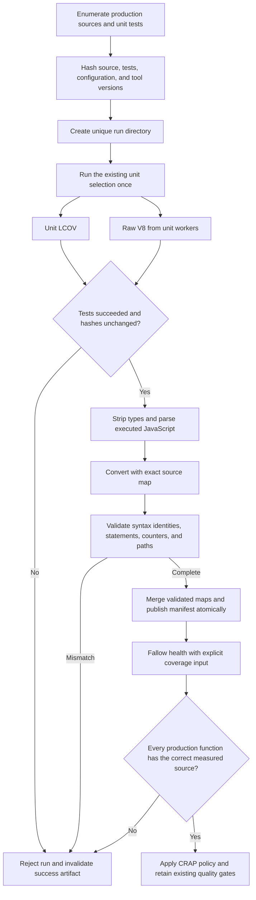

# Phase 7: Reliable Coverage Metrics — Research

Researched: 2026-09-14. Domain: Node unit coverage, Istanbul conversion, and Fallow CRAP scoring. Confidence: **MEDIUM**. The production probe is exploratory because source files changed during the measurement. The isolated counterexamples are reproducible. [VERIFIED: /tmp/phase7-production-function-audit-summary.json; /tmp/phase7-coverage-probe/results-identity.json]

## User Constraints

No phase CONTEXT.md existed when research started. The following constraints are copied from the active requirements. [VERIFIED: GSD `query init.phase-op 7`; .planning/REQUIREMENTS.md:5-11]

<!-- DATA_6d71af20_START -->
- Preserve the current 100% aggregate unit coverage baseline and assertion strength.
- Do not lower thresholds, exclude production code, or create test-only production exports.
- Unit/Sonar aggregate coverage and the existing direct-pair pin are distinct measurements.
- Keep this branch and preserve archived milestones and unrelated local edits.
- All items in the user handoff are in scope; prior scope exclusions are historical.
<!-- DATA_6d71af20_END -->

The research assignment additionally prohibits naive coordinate clamping, arbitrary production exclusions, and incomplete converters presented as finished work. It requires missing/stale reports to fail closed. Research owns this document and temporary probes only; the orchestrator owns commits. [VERIFIED: research assignment]

## Summary

Capture raw V8 coverage alongside the existing unit LCOV in **one unit execution**. Use the JavaScript actually executed after native TypeScript stripping. LCOV is insufficient as the sole input to exact statement reconstruction: the fixture reports two different functions on the same line without their columns or body ranges. [VERIFIED: /tmp/phase7-coverage-probe/unit.lcov; /tmp/phase7-coverage-probe/source.ts:1-8] Node supports raw coverage through `NODE_V8_COVERAGE` and propagates it to subprocesses. [CITED: https://nodejs.org/api/cli.html#node_v8_coveragedir]

The leading candidate, `ast-v8-to-istanbul`, needs **three fidelity remedies before adoption**: explicit source maps with exact endpoints, source-derived method names, and a fix for omitted nested functions/statements. Fallow parsing and a reported 100% function-match ratio do not prove correctness. The probe produced a map with a missing inner function that Fallow nevertheless matched to a neighboring function. [VERIFIED: /tmp/phase7-coverage-probe/results.json; /tmp/phase7-production-name-restorations.json; /tmp/phase7-production-function-audit-summary.json; /tmp/phase7-production-fallow-canonical.json]

**Primary recommendation:** Implement a fail-closed producer contract first. Promote the converter only after the acceptance corpus passes with one-to-one syntax correspondence. Then use CRAP 30 as an additional risk gate, preserving the existing complexity and aggregate unit gates. An uncovered function with cyclomatic complexity 6 produced CRAP 42 and failed; its fully covered counterpart produced CRAP 6 and passed. [VERIFIED: /tmp/phase7-coverage-probe/risk-results.json] Keep the existing disabled CRAP setting until that promotion succeeds; do not call the current prototype production-ready.

## Architectural Responsibility Map

This is a local tooling phase. The ownership below follows the actual unit command and Fallow consumer boundary. [VERIFIED: package.json:75-99; /tmp/test-backlog-fallow-scoring.rs:399-509]

| Capability | Primary tier | Secondary tier | Responsibility |
| --- | --- | --- | --- |
| Select and execute unit tests | Test-process orchestrator | Node test workers | Own one run and its exit result |
| Record runtime execution | Node/V8 | Local artifact storage | Emit LCOV and raw V8 from that run |
| Recover source locations | Coverage adapter | AST parser and converter | Prove executed-source identity before conversion |
| Validate completeness | Coverage adapter | Filesystem/AST inventory | Require every production module and function |
| Compute function risk | Fallow health | Validated Istanbul artifact | Apply the existing statement-based CRAP implementation |
| Reject stale/incomplete artifacts | Quality-gate wrapper | Manifest and hashes | Refuse estimated fallback or reused success artifacts |
| Preserve Sonar coverage | Existing Sonar input | Unit LCOV | Continue the existing unit-only report |

## Project Constraints (from AGENTS.md)

- Reach for CodeGraph before grep or file reads when locating or understanding code in an indexed repository. Its source output is the current, line-numbered source. [VERIFIED: AGENTS.md:4-7]
- Skip CodeGraph if the repository is not indexed; indexing remains the user's decision. [VERIFIED: AGENTS.md:9]

Related project directives apply to implementation: read files before editing, trace callers before function changes, use a GSD workflow, preserve strict TypeScript conventions, and run the required quality checks. Commits require pre-commit first, forbid bypassing hooks/history rewrites, and use the worktree hook exception documented by the project. [VERIFIED: CLAUDE.md, General/Git/GSD Workflow Enforcement]

Use the existing Node test runner and strict assertions. Do not add a runner or coverage exclusions. Public behavior and discriminating assertions remain required. The concrete runner flags are `--test` and `--experimental-test-coverage`; the full gate is `npm run check`. [VERIFIED: package.json:76-95; .claude/rules/typescript-unit-testing.md:10-32]

The package runtime declaration is `"node": ">=20.19.0"`. This research tested tooling on Node **26.8.2**. Do not infer that native stripping or the coverage adapter works throughout the declared application-runtime range. Keep the application requirement separate from the tested tooling-runtime contract. [VERIFIED: package.json:32-34; `node --version` probe]

<phase_requirements>

## Phase Requirements

| ID | Requirement | Research support |
| --- | --- | --- |
| METRIC-01 | Reliably convert current unit coverage to Fallow-compatible Istanbul JSON and verify measurement fidelity. | Same-run raw capture; source identity; exact AST locations; complete source/function enumeration; producer defect controls |
| METRIC-02 | Select and validate a CRAP metric policy using real measurements and negative controls. | Formula and consumer audit; CRAP 30 candidate; measured offender/benign controls; production-only denominator |

The requirement wording above is verbatim. [VERIFIED: .planning/REQUIREMENTS.md:29-30]

</phase_requirements>

## Standard Stack

### Core

| Component | Version researched | Purpose | Evidence / disposition |
| --- | --- | --- | --- |
| Node | 26.8.2 | Existing runner, raw V8 capture, native type stripping | Installed and exercised. [VERIFIED: runtime and fixture probes] |
| Fallow | 3.22.0 | Existing health consumer | Installed binary reports `fallow 3.22.0`; npm dependency declaration remains `"fallow": "^3.17.0"`. [VERIFIED: binary version probe; package.json:24] |
| `ast-v8-to-istanbul` [WARNING: flagged as suspicious — verify before using.] | 1.0.6, published 2026-09-07 | Candidate AST-aware producer | Official API requires executed-code AST; fidelity defects prevent unconditional adoption. [CITED: https://github.com/AriPerkkio/ast-v8-to-istanbul] [VERIFIED: npm version/time query; isolated probes] |
| `acorn` | 8.18.0, published 2026-07-28 | Parse stripped JavaScript with offsets and locations | Officially supported parser in converter documentation; legitimacy check OK. [VERIFIED: npm registry] [CITED: https://github.com/acornjs/acorn] |
| `istanbul-lib-coverage` | 3.2.2, published 2023-11-08 | Merge per-worker maps and summarize counters | Official Istanbul package; legitimacy check OK. [VERIFIED: npm registry] [CITED: https://github.com/istanbuljs/istanbuljs/tree/main/packages/istanbul-lib-coverage] |
| `@jridgewell/sourcemap-codec` [WARNING: flagged as suspicious — verify before using.] | 1.6.0, published 2026-08-28 | Encode explicit identity source-map segments | Official source-map codec; flagged solely on latest-release age. [CITED: https://github.com/jridgewell/sourcemaps/tree/main/packages/sourcemap-codec] [VERIFIED: npm version/time and legitimacy query] |

### Supporting

Use Node's filesystem, URL, crypto, and process APIs for manifest checks and local orchestration. Existing script tests already run through the unit glob. The relevant package-script fragment is `tests/{architecture,bridges,domain,edge,orchestrators,persistence,platform,scripts,shared,transaction}/**/*.test.ts`. [VERIFIED: package.json:84,95]

### Alternatives Considered

| Alternative | Strongest case | Decision |
| --- | --- | --- |
| LCOV-only reconstruction | Adds no capture dependency | Reject: same-line function/body information is absent in the measured LCOV. [VERIFIED: isolated fixture LCOV] |
| Legacy line-oriented V8 conversion | Established ecosystem integration | Do not treat old coordinate-clamping workarounds as fidelity fixes. The backlog records a large metric change from a flag change alone. [VERIFIED: .planning/BACKLOG.md:392-417] |
| Pre-instrumented Istanbul | Can distinguish runtime cases that V8 cannot observe | Keep as an alternative if a corrected AST producer cannot pass conformance. It changes execution and needs a separate impact study; it is not a verified drop-in for the existing run. [CITED: https://github.com/AriPerkkio/ast-v8-to-istanbul#limitations] [ASSUMED: compatibility with this repository's existing LCOV contract has not been probed] |
| Handwritten AST/V8 converter | Complete local control | Reject as the default: function-only recovery does not repair omitted statements or establish branch semantics. [VERIFIED: nested-function probe and producer walker audit] |

**Installation policy:** No repository dependencies changed during research. Temporary installs used `--ignore-scripts`. After the producer decision and legitimacy disposition, install only the selected development dependencies, pin the tested producer behavior, and update the lockfile. Do not copy the prototype into the check chain.

## Package Legitimacy Audit

All package names above were located in official project documentation before registry checks. The GSD seam returned the following results. The age column describes the latest release because that is the signal the seam returned. [VERIFIED: `query package-legitimacy check --ecosystem npm` and `npm view` probes]

| Package | Registry | Latest release age | Weekly downloads | Source repository | Verdict | Disposition |
| --- | --- | --- | --- | --- | --- | --- |
| ast-v8-to-istanbul | npm | 7 days | 24,907,830 | AriPerkkio/ast-v8-to-istanbul | SUS: too-new | Candidate only; record human verification before repository install |
| acorn | npm | 48 days | 180,583,668 | acornjs/acorn | OK | Suitable parser |
| istanbul-lib-coverage | npm | About 34 months | 60,461,047 | istanbuljs/istanbuljs | OK | Suitable merger |
| @jridgewell/sourcemap-codec | npm | 17 days | 158,514,442 | jridgewell/sourcemaps | SUS: too-new | Record human verification before direct repository install |

The converter package was first published on 2025-02-18. The seam's latest-release-age warning is not a finding that the package itself appeared seven days ago. All four postinstall lookups returned no postinstall script. No SLOP package was found. [VERIFIED: registry time history and postinstall queries]

## Architecture Patterns

### Data flow



This is the recommended implementation sequence, derived from the observed stale-source and false-match failures. [VERIFIED: production source-hash audit; isolated Fallow probes]

### Component responsibilities

- Keep capture, conversion, validation, and policy decisions in local tooling. Do not introduce test-only exports into application modules.
- Reuse the existing unit selection as one authoritative list. Preserve the existing LCOV destination, quoted in its writer as `--test-reporter-destination=coverage/unit.lcov`. [VERIFIED: package.json:95]
- Continue Sonar's exact input setting, `sonar.javascript.lcov.reportPaths=coverage/unit.lcov`. Do not add integration, e2e, or converted Istanbul inputs to Sonar. [VERIFIED: sonar-project.properties:49]
- Keep direct-pair coverage and its pin separate. This phase measures the aggregate unit execution. [VERIFIED: .planning/REQUIREMENTS.md:7-9]

### Pattern 1: Establish source identity before mapping offsets

Node's strip mode removes types while preserving source locations. Its documentation warns that stripping output is not stable across Node versions. Capture the Node version and source hashes as part of the artifact contract. Disable the compile cache for precise coverage. [CITED: https://nodejs.org/api/module.html#modulestriptypescripttypescode-options] [CITED: https://nodejs.org/api/module.html#limitations-of-the-compile-cache]

Before execution, hash every production source, selected test, support module/configuration that determines selection, and the lockfile. After execution and before conversion, compare the complete sets and bytes. Compare them again before artifact publication. Abort on additions, deletions, changes, failed tests, missing raw files, or an interrupted worker. Do not repair a source change by shifting coordinates or using Fallow's fuzzy matching.

A run manifest must bind both reports to one run identifier, the executed command/selection, tool versions, source hashes, raw-file inventory, and success status. Write the manifest last, atomically. A consumer must verify content hashes and source-set equality, not just a modification time. Keep raw capture out of the success path if conversion fails. These are design requirements, not claims that the current scripts implement them.

### Pattern 2: Use an explicit identity source map with endpoints

The converter's default map omitted end-of-line mappings. Several resulting end columns were `Infinity`, and JSON serialization converted them to `null`. Fallow accepted this and changed partial statement coverage to a binary function hit. [VERIFIED: /tmp/phase7-coverage-probe/results.json; /tmp/phase7-coverage-probe/fallow.json; converter distribution, locator and createEmptySourceMap]

Supply identity segments for every UTF-16 column, **including the column equal to the line length**. This produces exact finite endpoints in the tested source. Reject any source transformation that changes the assumed positions. Do not replace invalid output coordinates. [VERIFIED: /tmp/phase7-coverage-probe/convert.mjs; /tmp/phase7-coverage-probe/results-identity.json]

Use a fresh AST for each conversion. The producer mutates AST nodes and tracks visited nodes in weak sets. Reusing its mutated AST across worker reports introduces another source of missing records. [VERIFIED: converter distribution, getWalker and setSkipped/setCovered]

### Pattern 3: Source identity outranks producer-generated names

The converter adds numeric suffixes to repeated method names. In the production probe, 23 records required restoration: constructors and repeated object methods. The adapter matched each declaration to the **exact AST identifier span**, then used the identifier's real name. It did not strip suffixes by a regular expression. [VERIFIED: /tmp/phase7-coverage-probe/restore-names.mjs; /tmp/phase7-production-name-restorations.json]

Include a real source identifier ending in an underscore and number in negative controls. Include two methods with the same spelling but opposite coverage on the same line. The adapter must preserve their separate coordinates and counters.

### Pattern 4: Prove bijection, not merely Fallow's match ratio

Enumerate all executable function syntax independently. Each AST function must map to exactly one Istanbul function with the correct declaration/body span; each Istanbul function must map back. Maintain a separate explanation for runtime-generated V8 functions that have no explicit source function. Do not force native LCOV function counts to equal AST function counts.

The current producer missed the inner callback in the real source fragment `p.marketplacesToRemove.every((m) => m.plugins.length === 0)`. The fragment sits inside a longer logical expression. [VERIFIED: extensions/pi-claude-marketplace/orchestrators/reconcile/notify.ts:454-464]

That callback's exact raw range was `20361..20390`, with aggregate hit count `2`. The AST had 1,825 functions; the producer had 1,824. After name restoration, Fallow reported all 1,825 matched anyway. Its nearby anonymous fallback assigned the missing callback coverage from another record. [VERIFIED: /tmp/phase7-production-function-audit-summary.json; /tmp/phase7-production-fallow-canonical.json]

**Generic AST/V8 recovery assessment:** Exact AST body/declaration spans plus an exact V8 function-root range can recover a function identity and entry count. This is evidence-based normalization, unlike inventing spans from LCOV. It is insufficient by itself when the producer also skipped body statements. A missing statement must never turn a partially covered body into Fallow's binary fallback. Require independent statement completeness and a nested partially covered callback control before adopting any generic recovery adapter.

**Bounded repair lead:** The producer marks nested logical expressions skipped to avoid duplicate branch records, then suppresses traversal of their descendants. A temporary, one-line walker change that retained descendant traversal produced three function records for the three-function reproduction, instead of two. That temporary package change was reverted. This is a repair lead, not a validated fork. Prefer a corrected upstream release; otherwise plan an explicitly maintained, version-pinned producer patch with license/provenance and the full conformance corpus. Do not mutate installed dependencies implicitly during normal tests. [VERIFIED: /tmp/phase7-coverage-probe/nested-results.json; /tmp/phase7-coverage-probe/nested-patched-results.json; temporary patch probe]

### Pattern 5: Validate the consumer boundary strictly

Fallow 3.22.0 retries malformed maps after clamping negative position values. Therefore, a successful Fallow parse does not meet this project's no-clamping requirement. Its parser implementation contains `clamp_negative_positions`, and its scorer uses statement containment inside a function body. [VERIFIED: /tmp/test-backlog-fallow-scoring.rs:1714-1758,2111-2159]

Reject negative, non-finite, null, fractional, out-of-range, or reversed concrete positions before serialization and again after reading JSON. Require exact statement/map-counter and function/map-counter key sets. Require nonnegative finite integer hits, branch-location/counter cardinality, canonical contained file paths, and no duplicate canonical source records.

One branch-location case needs a precise policy: the producer deliberately emits absent coordinates for an implicit else with no source syntax. The exploratory preflight recorded 6,060 unique absent-coordinate fields from these records. Fallow consumed them. Do not treat these empty locations as ordinary finite positions, and do not fill them with zero. Acceptance must establish the producer/consumer convention and admit it only when the AST proves the absent else, or select a producer representation that preserves that meaning. Unexpected missing coordinates remain failures. [VERIFIED: producer distribution, onBranch; /tmp/phase7-production-conversion-summary.json; /tmp/phase7-production-fallow.json]

## Don't Hand-Roll

| Problem | Do not build | Use instead |
| --- | --- | --- |
| Reconstruct source statements | LCOV line-to-statement guesses | Executed-code AST plus a conformance-tested producer |
| Merge worker coverage | Sum records by line or array index | Istanbul's merger, after stable map identities are established |
| Encode source maps | Custom VLQ encoder | Official source-map codec |
| Repair coordinates | Clamp `-1`, null, or Infinity | Exact input source maps and strict output refusal |
| Restore method names | Strip `_2`-style suffixes | Match the declaration to the exact AST source identifier |
| Hide missing functions | Accept Fallow's approximate match | Independent AST/function bijection and planted missing-record controls |

The first, fourth, and sixth failures were reproduced in this session. The merger and codec come from their official projects. [VERIFIED: isolated and production probes] [CITED: https://github.com/istanbuljs/istanbuljs/tree/main/packages/istanbul-lib-coverage] [CITED: https://github.com/jridgewell/sourcemaps/tree/main/packages/sourcemap-codec]

## Runtime State Inventory

This phase migrates a coverage pipeline. The inventory concerns coverage artifacts, not application data.

| Category | Items found / observation boundary | Required action |
| --- | --- | --- |
| Stored data | Generated coverage is the relevant stored state. Existing package scripts write LCOV. [VERIFIED: package.json:87-95] | Invalidate prior metric success artifacts; generate a fresh run. No application-data migration is proposed. |
| Live service configuration | Sonar's repository setting names unit LCOV alone. Remote Sonar administration was not inspected. [VERIFIED: sonar-project.properties:49] | Preserve that input; no remote change is required by the design. |
| OS-registered state | No OS registration is part of the proposed tooling architecture. No system-wide registration audit was performed. [ASSUMED] | Keep the implementation local; do not add a service or scheduler. |
| Secrets/environment | Raw capture and compile-cache behavior depend on documented Node environment variables. Fallow also accepts a coverage environment override. [CITED: https://nodejs.org/api/cli.html#node_v8_coveragedir] [VERIFIED: installed `fallow health --help`] | Set the run's coverage destination explicitly; prevent inherited overrides from choosing an old report. No secret rename. |
| Build artifacts/installed packages | Converter packages exist only in the temporary research project; the installed Fallow is 3.22.0. [VERIFIED: package and binary probes] | Pin the adopted producer/tooling behavior; refuse stale artifacts after a tool-version change. |

## Common Pitfalls

1. **Passing because Fallow silently estimates missing coverage.** Unmatched functions use estimated coverage. The production probe initially had 23 such records. Require measured provenance for every production function after exact identity validation. [VERIFIED: /tmp/test-backlog-fallow-scoring.rs:467-509; production Fallow report]
2. **Passing because all current functions happen to be covered.** A wrong nearby match can still return 100%. Opposite-coverage neighbors and deleted-function records must fail conformance. [VERIFIED: nested production callback audit]
3. **Equating statement coverage with branch coverage.** The ternary fixture had 100% function statement coverage but only one covered branch. Preserve the existing native branch gate. [VERIFIED: /tmp/phase7-coverage-probe/results-identity.json; /tmp/phase7-coverage-probe/fallow-identity.json]
4. **Ignoring nested statements.** Fallow counts all statements fully contained in the body, including nested-function statements. An outer function that executed while its inner function did not had 50% coverage in the exact-coordinate fixture. [VERIFIED: scoring.rs:2111-2159; identity fixture]
5. **Claiming exact execution after a throwing call.** The fixture `throwsCall()` called a throwing function, then had an unreachable return. V8 conversion marked both statements covered. This is a documented V8 limitation. [VERIFIED: /tmp/phase7-coverage-probe/results-limits.json] [CITED: https://github.com/AriPerkkio/ast-v8-to-istanbul#limitations]
6. **Reusing a report from a changing checkout.** The research caught real source drift: 23 functions in the agents converter had raw offsets eight characters before the current AST; the argument parser later changed hash too. Refuse the entire run, not just the mismatched functions. [VERIFIED: production function audit and source-hash comparison]
7. **Using the whole health report's denominator.** The diagnostic run contained 12,796 functions across application, tests, and scripts; 1,825 were production functions. Keep the broader existing complexity gate while evaluating the coverage policy over the complete production subset. [VERIFIED: /tmp/phase7-fallow-denominator.json]

## Code Examples

### Exact input positions for a verified native-strip run

This is a tested adapter pattern, not a finished converter. The producer still needs the completeness remedy above. These APIs come from the official converter, Node, Acorn, and codec documentation. [VERIFIED: /tmp/phase7-coverage-probe/convert.mjs] [CITED: https://github.com/AriPerkkio/ast-v8-to-istanbul] [CITED: https://nodejs.org/api/module.html#modulestriptypescripttypescode-options] [CITED: https://github.com/jridgewell/sourcemaps/tree/main/packages/sourcemap-codec]

```js
const executed = stripTypeScriptTypes(original, { mode: "strip" });
// First prove source length, every line boundary, and run hashes agree.
const lines = executed.split("\n");
const sourceMap = {
  version: 3,
  file: sourcePath,
  sources: [sourcePath],
  sourcesContent: [original],
  names: [],
  mappings: encode(lines.map((line, index) =>
    Array.from({ length: line.length + 1 }, (_, column) =>
      [column, 0, index, column]))),
};
const converted = await convert({
  ast: parse(executed, {
    ecmaVersion: "latest", sourceType: "module", locations: true,
  }),
  code: executed,
  coverage: scriptCoverage,
  sourceMap,
  wrapperLength: 0,
});
// Reject invalid positions and incomplete identities before JSON.stringify.
```

### Consumer formula and metric policy

Fallow uses `CRAP = CC^2 * (1 - cov/100)^3 + CC`. Here, coverage is the percentage of covered statements inside the function body. With no contained statements, the function hit count supplies a binary result. [VERIFIED: /tmp/test-backlog-fallow-scoring.rs:399-405,833-836,2111-2159]

The current settings are `"maxCyclomatic": 20`, `"maxCognitive": 15`, `"maxUnitSize": 60`, and `"maxCrap": 0`. Preserve the first three settings. [VERIFIED: .fallowrc.json:4-8]

Recommended final policy: CRAP threshold **30**, after fidelity acceptance. This is an additional risk gate, not a replacement for 100% aggregate native unit coverage. At full statement coverage CRAP equals cyclomatic complexity; the exploratory production maximum was 20. Fallow documents 30 as its default and reports functions meeting or exceeding the threshold. [VERIFIED: installed `fallow health --help`; exploratory canonical-name report; formula]

| Control | CC | Statement coverage | CRAP | Threshold 30 outcome |
| --- | --- | --- | --- | --- |
| Imported function never called | 6 | 0% | 42 | Exit 1 |
| Same function, all arms exercised | 6 | 100% | 6 | Exit 0 |
| Exact-coordinate partial fixture | 2 | 2/3 | 2.1 rounded | Informational measurement |
| Outer function with uncalled nested function | 1 | 1/2 | 1.1 rounded | Informational measurement |

The first two rows were asserted against the installed binary, including its exit status and score. The remaining rows came from the actual Fallow output. [VERIFIED: /tmp/phase7-coverage-probe/risk-controls.mjs; risk-results.json; fallow-identity.json]

## Measurements and State of the Art

### Exploratory production measurement: not a certified baseline

The additional unit run exited successfully. It used the existing unit selection and wrote both reports to temporary destinations. Concurrent source edits invalidate it for final acceptance; the values below explain pipeline behavior only. [VERIFIED: unit process exit; /tmp/phase7-production-unit.log; source-hash audit]

| Measurement | Observed result |
| --- | --- |
| Native production LCOV | 227 records; 63,374/63,374 lines; 1,851/1,851 functions; 9,145/9,145 branches |
| Raw inputs | 296 files; 8,409 production script records |
| Enumerated source files | 234; seven unobserved files converted to empty maps, with zero statement/function/branch records |
| Candidate AST statements | 10,275 / 10,276 |
| Candidate AST functions | 1,824 / 1,824 hit, but one actual AST function was absent |
| Candidate AST branches | 6,592 / 6,610 |
| Files with candidate AST deficits | 14 |
| Initial production Fallow matching | 1,802 / 1,825 |
| After 23 exact source-name restorations | Reported 1,825 / 1,825; still not a bijection |
| Exploratory production CRAP maximum after restoration | 20 |

[VERIFIED: /tmp/phase7-production-unit.lcov; /tmp/phase7-production-conversion-summary.json; /tmp/phase7-production-fallow.json; /tmp/phase7-production-fallow-canonical.json; /tmp/phase7-production-function-audit-summary.json]

The only candidate uncovered statement was `throw err;` in the command-discovery catch that excludes `CommandNameError`. The preceding wrapper catches a failure from `generatedCommandName` and creates `CommandNameError`. Treat reachability of the outer nonmatching-error arm as a separate code/test question; do not fabricate a test-only input or change production code to make this report look complete. [VERIFIED: extensions/pi-claude-marketplace/bridges/commands/discover.ts:222-227,285-293; candidate statement map]

The 14 candidate AST deficit files are: notification grammar, source parsing, hook spawn helpers, marketplace add, clone cache, command discovery, skill staging, marketplace autoupdate, install outcome, plugin info, reinstall record, update flow, update swap, and reconcile apply. Their exact per-file counts remain in the temporary conversion summary. These are **measurement differences**, not a regression of the existing 100% native aggregate gate. They also need reevaluation after the producer correction and a stable run. [VERIFIED: /tmp/phase7-production-conversion-summary.json]

| Earlier assumption | Session finding | Planning consequence |
| --- | --- | --- |
| Negative coordinates guarantee Fallow rejects the report | 3.22.0 has a tolerant clamping parser | Validate before invoking Fallow |
| An AST-aware package automatically supplies finite JSON positions | Default mapping produced Infinity/null endpoints | Supply exact source maps and validate both in-memory and serialized output |
| 100% Fallow match ratio proves correspondence | One absent nested callback received a nearby match | Require AST/function bijection |
| Current native unit totals are Istanbul denominators | Counts differ by representation | Preserve each measurement and explain its denominator |

[VERIFIED: version-matched scoring source; isolated and production probes]

## Validation Architecture

Validation is enabled: `"nyquist_validation": true`. [VERIFIED: .planning/config.json:16-21]

### Test framework

| Property | Recommendation / existing value |
| --- | --- |
| Framework | Existing `node:test` and `node:assert/strict`; runtime 26.8.2 exercised |
| Quick run | `node --test <new-metric-test-file>`; planner selects the actual test filename |
| Existing full quality command | `npm run check` |
| Native aggregate command | `npm run test:coverage:unit` |
| Consumer conformance | Installed Fallow in isolated fixture roots, with explicit coverage path and expected exit/score |

Existing commands are defined in package.json; the new quick command is a proposed task shape. [VERIFIED: package.json:76,95; .claude/rules/typescript-unit-testing.md:14-22]

### Requirements to tests

| Requirement | Behavior | Test type | Execution |
| --- | --- | --- | --- |
| METRIC-01 | Same-run identity and source-set completeness | Unit/CLI controls | New script tests in existing runner |
| METRIC-01 | Exact coordinates and one-to-one function/statement correspondence | Converter conformance | Tiny captured V8 fixtures, normally under 30 seconds |
| METRIC-01 | Whole production mapping | Integration measurement | One fresh full unit capture after preceding phases stabilize |
| METRIC-02 | Correct CRAP and threshold behavior | Fallow CLI integration | Covered CC6 passes; uncovered CC6 fails at 30 |
| METRIC-02 | No accepted stale, guessed, or estimated coverage | Gate negative controls | Delete/swap/corrupt artifacts and require targeted diagnostics |

### Required acceptance corpus / Wave 0 gaps

The repository does not yet contain the proposed converter or its acceptance corpus; all probes in this research remain temporary. [VERIFIED: initial GSD phase state and temporary probe creation]

- Same-line covered and uncovered functions, with different names and repeated method names.
- Nested functions with opposite coverage, including a callback inside the left operand of a chained logical expression.
- A nested partially covered callback whose body has several statements. A function-entry count alone must not claim full statement coverage.
- One-line arrows, ternaries, empty functions, getters/setters, constructors, methods, async functions, and generators.
- Multibyte Unicode before a function, surrogate pairs, CRLF, blank lines, and exact end-of-line endpoints.
- Same declaration spelling in different scopes; a real name with a numeric suffix must remain unchanged.
- A file never loaded, an imported but uncalled function, and a genuinely type-only module. No silent omission.
- Split coverage across two workers, overlapping raw reports, reversed input order, and fresh ASTs per conversion. Require stable merged identities and percentages.
- Negative, null, infinite, fractional, reversed, or out-of-bounds coordinates; missing map counters; extra counters; negative hits; wrong branch cardinality.
- Implicit-else empty-location records accepted only under the established AST/producer contract; all other missing locations rejected.
- Missing LCOV/raw/Istanbul/manifest, empty maps, a removed production record, a deleted nested function record, stale hashes, changed source set, changed tools, failed tests, and interrupted capture.
- Report substitution from integration/e2e or another run, malformed paths, outside-root paths, and duplicated canonical paths.
- Documented V8 limitations for default arguments and code after throwing calls. Assertions must expose the limitations, not encode false full coverage as success.
- Full production cardinality and per-function measured provenance after the candidate producer fix. Preserve the exact native aggregate baseline and the separate direct-pair contract.

These controls derive from the actual failures and consumer semantics documented above. No existing broad gate substitutes for them. Per task, run relevant new script tests; before phase completion, run the required full quality gate and a stable aggregate capture. Do not repeatedly rerun unrelated full suites during development.

## Security Domain

This phase processes local report data, source paths, and subprocess results. It adds no authentication service or network-facing API. Apply the input/file controls relevant to that boundary. This is a scoped design assessment, not an ASVS certification.

Use **ASVS 5.0 category names**, not the older numbering in generic templates. [CITED: https://github.com/OWASP/ASVS/tree/v5.0.0/5.0/en]

| Category | Application here | Standard control |
| --- | --- | --- |
| V2 Validation and Business Logic | Yes | Validate report structure, ranges, cross-field consistency, and required workflow order |
| V5 File Handling | Yes | Validate contained canonical paths and trusted artifact destinations |
| V6 Authentication / V7 Session Management / V8 Authorization | No new application mechanism | Keep existing local execution permissions |
| V11 Cryptography | Content identity only | Standard Node SHA-256 for hashes; no custom cryptography |

Input consistency and path construction controls are described in the official ASVS chapters. [CITED: https://raw.githubusercontent.com/OWASP/ASVS/v5.0.0/5.0/en/0x11-V2-Validation-and-Business-Logic.md] [CITED: https://raw.githubusercontent.com/OWASP/ASVS/v5.0.0/5.0/en/0x14-V5-File-Handling.md]

| Threat | STRIDE | Mitigation required by this design |
| --- | --- | --- |
| Substitute a stale passing report | Tampering | Bind source/test/tool and artifact hashes to one successful run |
| Read/write paths outside the intended tree | Tampering / information disclosure | Resolve canonical contained paths and refuse mismatched report identities |
| Child launch error mistaken for a control failure | Repudiation of result | Distinguish spawn errors, signals, exit status, and expected diagnostic |
| Hidden producer omissions | Tampering of measurement | Independent AST inventory and one-to-one correspondence checks |

## Environment Availability

| Dependency | Available | Version | Action |
| --- | --- | --- | --- |
| Node | Yes | 26.8.2 | Use a pinned, conformance-tested tooling runtime |
| npm | Yes | 11.19.1 | Install selected tooling with scripts disabled |
| Fallow | Yes | 3.22.0 | Test the exact installed consumer |
| Candidate converter/parser/merger/codec | Temporary project only | Versions above | Decide producer remedy before repository installation |
| Context7 MCP / CLI | Not available in this session | — | Official web documentation used |

[VERIFIED: runtime probes; tool inventory; `command -v ctx7`; temporary package installation]

No external service is needed to execute the final coverage pipeline. Package download access is needed for installation. The current blocking implementation concern is producer fidelity, not tool availability.

## Assumptions Log

| ID | Assumption | Risk if wrong | Required disposition |
| --- | --- | --- | --- |
| A1 | Pre-instrumented Istanbul could replace the candidate without breaking this repository's coverage contract. [ASSUMED] | Changes execution or existing native LCOV results | Research only if the corrected V8 producer is rejected |
| A2 | No OS-registered component needs migration for the proposed local tooling. [ASSUMED] | An undocumented external consumer keeps an old input | Confirm only if implementation discovers such an integration |
| A3 | A corrected producer will preserve the exploratory maximum CRAP of 20 on a stable tree. [ASSUMED] | Candidate threshold selection needs reevaluation | Measure a stable complete run; never lock the current number as a baseline |

## Open Questions and Bounded Remaining Work

1. **Choose a conformance-passing producer delivery.** The unmodified 1.0.6 package fails function completeness. Validate a corrected upstream version or a maintained version-specific patch. The temporary one-line patch proves only the minimal reproduction, not the full corpus.
2. **Finish the exact implicit-else schema policy.** Preserve absent syntax explicitly without fabricating coordinates. Demonstrate actual consumer acceptance and reject other absent positions.
3. **Implement complete correspondence.** A generic AST/V8 function recovery is permissible only with exact range evidence and complete body statements. Name restoration alone and Fallow's match count are insufficient.
4. **Capture the final stable tree.** The exploratory run changed underneath the analysis. Source hashes must be captured before execution, checked after it, and carried through publication. The final implementation must fail the naturally observed drift case.
5. **Reassess candidate AST deficits and the CRAP 30 policy after the producer fix.** Preserve native unit 100%; do not impose equality between unrelated denominators or dismiss the AST deficits as automatically false.

These are executable planning tasks. Research is ready for planning; converter implementation and phase acceptance are not complete.

## Sources

Primary sources consulted:

- Official Node CLI documentation: raw V8 output, subprocess inheritance, and source-map cache. [CITED: https://nodejs.org/api/cli.html#node_v8_coveragedir]
- Official Node module documentation: type stripping and compile-cache coverage limitations. [CITED: https://nodejs.org/api/module.html]
- Official AST converter README and installed 1.0.6 distribution: conversion API, walker, name generation, locations, and limitations. [CITED: https://github.com/AriPerkkio/ast-v8-to-istanbul]
- Official Acorn, Istanbul coverage, and source-map codec documentation. [CITED: https://github.com/acornjs/acorn] [CITED: https://github.com/istanbuljs/istanbuljs/tree/main/packages/istanbul-lib-coverage] [CITED: https://github.com/jridgewell/sourcemaps/tree/main/packages/sourcemap-codec]
- Fallow 3.22.0 installed CLI and version-matched scoring source supplied by the orchestrator: `/tmp/test-backlog-fallow-scoring.rs`. Relevant ranges: formula 833-836; lookup 1276-1409; loading 1614-1688; tolerant positions 1714-1758; statement containment 2111-2159. [VERIFIED: source reads and installed binary probes]
- Official ASVS 5.0 chapters for scoped input/file controls. [CITED: https://github.com/OWASP/ASVS/tree/v5.0.0/5.0/en]

Local evidence retained for the executor:

- `/tmp/phase7-coverage-probe/`: fixture source, conversion experiments, default-map failure, identity-map correction, V8 limitations, nested-function reproduction, and CRAP control scripts/results.
- `/tmp/phase7-production-unit.log` and `/tmp/phase7-production-unit.lcov`: exploratory same-run native output.
- `/tmp/phase7-production-raw`: exploratory raw captures.
- `/tmp/phase7-production-conversion-summary.json`: exact per-file candidate AST measurements. Read selectively; the diagnostic list is large.
- `/tmp/phase7-production-fallow-canonical.json`: consumer output after exact source-name restoration.
- `/tmp/phase7-production-function-audit-summary.json`: missing nested callback and source-offset drift evidence.
- `/tmp/phase7-production-source-hashes.json`: hashes taken during conversion; these are deliberately **not** a pre-run manifest.

These paths are research artifacts, not permanent project interfaces. The durable counterexamples and numbers needed for planning are embedded above. [VERIFIED: temporary probe creation and executions]

## Metadata

The research-plan seam selected Context7 for library questions and web search for Fallow. Context7 was unavailable, so official web sources supplied the documentation. The confidence seam returned MEDIUM for the checked documentation provider; it did not grant HIGH for local-provider labels. Overall confidence therefore remains MEDIUM. [VERIFIED: research-plan and classify-confidence command output]

| Area | Confidence | Reason |
| --- | --- | --- |
| Stack | MEDIUM | Official identities and registry metadata checked; two age warnings remain |
| Architecture | MEDIUM | Same-run capture demonstrated; immutable final-run workflow still to implement |
| Pitfalls | MEDIUM | Concrete local counterexamples and consumer source agree |
| Production metric baseline | LOW | Concurrent source edits invalidate final certification |

Research date: 2026-09-14. Revalidate on any Node, converter, parser, merger, codec, or Fallow change. No research commit was made, as directed by the orchestrator.
