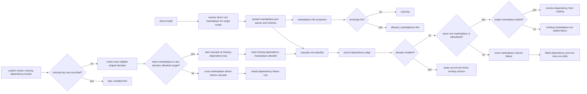

# Phase 11: Cross-marketplace dependency allowlist - Research

**Researched:** 2026-09-23
**Domain:** Claude plugin marketplace manifest validation, dependency closure, and Pi notifications
**Confidence:** HIGH for the local implementation seam and locked behavior; MEDIUM for current upstream documentation

<user_constraints>
## User Constraints (from CONTEXT.md)

### Locked Decisions

### Allowlist policy
- **D-11-01:** Only the marketplace of the root plugin being installed grants
  permission for new cross-marketplace dependency edges. An absent field is an
  empty list. A marketplace merely being added is not permission.
- **D-11-02:** Check whether the dependency is already installed in the target
  scope before checking the allowlist. An installed dependency satisfies the
  declaration even when its marketplace is absent from the list. Preserve the
  existing installed-first guard order.
- **D-11-03:** Do not add or clone a marketplace to satisfy a dependency.

### Marketplace info
- **D-11-04:** Render an `allowed_marketplaces:` line only when the parsed
  allowlist is nonempty. Omit it for both an absent field and an empty array.
  The info surface and the cascade must use the same parsed value.

### Malformed field
- **D-11-05:** A present `allowCrossMarketplaceDependenciesOn` value that is not
  an array of strings invalidates the marketplace manifest. Identify the field
  in the validation error. Do not coerce the value, discard invalid entries,
  or silently replace it with an empty list. This matches Claude Code 2.1.267.

### Refusal message
- **D-11-06:** Use the closed-set `cross-marketplace` reason. Its cause names
  the blocked dependency, the plugin that declared it, and the target
  marketplace. Explain both remedies: install the dependency manually first,
  or add the target marketplace to `allowCrossMarketplaceDependenciesOn` in the
  **root** marketplace's `marketplace.json`. Follow Pi's existing failed-row
  grammar; the information matches Claude Code without copying its exact
  output bytes.

### the agent's Discretion
- Choose list value separators, order, and line placement consistent with the
  existing `marketplace info` format. The label and omission rule are locked.
- Choose the sentence structure of the failure cause while retaining every
  fact and both remedies in D-11-06.

### Deferred Ideas (OUT OF SCOPE)

None — discussion stayed within phase scope.
</user_constraints>

<phase_requirements>
## Phase Requirements

| ID | Description | Research support |
|----|-------------|------------------|
| XMKT-01 | A dependency in a marketplace other than the root plugin's is refused unless the root marketplace lists it; the reason names the field. | Shared manifest schema; pure closure guard; closed-set notification and catalog contracts. |
| XMKT-02 | An already-installed dependency satisfies regardless of the allowlist. | Existing installed-first guard at `walkDependencyEdge`; keep it before the new guard and test both known and absent marketplaces. |
</phase_requirements>

## Summary

The official marketplace schema lists the optional `allowCrossMarketplaceDependenciesOn` array. The official dependency guide says the root marketplace alone grants cross-marketplace permission, and a manually installed dependency satisfies without the permission. The phase context records a Claude Code 2.1.267 probe that rejects a scalar or a mixed-type array. Quote from the context: `allowCrossMarketplaceDependenciesOn`, `cross-marketplace`. [CITED: https://code.claude.com/docs/en/plugin-marketplaces] [CITED: https://code.claude.com/docs/en/plugin-dependencies] [VERIFIED: .planning/phases/11-cross-marketplace-dependency-allowlist/11-CONTEXT.md:127-138]

The implementation needs two authorization seams. A direct install's declared edges reach the closure walker, where the current order is `recordEdge`, `installedKeys.has`, `knownMarketplaces.has`, then lookup. Place the root-allowlist check after the installed check and before marketplace lookup. A reload's *original* declarer-to-missing-dependency edge does not reach that walker: the reload starts a new cascade rooted at the missing key. Authorize that original edge before invoking the new cascade, after the reload's already-recorded check. Quote from the source: `recordEdge(ctx, edge)`, `installedKeys.has(edge.key)`, `knownMarketplaces.has(edge.parts.marketplace)`, and `rootKey`. [VERIFIED: extensions/pi-claude-marketplace/domain/dependency-closure.ts:363-387] [VERIFIED: extensions/pi-claude-marketplace/orchestrators/plugin/install-flow.ts:2063-2095]

**Primary recommendation:** Add the field to the compiled marketplace schema; pass each cascade root marketplace's parsed allowlist into the closure walker; on reload, also authorize the missing dependency against its *original eligible declarers* before starting the cascade. Preserve all eligible declarer keys in the reload plan, since its current `requiredBy` field retains only the first. [VERIFIED: extensions/pi-claude-marketplace/domain/manifest.ts:29-43] [VERIFIED: extensions/pi-claude-marketplace/orchestrators/reconcile/plan.ts:781-824] [VERIFIED: extensions/pi-claude-marketplace/orchestrators/plugin/install-flow.ts:2083-2095]

## Architectural Responsibility Map

| Capability | Primary tier | Secondary tier | Rationale |
|------------|--------------|----------------|-----------|
| Manifest shape and validation | Storage/domain boundary | — | The sole cached marketplace parser owns the compiled schema and typed validation error. [VERIFIED: extensions/pi-claude-marketplace/domain/manifest.ts:95-105] [VERIFIED: extensions/pi-claude-marketplace/domain/manifest.ts:123-153] |
| Root policy selection | API/backend orchestration | Storage/domain boundary | Both install entry points already know the target scope and resolve marketplace records with the project/user fallback. [VERIFIED: extensions/pi-claude-marketplace/orchestrators/plugin/install-flow.ts:1448-1465] [VERIFIED: extensions/pi-claude-marketplace/orchestrators/plugin/install-flow.ts:2092-2111] |
| Reload original-edge authorization | API/backend orchestration | Storage/domain boundary | The planner groups missing declarations by dependency but currently keeps only the first `"requiredBy"` key; reload must retain every eligible declarer and check their marketplace policies before the missing-key cascade starts. Quote: `requiredBy: entry.dependent`. [VERIFIED: extensions/pi-claude-marketplace/orchestrators/reconcile/plan.ts:781-824] [VERIFIED: extensions/pi-claude-marketplace/orchestrators/plugin/install-flow.ts:2083-2095] |
| Dependency edge authorization | API/backend domain | — | The pure closure walk owns installed, marketplace-known, and recursive lookup order. [VERIFIED: extensions/pi-claude-marketplace/domain/dependency-closure.ts:363-387] |
| Read-only info projection | API/backend presentation | Storage/domain boundary | `buildBlock` reads the cached manifest, then the shared renderer emits labeled lines. [VERIFIED: extensions/pi-claude-marketplace/orchestrators/marketplace/info.ts:89-99] [VERIFIED: extensions/pi-claude-marketplace/shared/notification-grammar.ts:1175-1189] |
| Failure row | API/backend presentation | — | The cascade composer maps closure failures to a dependency failed row and root dependency-failed row. [VERIFIED: extensions/pi-claude-marketplace/orchestrators/plugin/install-cascade.messaging.ts:268-315] |

## Standard Stack

| Component | Version / contract | Use |
|-----------|--------------------|-----|
| Node.js | `">=20.19.0"` engine floor; local probe `v26.9.0` | Run TypeScript sources and node:test. [VERIFIED: package.json:34-36] [VERIFIED: local `node --version` 2026-09-23] |
| TypeScript | `"typescript": "^6.0.3"` | Keep the new failure arm and notification payload statically exhaustive. [VERIFIED: package.json:31-32] |
| TypeBox | `"typebox": "^1.1.38"` | Extend the existing `Type.Optional(Type.Array(Type.String()))` schema pattern; do not add another validator. [VERIFIED: package.json:29-31] [VERIFIED: extensions/pi-claude-marketplace/domain/manifest.ts:29-43] |
| node:test | Built into Node | Extend paired unit tests and catalog architecture tests. [VERIFIED: tests/domain/manifest.test.ts:1-5] [VERIFIED: package.json:89-104] |

The recommendation adds no external package, so the package legitimacy gate and registry-version audit do not apply to this plan. The versions above are existing project declarations, not claims that they are the latest registry releases. [ASSUMED]

## Architecture Patterns

### System Architecture Diagram



The branch order preserves D-11-02 on both paths. The `"marketplace-not-added"` value is the current closure failure discriminant, quoted in its source definition. The new `"cross-marketplace"` value is the locked decision, quoted in context. [VERIFIED: extensions/pi-claude-marketplace/domain/dependency-closure.ts:148-155] [VERIFIED: extensions/pi-claude-marketplace/orchestrators/plugin/install-flow.ts:2083-2089] [VERIFIED: .planning/phases/11-cross-marketplace-dependency-allowlist/11-CONTEXT.md:42-49]

### Recommended project structure and files

| File | Planned responsibility |
|------|------------------------|
| `domain/manifest.ts` | Add an optional string-array property; let `MARKETPLACE_VALIDATOR.Check` reject present malformed values with the field path. [VERIFIED: extensions/pi-claude-marketplace/domain/manifest.ts:29-43] [VERIFIED: extensions/pi-claude-marketplace/domain/manifest.ts:123-133] |
| `orchestrators/plugin/install-flow.ts` | For direct install, pass the direct root's parsed list to its cascade. For reload, evaluate every original declarer and permit the original edge if any authorizes the missing target before `runInstallCascade`; then pass the missing root's parsed list for its transitive closure. Reuse scope-aware marketplace source resolution and the cached manifest loader. [VERIFIED: extensions/pi-claude-marketplace/orchestrators/plugin/install-flow.ts:508-523] [VERIFIED: extensions/pi-claude-marketplace/orchestrators/plugin/install-flow.ts:2083-2136] |
| `orchestrators/reconcile/plan.ts`, `orchestrators/reconcile/types.ts` | Retain all eligible original declarer keys beside the existing first `requiredBy` and accumulated ranges. Quote: `requiredBy: entry.dependent` is currently recorded only for the first entry. [VERIFIED: extensions/pi-claude-marketplace/orchestrators/reconcile/plan.ts:781-824] [VERIFIED: extensions/pi-claude-marketplace/orchestrators/reconcile/types.ts:174-190] |
| `orchestrators/reconcile/apply.ts` | Pass the complete declarer set to the reload missing-dependency operation, while keeping the existing reload-only trigger. Quote: `if (opts.reason !== "reload")`. [VERIFIED: extensions/pi-claude-marketplace/orchestrators/reconcile/apply.ts:682-707] |
| `orchestrators/plugin/install-cascade.ts` | Carry the root allowlist in `InstallCascadeOptions` to `resolveDependencyClosure`; keep this module's phase execution and rollback unchanged. [VERIFIED: extensions/pi-claude-marketplace/orchestrators/plugin/install-cascade.ts:429-477] [VERIFIED: extensions/pi-claude-marketplace/orchestrators/plugin/install-cascade.ts:1175-1191] |
| `domain/dependency-closure.ts` | Add a required root allowlist input and new failure arm with dependency key, declaring key, and target marketplace. Guard before `knownMarketplaces`. [VERIFIED: extensions/pi-claude-marketplace/domain/dependency-closure.ts:123-169] [VERIFIED: extensions/pi-claude-marketplace/domain/dependency-closure.ts:363-387] |
| `orchestrators/marketplace/info.ts`, `shared/notification-types.ts`, `shared/notification-grammar.ts` | Project the parsed list and render `allowed_marketplaces:` only when nonempty. Quote: `"marketplace-info"`, `"description:"`, `"last_updated:"` are existing contracts; the new label is D-11-04. [VERIFIED: extensions/pi-claude-marketplace/shared/notification-types.ts:718-734] [VERIFIED: extensions/pi-claude-marketplace/shared/notification-grammar.ts:1175-1188] [VERIFIED: .planning/phases/11-cross-marketplace-dependency-allowlist/11-CONTEXT.md:31-34] |
| `orchestrators/plugin/install-cascade.messaging.ts`, `shared/notification-types.ts`, `shared/notify-reasons.ts` | Map the new closure arm to `"cross-marketplace"` and a cause with both remedies; update the closed-set membership proof. [VERIFIED: extensions/pi-claude-marketplace/orchestrators/plugin/install-cascade.messaging.ts:268-315] [VERIFIED: .planning/phases/11-cross-marketplace-dependency-allowlist/11-CONTEXT.md:42-49] |
| `docs/dependency-resolution.md`, `docs/output-catalog.md`, `docs/messaging-style-guide.md` | State the rule, revise the failure table and output catalog, and describe the new cause grammar. [VERIFIED: tests/architecture/dependency-doc-agreement.test.ts:1-28] [VERIFIED: docs/output-catalog.md:926-937] |

### Pattern 1: One typed parse feeds policy and info

The loader returns the validated `MarketplaceManifest` by reference from a process-lifetime cache and instructs consumers to treat it as read-only. Use its optional array directly, with `?? []` only for absence; do not mutate, filter, or reparse it. Quote: `return manifestCache.load(manifestPath) as Promise<MarketplaceManifest>`. [VERIFIED: extensions/pi-claude-marketplace/domain/manifest.ts:143-153] [VERIFIED: .planning/phases/11-cross-marketplace-dependency-allowlist/11-CONTEXT.md:36-40]

### Pattern 2: Root policy is fixed for each closure

The dependency parser fills a missing marketplace from the *declaring* plugin, but the permission test compares the resolved edge marketplace to the *root* marketplace of that cascade. On a direct A install, A's list governs A→B and B→C. On reload, Phase 9 starts a new cascade at missing B, so B's list governs B→C; A's original A→B edge needs its own pre-cascade gate. Quote: `const marketplace = args.dependency.marketplace ?? args.declaringMarketplace`; `requiredBy: args.declaringKey`; and `rootKey: opts.rootKey`. [VERIFIED: extensions/pi-claude-marketplace/domain/dependency-closure.ts:285-324] [VERIFIED: extensions/pi-claude-marketplace/orchestrators/plugin/install-cascade.ts:1175-1191] [CITED: https://code.claude.com/docs/en/plugin-dependencies]

### Pattern 3: Authorize reload's original edge before its synthetic-root cascade

The local reload path is `buildDependencyInstallBucket` → `applyDependencyInstalls` → `installMissingDependencyWithTransaction` → `runInstallCascade`. The planner groups missing verdicts by dependency and accumulates all ranges, but stores only the first declarer as `requiredBy`. The operation then constructs `rootKey` from the *missing* plugin and marketplace and checks that key's recorded state before entering its cascade. Thus the original declarer→missing edge is absent from the closure walk. Quote: `const grouped = new Map<string, { ranges: string[]; requiredBy: string }>()`, `group.ranges.push(...(entry.ranges ?? []))`, `const rootKey = \`${plugin}@${marketplace}\``, and `if (state.marketplaces[marketplace]?.plugins[plugin] !== undefined)`. [VERIFIED: extensions/pi-claude-marketplace/orchestrators/reconcile/plan.ts:781-824] [VERIFIED: extensions/pi-claude-marketplace/orchestrators/reconcile/apply.ts:682-707] [VERIFIED: extensions/pi-claude-marketplace/orchestrators/plugin/install-flow.ts:2063-2095]

The installed Claude Code `2.1.267` binary's `resolveMissingDependencies` groups not-found unsatisfied entries as a set of sources for each dependency, then checks the target marketplace against **each declaring source**. The exact excerpt includes `c.add(e.source)`, `for(let o of c){let p=jn(o).marketplace;if(p===u){y=!0;break}`, `if((await _k(p,r))?.allowCrossMarketplaceDependenciesOn?.includes(u)){y=!0;break}`, and later `hJe({pluginId:e,entry:o.entry,scope:m??"user",marketplaceInstallLocation:o.marketplaceInstallLocation,trigger:"dependency-resolution"`. The install invocation follows the allowlist check. This establishes **any eligible declarer** (logical OR), including a same-marketplace declarer, as the upstream reload rule. [VERIFIED: installed Claude Code 2.1.267 binary `/home/acolomba/.local/share/claude/versions/2.1.267`, JS payload near byte offset 191433570, inspected 2026-09-23] [VERIFIED: .planning/phases/09-reload-installs-missing-dependencies/09-CONTEXT.md:442-452]

Prescribe this order inside the missing-dependency locked transaction: (1) preserve the already-recorded skip; (2) retain the existing target-marketplace-absent failure when no source record is reachable; (3) test the original declarer→missing edge using every eligible declarer's marketplace and its scope-resolved, validated manifest; (4) return a structured `cross-marketplace` failure if **none** authorizes; (5) start B's cascade with B's own parsed allowlist for B→C. No new marketplace is added or cloned. Keep `requiredBy` as the stable first-declarer label for the failed row while carrying a distinct complete, deduplicated declarer list for authorization. Quote: `"already-recorded"`, `"marketplace-not-added"`, and `requiredBy: opts.requiredBy` are existing local outcomes; `"cross-marketplace"` is D-11-06. [VERIFIED: extensions/pi-claude-marketplace/orchestrators/plugin/install-flow.ts:2083-2153] [VERIFIED: .planning/phases/11-cross-marketplace-dependency-allowlist/11-CONTEXT.md:42-49]

### Pattern 4: Failure before materialization

`runInstallCascade` returns `"closure-failed"` before it builds phases, so a policy refusal cannot leave a newly materialized member. Its caller's existing failure sink then renders Pi's failed-row grammar. Quote: `if (!closure.ok) { return { kind: "closure-failed", failure: closure }; }`. [VERIFIED: extensions/pi-claude-marketplace/orchestrators/plugin/install-cascade.ts:1175-1191] [VERIFIED: extensions/pi-claude-marketplace/orchestrators/plugin/install-flow.ts:540-549]

### Anti-patterns to avoid

- Read an intermediary marketplace's allowlist during recursion: only the root's list grants permission. [CITED: https://code.claude.com/docs/en/plugin-dependencies]
- On reload, check only the missing key's new cascade root list: that skips the original A→B authorization entirely. [VERIFIED: extensions/pi-claude-marketplace/orchestrators/plugin/install-flow.ts:2063-2095] [VERIFIED: installed Claude Code 2.1.267 binary `/home/acolomba/.local/share/claude/versions/2.1.267`, inspected 2026-09-23]
- Use only the first `requiredBy` as reload's policy authority, or require every declarer to allow the target: upstream accepts when any declarer authorizes, while `requiredBy` currently retains only the first. [VERIFIED: extensions/pi-claude-marketplace/orchestrators/reconcile/plan.ts:781-824] [VERIFIED: installed Claude Code 2.1.267 binary `/home/acolomba/.local/share/claude/versions/2.1.267`, inspected 2026-09-23]
- Treat `knownMarketplaces` as permission: it answers availability, not trust. [VERIFIED: .planning/phases/11-cross-marketplace-dependency-allowlist/11-CONTEXT.md:21-29]
- Put the new guard before the installed check, or before edge recording: that changes installed-first behavior or loses a repeated edge's range. [VERIFIED: extensions/pi-claude-marketplace/domain/dependency-closure.ts:241-266] [VERIFIED: extensions/pi-claude-marketplace/domain/dependency-closure.ts:363-387]
- Parse a second JSON copy or mutate the cached parsed object. [VERIFIED: extensions/pi-claude-marketplace/domain/manifest.ts:95-105] [VERIFIED: extensions/pi-claude-marketplace/domain/manifest.ts:143-153]

## Don't Hand-Roll

| Problem | Use instead | Why |
|---------|-------------|-----|
| Manifest type validation | Existing compiled TypeBox `MARKETPLACE_VALIDATOR` | It already produces a field-path error via `InvalidMarketplaceManifestError`. [VERIFIED: extensions/pi-claude-marketplace/domain/manifest.ts:42-43] [VERIFIED: extensions/pi-claude-marketplace/domain/manifest.ts:123-130] |
| Marketplace source selection | `resolveInstallMarketplaceSource` | It already handles target-scope and user-scope fallback for catalog reads. [VERIFIED: extensions/pi-claude-marketplace/orchestrators/plugin/install-flow.ts:508-523] |
| Recursive dependency resolution or rollback | Existing `resolveDependencyClosure` and `runInstallCascade` | The guard is a pure failure before the transactional phase array. [VERIFIED: extensions/pi-claude-marketplace/domain/dependency-closure.ts:451-477] [VERIFIED: extensions/pi-claude-marketplace/orchestrators/plugin/install-cascade.ts:1175-1191] |
| User-visible row formatting | `composeCascadeFailureMessage` and central notification grammar | Closed reasons and full catalog bytes are already gated. [VERIFIED: extensions/pi-claude-marketplace/orchestrators/plugin/install-cascade.messaging.ts:268-315] [VERIFIED: tests/architecture/notify-closed-set-locks.test.ts:35-105] |

## Common Pitfalls

1. **Known target accepted accidentally.** A target marketplace can already be added without appearing in the root list. Test that this still returns `"cross-marketplace"` and does not invoke the target catalog lookup. The string is quoted in D-11-06. [VERIFIED: .planning/phases/11-cross-marketplace-dependency-allowlist/11-CONTEXT.md:21-24] [VERIFIED: .planning/phases/11-cross-marketplace-dependency-allowlist/11-CONTEXT.md:42-49]
2. **Installed dependency refused.** Test an installed cross-marketplace key with an empty list, including a target marketplace absent from `knownMarketplaces`. The current guard already handles the latter case. [VERIFIED: extensions/pi-claude-marketplace/domain/dependency-closure.ts:363-385] [VERIFIED: tests/domain/dependency-closure.test.ts:340-382]
3. **Transitive trust chain.** Test root A allowing B, a B dependency asking for C, and C rejected unless A allows C. Also test B asking back into A; this is same-root territory and needs no entry. [CITED: https://code.claude.com/docs/en/plugin-dependencies] [VERIFIED: extensions/pi-claude-marketplace/domain/dependency-closure.ts:303-324]
4. **Reload synthetic-root bypass.** A→B is missing from B's reload cascade, so checking only B's list could install B even though A did not allow it. Test that refusal occurs before B lookup or mutation, and that a later already-recorded B skips the policy. [VERIFIED: extensions/pi-claude-marketplace/orchestrators/plugin/install-flow.ts:2063-2136] [VERIFIED: installed Claude Code 2.1.267 binary `/home/acolomba/.local/share/claude/versions/2.1.267`, inspected 2026-09-23]
5. **Lost declaring source.** Two eligible plugins can declare the same missing B. The planner currently retains ranges from both but only the first `requiredBy`; test authorization when only the *second* declarer's marketplace allows B, and refusal when neither allows it. A same-marketplace declarer must also authorize even if another declarer is foreign. [VERIFIED: extensions/pi-claude-marketplace/orchestrators/reconcile/plan.ts:781-824] [VERIFIED: installed Claude Code 2.1.267 binary `/home/acolomba/.local/share/claude/versions/2.1.267`, inspected 2026-09-23]
6. **Malformed list silently normalized.** A schema field declared as unknown, a `filter(Boolean)`, or a `Type.Parse` coercion would violate D-11-05. Test scalar, mixed array, null, and valid empty array through the cached loader; assert the error names `"/allowCrossMarketplaceDependenciesOn"`. The proposed path is inferred from the existing TypeBox field-path behavior and needs a passing test before locking its exact bytes. [VERIFIED: extensions/pi-claude-marketplace/domain/manifest.ts:123-130] [VERIFIED: tests/domain/manifest.test.ts:75-104] [ASSUMED]
7. **Unsafe info interpolation.** The new field is an array of strings, and the info renderer creates line-oriented text. Render values with a stable escaped representation if arbitrary strings can include line controls; do not drop string entries to make output safe. Plain `JSON.stringify` escapes LF and ESC but leaves Unicode U+2028 and U+202E literal in the current Node probe, so the representation needs an explicit Unicode review. The manifest schema currently uses `Type.String()` for other fields, while dependency tokens have a stricter renderable-name guard. [VERIFIED: local Node stringification probe 2026-09-23] [VERIFIED: extensions/pi-claude-marketplace/domain/manifest.ts:29-38] [VERIFIED: extensions/pi-claude-marketplace/domain/dependencies.ts:20-50] [VERIFIED: extensions/pi-claude-marketplace/shared/notification-grammar.ts:1184-1188]
8. **Closed-set and documentation drift.** Adding the new reason requires the type, membership proof, exact-length lock, ordered compatibility list, catalog fixture, output catalog, and dependency-doc agreement fixture in the same wave. Quote: `"dependency marketplace not added"` is the existing nearby reason and `"cross-marketplace"` is the locked addition. [VERIFIED: extensions/pi-claude-marketplace/shared/notification-types.ts:86-100] [VERIFIED: extensions/pi-claude-marketplace/shared/notify-reasons.ts:347-357] [VERIFIED: tests/architecture/notify-closed-set-locks.test.ts:75-90] [VERIFIED: tests/architecture/compat-01-no-expansion.test.ts:270-280] [VERIFIED: .planning/phases/11-cross-marketplace-dependency-allowlist/11-CONTEXT.md:42-49]

## Code Examples

These are implementation sketches, not replacement source. The field and reason values are quoted verbatim in D-11-04 through D-11-06 above; `"marketplace-not-added"` is quoted in the current closure result. [VERIFIED: .planning/phases/11-cross-marketplace-dependency-allowlist/11-CONTEXT.md:31-49] [VERIFIED: extensions/pi-claude-marketplace/domain/dependency-closure.ts:148-155]

```typescript
// Extend the existing schema; TypeBox Check keeps this non-coercing.
allowCrossMarketplaceDependenciesOn: Type.Optional(Type.Array(Type.String())),

// Derive the policy once from the root's parsed manifest.
const allowed = new Set(rootManifest.allowCrossMarketplaceDependenciesOn ?? []);

// In walkDependencyEdge, after recordEdge and installedKeys.has:
if (edge.parts.marketplace !== rootMarketplace &&
    !allowed.has(edge.parts.marketplace)) {
  return {
    ok: false,
    reason: "cross-marketplace",
    key: edge.key,
    marketplace: edge.parts.marketplace,
    requiredBy: edge.requiredBy,
  };
}
```

Use a failed dependency row with reason `"cross-marketplace"`, followed by the existing root `"dependency failed"` row. The cause must name the blocked key, declarer, target, manual-install remedy, and declaring root marketplace's `allowCrossMarketplaceDependenciesOn` edit. For a reload refusal with several declarers, use the first eligible `requiredBy` and its marketplace as the stable displayed example; adding the target to **any** original declarer's marketplace would authorize the retry. Do not tell the user to edit the missing B marketplace to authorize A→B. Quote: `"dependency failed"` is already a `Reason` member, and `requiredBy` is the first eligible declarer. [VERIFIED: extensions/pi-claude-marketplace/shared/notification-types.ts:98-108] [VERIFIED: extensions/pi-claude-marketplace/orchestrators/reconcile/types.ts:174-190] [VERIFIED: .planning/phases/11-cross-marketplace-dependency-allowlist/11-CONTEXT.md:42-49]

For reload, keep every eligible declaring key alongside the first `requiredBy`. Inside the locked missing-dependency operation, check the installed record first, then perform a pre-cascade authorization of the original edge. The sketch uses a loop because manifest loading is asynchronous; `Array.some(async ...)` would treat promises as truthy. [VERIFIED: extensions/pi-claude-marketplace/orchestrators/reconcile/plan.ts:781-824] [VERIFIED: extensions/pi-claude-marketplace/orchestrators/plugin/install-flow.ts:2083-2136]

```typescript
// Sketch only: use the project's existing key parser and scope-aware source loader.
if (state.marketplaces[marketplace]?.plugins[plugin] !== undefined) {
  return { kind: "already-recorded" };
}
let authorized = false;
for (const declaringKey of declarers) {
  const declaringMarketplace = parsePluginKey(declaringKey)?.marketplace;
  if (declaringMarketplace === marketplace) {
    authorized = true;
    break;
  }
  const declaringManifest = await loadResolvedMarketplaceManifest(declaringMarketplace);
  if (declaringManifest.allowCrossMarketplaceDependenciesOn?.includes(marketplace)) {
    authorized = true;
    break;
  }
}
if (!authorized) {
  // Return a structured cross-marketplace failure before runInstallCascade.
}
const missingRootManifest = await loadResolvedMarketplaceManifest(marketplace);
// Run B's cascade with missingRootManifest's allowlist for B's child edges.
```

`loadResolvedMarketplaceManifest` above is a descriptive placeholder for composing the existing `resolveInstallMarketplaceSource` and `loadMarketplaceManifest`; it is not a proposed new library or exported API. Keep the current target-absent error precedence and avoid reading an absent `declaringMarketplace` as if it were an allowlist. The quoted source values are `"already-recorded"`, `"cross-marketplace"`, and `allowCrossMarketplaceDependenciesOn`. [VERIFIED: extensions/pi-claude-marketplace/orchestrators/plugin/install-flow.ts:508-523] [VERIFIED: extensions/pi-claude-marketplace/orchestrators/plugin/install-flow.ts:2083-2153] [VERIFIED: .planning/phases/11-cross-marketplace-dependency-allowlist/11-CONTEXT.md:21-49]

## Validation Architecture

The project explicitly has `"nyquist_validation": true`. The test runner is `node:test`; `npm run check` includes typecheck, lint, fallow, formatting, paired-test checks, 100% unit coverage, integration tests, and type-member checks. [VERIFIED: .planning/config.json:39-45] [VERIFIED: package.json:77-104]

| Requirement | Behavior | Test location | Quick command |
|-------------|----------|---------------|---------------|
| XMKT-01 | Optional field accepts valid arrays and rejects malformed present values with field name | `tests/domain/manifest.test.ts` | `node --test tests/domain/manifest.test.ts` |
| XMKT-01 | Same-root and root-allowlisted transitive edges pass; added-but-unlisted edge fails before lookup | `tests/domain/dependency-closure.test.ts` | `node --test tests/domain/dependency-closure.test.ts` |
| XMKT-02 | Installed cross-marketplace edge skips policy, including absent target marketplace; disabled record behavior remains explicit | `tests/domain/dependency-closure.test.ts`, `tests/orchestrators/plugin/install-cascade.test.ts` | `node --test tests/domain/dependency-closure.test.ts tests/orchestrators/plugin/install-cascade.test.ts` |
| XMKT-01 | Direct install uses its root list; reload authorizes the original declarer→missing edge before B's cascade, then B's list guards B→C; refusal leaves state/files unchanged | `tests/orchestrators/plugin/install-flow.test.ts`, `tests/orchestrators/plugin/install-cascade.test.ts` | `node --test tests/orchestrators/plugin/install-flow.test.ts tests/orchestrators/plugin/install-cascade.test.ts` |
| XMKT-01 | Reload preserves all eligible declarers and ranges; second-only authorizer and same-marketplace declarer pass; no authorizer fails | `tests/orchestrators/reconcile/plan.test.ts`, `tests/orchestrators/reconcile/apply.test.ts`, `tests/orchestrators/plugin/install-flow.test.ts` | `node --test tests/orchestrators/reconcile/plan.test.ts tests/orchestrators/reconcile/apply.test.ts tests/orchestrators/plugin/install-flow.test.ts` |
| XMKT-02 | Reload's already-recorded missing key skips policy before any manifest read, including absent target marketplace | `tests/orchestrators/plugin/install-flow.test.ts` | `node --test tests/orchestrators/plugin/install-flow.test.ts` |
| D-11-04 | Info emits one line only for nonempty list, including two-scope fan-out | `tests/orchestrators/marketplace/info.test.ts`, `tests/shared/notification-grammar.test.ts` | `node --test tests/orchestrators/marketplace/info.test.ts tests/shared/notification-grammar.test.ts` |
| D-11-06 | Full failed-row bytes and both remedies; reason vocabulary and docs agree | `tests/orchestrators/plugin/install-cascade.messaging.test.ts`, `tests/architecture/catalog-uat/catalog-contract.test.ts`, `tests/architecture/dependency-doc-agreement.test.ts` | `node --test tests/orchestrators/plugin/install-cascade.messaging.test.ts tests/architecture/catalog-uat/catalog-contract.test.ts tests/architecture/dependency-doc-agreement.test.ts` |

**Wave 0 gaps:** Add cases to the existing paired files and catalog fixtures. No test framework setup or new test-support module is needed. Existing cross-marketplace success fixtures may need an explicit root allowlist, because their former assumption that an added marketplace was enough will become false. [VERIFIED: tests/domain/dependency-closure.test.ts:383-410] [VERIFIED: tests/orchestrators/plugin/install-cascade.test.ts:1850-1897]

**Gate sequence:** After each source/test pair, run its direct test and `npm run test:coverage:direct -- <source-path>`; after the shared reason/catalog changes, run `npm run check`. Before any commit the project additionally requires pre-commit and fallow audit, but the orchestrator owns Git operations. Quote: `"test:coverage:direct"`, `"check"`. [VERIFIED: package.json:77-104] [VERIFIED: AGENTS.md:9-19] [VERIFIED: AGENTS.md:145-149]

The state handoff records pre-existing `.planning/config.json` formatting drift that can make `format:check` red independently of this phase. Preserve that user-owned file and distinguish any such baseline failure from changed-file failures. [VERIFIED: .planning/STATE.md:98-99] [VERIFIED: local `git status --short` 2026-09-23]

## Security Domain

The research contract defaults security enforcement on, so this section applies. The applicable OWASP ASVS 5.0 controls are V2.2 input validation and V5.3 file-path safety by analogy: this is a local CLI extension handling untrusted marketplace JSON and plugin sources. [ASSUMED] [CITED: https://github.com/OWASP/ASVS/blob/v5.0.0/5.0/docs_en/OWASP_Application_Security_Verification_Standard_5.0.0_en.json]

| ASVS category | Applies | Phase control |
|---------------|---------|---------------|
| Authentication / session | No | No identity or session behavior changes in this phase. [VERIFIED: .planning/phases/11-cross-marketplace-dependency-allowlist/11-CONTEXT.md:6-14] |
| V2.2 Input Validation (ASVS 5.0) | Yes | Reject malformed manifest array at the compiled schema; keep display safe for string contents. [CITED: https://github.com/OWASP/ASVS/blob/v5.0.0/5.0/docs_en/OWASP_Application_Security_Verification_Standard_5.0.0_en.json] [VERIFIED: extensions/pi-claude-marketplace/domain/manifest.ts:123-130] |
| Access control / trust boundary | Yes, as an analogy | Root marketplace grants permission before any new foreign catalog lookup or install. [CITED: https://code.claude.com/docs/en/plugin-dependencies] |
| V5.3 File Storage (ASVS 5.0) | Existing control | Preserve source containment and no-auto-add behavior; this phase should not create a new path write. [CITED: https://github.com/OWASP/ASVS/blob/v5.0.0/5.0/docs_en/OWASP_Application_Security_Verification_Standard_5.0.0_en.json] [VERIFIED: .planning/phases/11-cross-marketplace-dependency-allowlist/11-CONTEXT.md:21-29] |
| Cryptography | No | No cryptographic operation changes in the phase boundary. [VERIFIED: .planning/phases/11-cross-marketplace-dependency-allowlist/11-CONTEXT.md:6-14] |

**Threats to test:** trust-boundary bypass from an already-added foreign marketplace or reload's synthetic missing-key root; first-declarer-only authorization; intermediary allowlist chaining within a cascade; line/row injection in info output from a string containing control characters; partial install on refusal. [CITED: https://code.claude.com/docs/en/plugin-dependencies] [VERIFIED: extensions/pi-claude-marketplace/orchestrators/reconcile/plan.ts:781-824] [VERIFIED: extensions/pi-claude-marketplace/orchestrators/plugin/install-flow.ts:2063-2136]

## Project Constraints (from AGENTS.md)

- Read each file before editing it and trace callers before changing a function; use CodeGraph before grep or file reads when the index is present. [VERIFIED: AGENTS.md:5-7] [VERIFIED: AGENTS.md:130-139]
- Keep upstream behavior unless a recorded decision or Pi capability gap permits divergence; consult `skills/claude-code-compat-research`. [VERIFIED: AGENTS.md:40-42]
- Keep the Node engine floor, strict TypeScript, atomic writes, reload-only recovery, idempotence, offline rules, containment, and `ctx.ui.notify` output. This phase should add no disk mutation or network branch. [VERIFIED: AGENTS.md:43-54]
- Keep exactly the `"user"` and `"project"` scopes; do not add a `"local"` scope. Quote: `user`, `project`, `local`. [VERIFIED: AGENTS.md:54-54]
- Add no telemetry, analytics endpoint, message catalog, or locale negotiation; messages remain English. [VERIFIED: AGENTS.md:51-54]
- Follow the TypeScript comment and review rules, and the paired unit-test rules for any changed source/tests. [VERIFIED: AGENTS.md:21-26]
- Start implementation file edits through a GSD workflow; the current research is already inside the planner's GSD workflow. [VERIFIED: AGENTS.md:95-107]
- Do not commit on `main`; use Conventional Commits, pre-commit and fallow gates, do not bypass hooks, rebase, or rewrite history. The orchestrator explicitly owns commits for this research. [VERIFIED: AGENTS.md:9-19] [VERIFIED: AGENTS.md:145-149]
- For a worktree commit, prefix the command with `SKIP=trufflehog`. Before PR creation, offer the package and Sonar version bump, update the lockfile and CHANGELOG, and use `simple-english` and `humanizer` for the PR description. PR merges use `gh pr merge --squash`. [VERIFIED: AGENTS.md:17-19] [VERIFIED: AGENTS.md:28-30]
- Preserve the five pre-existing user-owned local changes: `.claude/settings.json`, `.codex/config.toml`, `.planning/config.json`, `.planning/state.json`, and `.mcp.json`. These were observed in `git status --short` before research. [VERIFIED: local `git status --short` 2026-09-23]

## Environment Availability

| Dependency | Required by | Available | Version / note |
|------------|-------------|-----------|----------------|
| Node.js | TypeScript source and tests | Yes | `v26.9.0`; project floor quoted as `">=20.19.0"`. [VERIFIED: local `node --version` 2026-09-23] [VERIFIED: package.json:34-36] |
| npm | Project scripts | Yes | `11.19.1`. [VERIFIED: local `npm --version` 2026-09-23] |
| Local TypeScript, ESLint, Prettier, fallow | Quality gate | Yes | Executable files observed under `node_modules/.bin/`. [VERIFIED: local executable probes 2026-09-23] |
| Context7 CLI / MCP | Optional docs lookup | No | Official Claude documentation was read directly via web fallback. [VERIFIED: local `command -v ctx7` and tool inventory 2026-09-23] |
| Research digest cache | Optional research acceleration | No write access | `research-store put` returned `EROFS` for `~/.gsd/research-cache/`; research continued from the fetched official pages. [VERIFIED: local `research-store put` output 2026-09-23] |

No missing dependency blocks implementation. [VERIFIED: local tool probes 2026-09-23]

## Assumptions Log

| # | Claim | Section | Risk if wrong |
|---|-------|---------|---------------|
| A1 | No new external package is needed; existing TypeBox and node:test suffice. | Standard Stack | Planner may discover an unsupported schema or test case and need a package audit. |
| A2 | The TypeBox error for a malformed list will contain `"/allowCrossMarketplaceDependenciesOn"` exactly. | Common Pitfalls | Exact-message assertion may need to use the actual validator output. |
| A3 | An escaped JSON-style rendering that also handles Unicode line separators and bidi controls can preserve D-11-05 while preventing row injection. | Common Pitfalls | Presentation choice may need a different escaping convention after byte-level review. |

## Open Questions

1. **What should the info line's values look like?** D-11-04 leaves separators, order, and placement open. Recommend one JSON-array-style representation in source order, emitted after `description:`; explicitly escape Unicode line separators and bidi controls as well as JSON controls. This is a recommendation, not an upstream requirement. [VERIFIED: .planning/phases/11-cross-marketplace-dependency-allowlist/11-CONTEXT.md:31-55] [VERIFIED: local Node stringification probe 2026-09-23] [ASSUMED]
2. **How should absent root marketplace be handled while loading policy?** Preserve the current `"marketplace-absent"` cascade outcome (quoted in the result union) instead of throwing from a new preflight read. Make the helper return an empty policy only when the root source record truly is absent; a present malformed manifest must throw the typed validation error. [VERIFIED: extensions/pi-claude-marketplace/orchestrators/plugin/install-cascade.ts:483-511] [VERIFIED: extensions/pi-claude-marketplace/domain/manifest.ts:123-133] [ASSUMED]
3. **How should D-11-01's “root plugin” language apply to reload's synthetic root?** The observed upstream rule is unambiguous: the original A→B edge is authorized by **any** original declarer's marketplace before installing B, and B's own cascade then treats B as root for B→C. D-11-01 does not spell out reload or multiple declarers, so the planner should adopt this upstream interpretation and record it in plan acceptance criteria. A rule requiring every declarer, or using only the synthetic B root to authorize A→B, would be a behavioral divergence requiring an explicit user decision. [VERIFIED: installed Claude Code 2.1.267 binary `/home/acolomba/.local/share/claude/versions/2.1.267`, JS payload near byte offset 191433570, inspected 2026-09-23] [VERIFIED: .planning/phases/09-reload-installs-missing-dependencies/09-CONTEXT.md:442-452] [VERIFIED: .planning/phases/11-cross-marketplace-dependency-allowlist/11-CONTEXT.md:21-24]

## Sources and confidence

- **HIGH, local code and locked decisions:** cited source and test files above, read on 2026-09-23; context includes the Claude Code 2.1.267 sandboxed validation/refusal evidence. [VERIFIED: .planning/phases/11-cross-marketplace-dependency-allowlist/11-CONTEXT.md:127-138]
- **HIGH, reload parity:** installed Claude Code `2.1.267` binary `/home/acolomba/.local/share/claude/versions/2.1.267`, inspected 2026-09-23 near JS payload byte offset 191433570; its `resolveMissingDependencies` checks the set of original declarers with OR semantics before `installResolvedPlugin`. Phase 9's context independently records that ordering. [VERIFIED: installed Claude Code 2.1.267 binary `/home/acolomba/.local/share/claude/versions/2.1.267`, inspected 2026-09-23] [VERIFIED: .planning/phases/09-reload-installs-missing-dependencies/09-CONTEXT.md:442-452]
- **MEDIUM, official upstream docs:** [Marketplace schema](https://code.claude.com/docs/en/plugin-marketplaces), [dependency rules](https://code.claude.com/docs/en/plugin-dependencies), retrieved 2026-09-23. These pages state the current public contract; the phase's binary evidence pins 2.1.267 separately. [CITED: https://code.claude.com/docs/en/plugin-marketplaces] [CITED: https://code.claude.com/docs/en/plugin-dependencies]
- **MEDIUM, security reference:** [OWASP ASVS 5.0.0](https://github.com/OWASP/ASVS/blob/v5.0.0/5.0/docs_en/OWASP_Application_Security_Verification_Standard_5.0.0_en.json), retrieved 2026-09-23. Its web-application categories are used as design analogies for the CLI extension. [CITED: https://github.com/OWASP/ASVS/blob/v5.0.0/5.0/docs_en/OWASP_Application_Security_Verification_Standard_5.0.0_en.json]

**Valid until:** 2026-10-23 for local architecture; recheck upstream docs and the installed Claude Code version before changing parity behavior.
