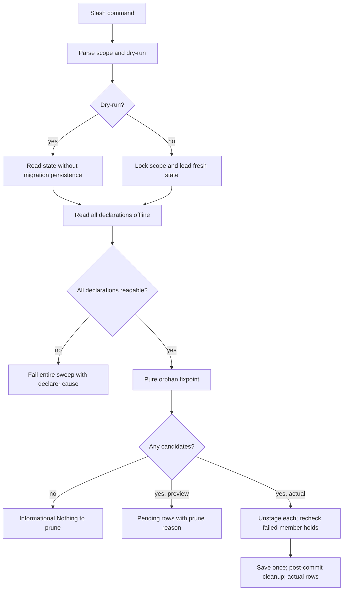

# Phase 12: Standalone prune with dry-run - Research

**Researched:** 2026-09-23
**Domain:** Offline plugin dependency cleanup, command routing, and notification contracts
**Confidence:** HIGH for the repository; MEDIUM for current upstream documentation

<user_constraints>
## User Constraints (from CONTEXT.md)

### Locked Decisions

#### Preview and empty result

- **D-12-01:** Each dry-run candidate uses Pi's pending removal status and
  carries the existing prune reason: `(will uninstall) {dependency pruned}`.
  The actual command uses `(uninstalled) {dependency pruned}`. The preview
  must identify the same members in the same removal order and never imply a
  removal has happened. This is a user-visible row contract.
- **D-12-02:** Both `prune` and `prune --dry-run` emit a normal, informational
  `Nothing to prune` message when no record qualifies. Include the selected
  scope and a short reason that no orphaned dependency installs were found.
  Do not use a failed row or a warning for this outcome.

#### Backlog disposition

- **D-12-03:** Close `PRUNE-CMD-01` when the standalone command and dry-run
  ship. Drop its proposed `{orphaned}` marker for `list` and `info`; the
  preview command supplies the orphan inventory and Claude Code shows no
  marker on those surfaces. Do not re-file the marker as a separate backlog
  item.

#### Carried decisions and fixed requirements

- **D-05-01/02/04/05/06/07:** Reuse the whole-scope, same-scope, offline,
  fail-closed fixpoint over dependency provenance. Disabled declarers still
  hold their dependencies. An unreadable declarer stops the entire sweep.
- **D-05-11/13:** Actual removals retain the ordinary uninstall rows and
  per-member failure reporting. A failed member still holds its dependencies.
- **FLAG-02 / D-02-05:** The standalone verb accepts only `--dry-run` beyond
  shared scope selection. Pi's slash command has no confirmation prompt or
  `-y`; the dry-run is the explicit preview path.

### the agent's Discretion

- Choose the exact no-orphans sentence after `Nothing to prune`, while naming
  the selected scope and reason.
- Reuse existing row and message types where practical. Keep the preview
  status and reason locked as stated above.

### Deferred Ideas (OUT OF SCOPE)

None. The old `{orphaned}` inventory marker was dropped, not deferred.
</user_constraints>

<phase_requirements>
## Phase Requirements

| ID | Description | Research Support |
|---|---|---|
| PRUNE-06 | "A standalone `prune` removes the dependency-installed plugins that no installed plugin in the scope declares, without uninstalling anything else, and says which ones it removed." [VERIFIED: .planning/REQUIREMENTS.md:94-96] | Reuse the declaration index, pure fixpoint, guarded removal body, and existing actual row. |
| PRUNE-07 | "`prune --dry-run` lists what `prune` would remove and removes nothing." [VERIFIED: .planning/REQUIREMENTS.md:97-98] | Use a read-only state load, the same index and selector, and pending removal rows. |
| FLAG-02 | "`prune` accepts exactly `--dry-run` as its extra flag, and the flag-catalog drift guard pins that set. No `-y`: there is no prompt to skip" [VERIFIED: .planning/REQUIREMENTS.md:117-119] | Add one catalog entry, consuming parser, completion and independent drift pin. |
</phase_requirements>

## Summary

Claude Code documents standalone `prune`, a dry-run listing, and an informational `Nothing to prune` result. Its default scope is user; its project and local scopes, prompt, and `-y` behavior must be narrowed by the recorded Pi decisions. [CITED: https://code.claude.com/docs/en/plugin-dependencies] The project's phase context expressly selects no prompt, no `-y`, and only user/project scope. [VERIFIED: .planning/phases/12-standalone-prune-with-dry-run/12-CONTEXT.md:6-13] The upstream guide does not define Pi's exact row bytes; D-12-01 does. [CITED: https://code.claude.com/docs/en/plugin-dependencies] [VERIFIED: .planning/phases/12-standalone-prune-with-dry-run/12-CONTEXT.md:20-30]

The current selector already computes the whole-scope fixpoint. Its API takes a set of previously removed keys, which standalone prune can supply empty; its inputs remain untouched. [VERIFIED: extensions/pi-claude-marketplace/domain/dependency-orphans.ts:84-132] The current scope index *requires* `exclude: string` and skips that key, so it needs a no-exclusion path before standalone prune can see every installed declarer and candidate. Verbatim definition: `readonly exclude: string;` and `if (key === options.exclude) { continue; }`. [VERIFIED: extensions/pi-claude-marketplace/orchestrators/plugin/dependency-index.ts:112-116,231-254]

**Primary recommendation:** Build one shared snapshot/selection seam, feed it from a guarded mutating path for `prune` and a migration-safe read-only path for `prune --dry-run`, then extend the notification model and catalog deliberately.

## Architectural Responsibility Map

| Capability | Primary Tier | Secondary Tier | Rationale |
|---|---|---|---|
| Command and flags | Edge / CLI | Orchestrator | Router, handler, and catalog own accepted syntax. [VERIFIED: extensions/pi-claude-marketplace/edge/router.ts:26-79,159-194; extensions/pi-claude-marketplace/edge/flag-catalog.ts:127-212] |
| Orphan selection | Domain | Orchestrator | Pure fixpoint consumes an offline declaration index. [VERIFIED: extensions/pi-claude-marketplace/domain/dependency-orphans.ts:84-132] |
| Actual removal | Orchestrator | Transaction / persistence | Existing sweep unstages each member, saves once, then cleans up. [VERIFIED: extensions/pi-claude-marketplace/orchestrators/plugin/uninstall.ts:622-653,683-708,1105-1138] |
| Dry-run | Orchestrator | Persistence | Selection needs state and declarations without the lock or any write. [VERIFIED: extensions/pi-claude-marketplace/transaction/with-state-guard.ts:83-104,111-165] |
| User output | Shared notification | Edge / orchestrator | Closed row types, renderer, dispatcher, and catalog bind bytes. [VERIFIED: extensions/pi-claude-marketplace/shared/notification-types.ts:507-520,836-845; extensions/pi-claude-marketplace/shared/notification-grammar.ts:830-852] |

## Project Constraints (from AGENTS.md)

- Read each file before editing and trace callers before changing a function. Use CodeGraph first when `.codegraph/` exists. [VERIFIED: AGENTS.md:7-8,130-139]
- Keep upstream parity unless a recorded decision or Pi capability gap licenses divergence; the compatibility research skill governs upstream checks. [VERIFIED: AGENTS.md:39-49; skills/claude-code-compat-research/SKILL.md:8-19]
- Preserve atomic writes, retry safety, same-scope containment, offline uninstall/list behavior, and `/reload` recovery. [VERIFIED: AGENTS.md:44-54]
- Route user-visible command output through the shared notification boundary. [VERIFIED: AGENTS.md:51-53; extensions/pi-claude-marketplace/shared/notification-dispatch.ts:36-75]
- Use strict TypeScript and the local comment, style, and unit-test rules; changed source/test pairs need direct coverage. [VERIFIED: AGENTS.md:20-26; skills/typescript-unit-testing/SKILL.md:14-32]
- The full quality gate is `npm run check`. Verbatim script key/value: `"check": "npm run typecheck && npm run lint && npm run lint:workflows && npm run lint:workflows:negative && npm run fallow && npm run format:check && npm run test:corresponding && npm run test:corresponding:negative && npm run test:coverage:direct:negative && npm run test:coverage:unit && npm run test:integration && npm run lint:type-members && npm run lint:type-members:negative"`. [VERIFIED: package.json:78-85]
- Before a future commit, run pre-commit and fallow audit, follow Conventional Commits, and never commit on main; the parent explicitly forbade a research commit this turn. [VERIFIED: AGENTS.md:11-18,166-170]
- Use `features/*` for a new feature branch; never rebase, rewrite history, or bypass hooks; squash any PR merge. [VERIFIED: AGENTS.md:11-19]
- Before a PR, offer the package/Sonar version bump, update the lockfile when bumping, and record changes in the changelog. [VERIFIED: AGENTS.md:28-30]
- Do not add telemetry or localization in V1. Verbatim policy names: `No telemetry V1` and `English only V1`. [VERIFIED: AGENTS.md:51-54]
- Start file-changing work through a GSD workflow. This research task was dispatched by the phase planning workflow. [VERIFIED: AGENTS.md:92-101]

## Standard Stack

No new package is required: the source already contains the selector, index reader, transaction, row types, and Node test infrastructure. [VERIFIED: extensions/pi-claude-marketplace/domain/dependency-orphans.ts:110-132; extensions/pi-claude-marketplace/orchestrators/plugin/dependency-index.ts:231-254; extensions/pi-claude-marketplace/transaction/with-state-guard.ts:83-104; package.json:8-35]

| Existing component | Declared version / contract | Use |
|---|---|---|
| Node.js | `"node": ">=20.19.0"` [VERIFIED: package.json:34-36] | Runtime and `node:test`. |
| TypeScript | `"typescript": "^6.0.3"` [VERIFIED: package.json:29-32] | Strict command and message type changes. |
| `proper-lockfile` | `"proper-lockfile": "^4.1.2"` [VERIFIED: package.json:8-12] | Existing mutating transaction only; dry-run must never acquire it. |

**Installation:** None. Package legitimacy audit and registry checks are inapplicable because this phase adds no external package.

## Architecture Patterns

### System Architecture Diagram



### Recommended Project Structure and Owners

| Owner | Planned work |
|---|---|
| `orchestrators/plugin/dependency-index.ts` | Allow a full-scope index without a primary exclusion; keep the existing uninstall exclusion behavior. [VERIFIED: extensions/pi-claude-marketplace/orchestrators/plugin/dependency-index.ts:112-116,227-254] |
| `orchestrators/plugin/uninstall.ts` and `operations.ts` | Extract shared selection/removal without forcing a fake primary; expose a standalone operation through the composition owner. [VERIFIED: extensions/pi-claude-marketplace/orchestrators/plugin/uninstall.ts:622-653,1276-1302; extensions/pi-claude-marketplace/orchestrators/plugin/operations.ts:117-132] |
| `persistence/state-io.ts` | Offer a load mode that never calls migration persistence for preview. [VERIFIED: extensions/pi-claude-marketplace/persistence/state-io.ts:396-407,501-510] |
| `edge/handlers/plugin/prune.ts`, `edge/register.ts`, `edge/router.ts`, `edge/flag-catalog.ts` | Wire the verb, exact flag set, help, and completion. [VERIFIED: extensions/pi-claude-marketplace/edge/register.ts:92-127; extensions/pi-claude-marketplace/edge/router.ts:26-79; extensions/pi-claude-marketplace/edge/flag-catalog.ts:127-212] |
| Shared notification modules and docs | Add the pending reason and normal empty message; pin emitted bytes in catalog fixtures. [VERIFIED: extensions/pi-claude-marketplace/shared/notification-types.ts:515-520,815-845; extensions/pi-claude-marketplace/shared/notification-grammar.ts:830-852] |

### Pattern 1: One pure selection, two effect paths

The selector's inputs and return are already pure. Verbatim API values: `pruneOrphans(records, index, removed)`, `record.provenance === "dependency"`, and `sort((a, b) => a.localeCompare(b))`. [VERIFIED: extensions/pi-claude-marketplace/domain/dependency-orphans.ts:110-132] Plan a shared selection helper that maps ordered keys to indexed records. Dry-run only renders them. Actual prune runs the current `removeDependencyMember`/`isHeldBy` body under the lock and saves once when an effect occurred. [VERIFIED: extensions/pi-claude-marketplace/orchestrators/plugin/uninstall.ts:567-604,622-653]

Use user scope when `--scope` is omitted and exactly the named scope when it is present. The upstream prune command documents a user default, while the project scope type quotes exactly `"user" | "project"`; it has no local scope. [CITED: https://code.claude.com/docs/en/plugin-dependencies] [VERIFIED: extensions/pi-claude-marketplace/shared/types.ts:11-19] Do not use the two-scope fan-out pattern of read-only `pending` for this destructive command. [VERIFIED: extensions/pi-claude-marketplace/orchestrators/reconcile/pending.ts:65-72]

### Pattern 2: Read-only means no lock and no hidden migration write

`withLockedStateTransaction` calls `withScopeLock`, which creates the extension root and lock file. Verbatim path construction: `const stateLockFile = path.join(extensionRoot, ".state-lock");`. [VERIFIED: extensions/pi-claude-marketplace/transaction/with-state-guard.ts:83-104,111-165; extensions/pi-claude-marketplace/persistence/locations.ts:144-149] `loadState` can call `void persistMigratedState(stateJsonPath, state);` when `mutated`, so merely avoiding `tx.save()` does not satisfy PRUNE-07. [VERIFIED: extensions/pi-claude-marketplace/persistence/state-io.ts:403-407,501-510] Add a read-only load entry or explicit `persistMigration: false` option while keeping the present default for existing callers; test a legacy state that would migrate. Recommendation, not an observed existing API. [ASSUMED]

### Pattern 3: Preserve visible removal order

`pruneOrphans` returns fixpoint batches in sorted order, but `composeRemovalBlocks` groups rows by marketplace in a `Map`; an alternating marketplace sequence can therefore be displayed out of global removal order. [VERIFIED: extensions/pi-claude-marketplace/domain/dependency-orphans.ts:117-132; extensions/pi-claude-marketplace/orchestrators/plugin/uninstall.messaging.ts:198-225] For standalone prune, use one shared projection for preview and actual that emits contiguous marketplace blocks (allowing a marketplace header to recur) or an equivalent order-preserving shape. This meets D-12-01 even for alternating marketplaces. [ASSUMED]

### Pattern 4: Closed notification amendment

The existing `PluginWillUninstallMessage` has verbatim `readonly status: "will uninstall";` and no `reasons` property. Its renderer returns `(will uninstall)` without a brace. [VERIFIED: extensions/pi-claude-marketplace/shared/notification-types.ts:515-520; extensions/pi-claude-marketplace/shared/notification-grammar.ts:830-852] Add optional `reasons` to that variant and render through the existing `pluginRow` helper, which already formats a reason brace and omits it when absent. Keep pending rows versionless, `needsReload: false`, and information severity; actual rows use `composePrunedRow` with `needsReload: true`. Verbatim current actual values: `status: "uninstalled"`, `reasons: ["dependency pruned"]`, `severity: "info"`, `needsReload: true`. [VERIFIED: extensions/pi-claude-marketplace/shared/notification-grammar.ts:515-552; extensions/pi-claude-marketplace/orchestrators/plugin/uninstall.messaging.ts:67-100]

The normal no-orphans result needs a dedicated structured informational kind with scope and fixed reason. The existing free-form empty kind is specific to reconcile pending and says `Pending: next reload will apply 0 actions.`; using it would misreport this operation. Verbatim kind: `"reconcile-pending-empty"`. [VERIFIED: extensions/pi-claude-marketplace/shared/notification-types.ts:815-818; extensions/pi-claude-marketplace/shared/notification-dispatch.ts:238-243] Proposed exact message: `Nothing to prune in user scope: no orphaned dependency installs were found.` (substitute selected scope). This is agent discretion, pending catalog lock. [ASSUMED]

## Don't Hand-Roll

| Problem | Use instead | Why |
|---|---|---|
| Orphan reachability | Existing `pruneOrphans` and `isHeldBy` | They encode provenance, disabled declarers, fixpoint order, and failed-member holds. [VERIFIED: extensions/pi-claude-marketplace/domain/dependency-orphans.ts:53-81,84-132] |
| Declaration parsing | Existing `buildScopeDeclarationIndex`/`readRecordDeclarations` | It uses the offline own-manifest/marketplace fallback and fails closed. [VERIFIED: extensions/pi-claude-marketplace/orchestrators/plugin/dependency-index.ts:173-220,227-254] |
| Removal of one plugin | Existing `removeDependencyMember` and post-commit cleanup | They preserve per-member failure and resource cleanup semantics. [VERIFIED: extensions/pi-claude-marketplace/orchestrators/plugin/uninstall.ts:567-604,683-708] |
| CLI completion list | Flag catalog and router subcommand tuple | Provider reads both rather than maintaining a second list. [VERIFIED: extensions/pi-claude-marketplace/edge/completions/provider.ts:37-49,72-76,115-141] |
| Rendering bytes | Shared notification grammar and catalog fixtures | Pending and actual rows must stay inside the closed model. [VERIFIED: extensions/pi-claude-marketplace/shared/notification-grammar.ts:830-852,897-1005; tests/architecture/catalog-uat/catalog-contract.test.ts:145-189] |

## Runtime State Inventory

This phase extracts a code path but renames no persisted key or external identifier. [VERIFIED: .planning/phases/12-standalone-prune-with-dry-run/12-CONTEXT.md:6-13,93-112]

| Category | Items Found | Action Required |
|---|---|---|
| Stored data | Existing state records retain verbatim `provenance: Type.Union([Type.Literal("explicit"), Type.Literal("dependency")])`; no schema migration is specified. [VERIFIED: extensions/pi-claude-marketplace/persistence/state-io.ts:143-149] | No data migration. Add read-only legacy-load test. |
| Live service config | No changed service-side identifier in phase scope. [VERIFIED: .planning/phases/12-standalone-prune-with-dry-run/12-CONTEXT.md:6-13] | None; external UI state was not inspected. [ASSUMED] |
| OS-registered state | No changed OS registration in phase scope. [VERIFIED: .planning/phases/12-standalone-prune-with-dry-run/12-CONTEXT.md:6-13] | None; OS registrations were not inspected. [ASSUMED] |
| Secrets/env vars | No changed secret or env-var name in phase scope. [VERIFIED: .planning/phases/12-standalone-prune-with-dry-run/12-CONTEXT.md:6-13] | None; external secret stores were not inspected. [ASSUMED] |
| Build artifacts | Source is run as TypeScript and no package rename is specified. [VERIFIED: package.json:67-70; .planning/phases/12-standalone-prune-with-dry-run/12-CONTEXT.md:6-13] | No artifact migration; run the normal check. |

## Common Pitfalls

1. **Hidden writes in preview.** `loadState` may persist migration in the background; the lock wrapper creates a directory and lock file. Verify bytes, mtime, and tree listing, including legacy state and absent state. [VERIFIED: extensions/pi-claude-marketplace/persistence/state-io.ts:403-407,504-510; extensions/pi-claude-marketplace/transaction/with-state-guard.ts:111-165]
2. **Incomplete declarer set.** The present index excludes the named uninstall target. Standalone prune has no primary and must index every record, including disabled records, before selection. [VERIFIED: extensions/pi-claude-marketplace/orchestrators/plugin/dependency-index.ts:10-12,112-116,231-254]
3. **Failed member unlocks a dependent incorrectly.** The precomputed order assumes success. The mutating sweep rechecks `isHeldBy` after each result and adds only removed keys to `gone`; retain that guard. [VERIFIED: extensions/pi-claude-marketplace/orchestrators/plugin/uninstall.ts:630-652]
4. **Preview claims a realized transition.** `will uninstall` must carry the prune reason but no version or reload trailer. Test byte-exact output and severity. [VERIFIED: extensions/pi-claude-marketplace/shared/notification-types.ts:515-520; extensions/pi-claude-marketplace/shared/notification-summary.ts:560-585]
5. **Grouping scrambles rows.** A marketplace map groups non-adjacent candidates and can invert the selector's display order. Pin an alternating-marketplace case. [VERIFIED: extensions/pi-claude-marketplace/orchestrators/plugin/uninstall.messaging.ts:213-225]
6. **Dry-run can become stale.** It deliberately holds no write lock; another process can change scope state after preview. Describe it as the current snapshot's plan, and have actual prune recompute inside its own lock. [VERIFIED: extensions/pi-claude-marketplace/transaction/with-state-guard.ts:83-104; .planning/phases/12-standalone-prune-with-dry-run/12-CONTEXT.md:9-12]
7. **No-op output differs from uninstall `--prune`.** Existing `uninstall --prune` emits only its primary row when no dependency qualifies; standalone `prune` must emit `Nothing to prune` at info severity. [VERIFIED: extensions/pi-claude-marketplace/orchestrators/plugin/uninstall.ts:1252-1272; .planning/phases/12-standalone-prune-with-dry-run/12-CONTEXT.md:27-30]

## Code Examples

These are planning sketches, not an existing API. All existing literal values used here are quoted below from source: `"dependency"`, `"will uninstall"`, `"dependency pruned"`, `"info"`, `"uninstalled"`. [VERIFIED: extensions/pi-claude-marketplace/domain/dependency-orphans.ts:58-61,117-122; extensions/pi-claude-marketplace/shared/notification-types.ts:515-520; extensions/pi-claude-marketplace/orchestrators/plugin/uninstall.messaging.ts:67-99]

```typescript
// Proposed shared selection; actual and preview call this with the same snapshot.
const order = pruneOrphans(snapshot.candidates, snapshot.index, new Set());
const orderedMembers = order.map((key) => byKey.get(key));

// Proposed preview projection; use the existing renderer after extending its type.
const row = {
  status: "will uninstall",
  name: member.plugin,
  reasons: ["dependency pruned"],
  severity: "info",
  needsReload: false,
};
```

The empty set, `byKey` map, and read-only state-load option are design recommendations; the planner should choose exact signatures and keep direct source/test pairing. [ASSUMED]

## Likely Plan Slices

1. **Read-only state and full-scope selection:** add a migration-safe read option; adjust the index exclusion; factor ordered candidate mapping; prove no lock, writes, or network. [VERIFIED: extensions/pi-claude-marketplace/persistence/state-io.ts:403-510; extensions/pi-claude-marketplace/orchestrators/plugin/dependency-index.ts:227-254]
2. **Standalone mutating operation:** reuse the sweep body under one lock and one save, with post-commit cleanup and failed-member recheck. [VERIFIED: extensions/pi-claude-marketplace/orchestrators/plugin/uninstall.ts:567-653,683-708]
3. **Rows and closed catalog:** pending reason, empty info kind, order-preserving blocks, actual/error rows, catalog fixtures and pins. [VERIFIED: extensions/pi-claude-marketplace/shared/notification-types.ts:515-520,815-845; tests/architecture/catalog-uat/catalog-contract.test.ts:34-38,142-189]
4. **Edge and docs:** handler, register/router/catalog/completions/help, README and dependency guide, close `PRUNE-CMD-01` without a new marker backlog item, then run full quality gate. [VERIFIED: extensions/pi-claude-marketplace/edge/register.ts:92-127; extensions/pi-claude-marketplace/edge/router.ts:62-114; .planning/BACKLOG.md:3153-3163]

## Assumptions Log

| # | Claim | Section | Risk if Wrong |
|---|---|---|---|
| A1 | A separate read-only load option is the cleanest way to suppress legacy migration persistence. | Architecture Pattern 2 | Planner may find a better existing seam; test must still prove zero writes. |
| A2 | Repeated contiguous marketplace headers are acceptable to preserve global row order. | Architecture Pattern 3 | The output catalog may prefer a different order-preserving envelope. |
| A3 | Proposed no-orphans sentence is suitable. | Architecture Pattern 4 | Wording changes require a catalog fixture update. |
| A4 | External service, OS, and secret state need no migration because the phase renames none. | Runtime State Inventory | External deployment could embed undocumented command behavior. |
| A5 | Security enforcement should be treated as enabled where no explicit override was established. | Security Domain | The planner might otherwise omit security tests. |
| A6 | Preview and actual can promise identical order only for the same state snapshot and successful member removals. | Open Questions | A concurrent change or failed unstage can change the actual member set. |

## Open Questions

1. **Concurrent change between preview and execution:** no locked preview can promise later execution against identical state. The accepted contract should be same algorithm/order on the same snapshot, with actual execution recomputing under its lock. This is an inference from the mandated read-only preview and locked actual path. [ASSUMED]
2. **Actual failure versus preview:** a failed member remains installed and may hold later candidates, so actual rows can be fewer than the preview's success-case plan. Retain failed-member protection and document preview as intended removals. [VERIFIED: extensions/pi-claude-marketplace/orchestrators/plugin/uninstall.ts:630-652]

## Environment Availability

| Dependency | Required By | Available | Version / source | Fallback |
|---|---|---|---|---|
| Node.js | TypeScript runtime and tests | Yes | `v26.9.0` from local `node --version` [VERIFIED: local CLI 2026-09-23] | None needed |
| npm | Quality gate | Yes | `11.19.1` from local `npm --version` [VERIFIED: local CLI 2026-09-23] | None needed |
| `fallow` CLI | Commit gate | Not on PATH in this shell [VERIFIED: local `command -v` 2026-09-23] | Package declared as `"fallow": "^3.27.0"`. [VERIFIED: package.json:25-27] | Use project `npm run fallow` / local binary during implementation. |
| `pre-commit` CLI | Commit gate | Available in the orchestration shell at `/home/acolomba/.local/bin/pre-commit` [VERIFIED: local `command -v` 2026-09-23] | — | Run with `SKIP=trufflehog` for this linked worktree before each commit. |

## Validation Architecture

Nyquist validation is enabled: verbatim config `"nyquist_validation": true`. [VERIFIED: .planning/config.json:35-45] The project uses `node:test` and 100% direct source/test-pair coverage for changed TypeScript. [VERIFIED: skills/typescript-unit-testing/SKILL.md:14-32; package.json:80-99]

| Property | Value |
|---|---|
| Framework | `node:test`, TypeScript source execution [VERIFIED: package.json:80-99] |
| Quick command | `node --test tests/orchestrators/plugin/prune.test.ts` once Wave 0 creates it [ASSUMED] |
| Full gate | `npm run check` [VERIFIED: package.json:78-99] |

| Req ID | Behavior to prove | Test type and exact target | Wave 0? |
|---|---|---|---|
| PRUNE-06 | Whole-scope fixpoint, explicit and held records survive, same-scope, offline, one save, member failure holds descendants, cleanup and rows | `tests/orchestrators/plugin/prune.test.ts`; `tests/integration/standalone-prune.test.ts`; existing `tests/domain/dependency-orphans.test.ts`, `tests/orchestrators/plugin/uninstall.test.ts`, `tests/orchestrators/plugin/dependency-index.test.ts` | New prune pair and integration test required |
| PRUNE-07 | Preview candidates/order; no state/disk/lock writes, including missing and legacy state; no reload hint | `tests/orchestrators/plugin/prune.test.ts`; `tests/integration/standalone-prune.test.ts`; `tests/persistence/state-io.test.ts`; `tests/architecture/catalog-uat/catalog-contract.test.ts` | New prune pair and catalog fixture |
| FLAG-02 | Only scope and dry-run; reject `-y`, `--keep-data`, `--prune`, extra positionals; completion exact set | `tests/edge/handlers/plugin/prune.test.ts`; `tests/edge/router.test.ts`; `tests/edge/completions/provider.test.ts`; `tests/architecture/flag-catalog-drift.test.ts` | New handler pair |
| Cross-cutting | Pending reason, empty info message, no output drift | `tests/shared/notification-grammar.test.ts` if that is the corresponding pair, `tests/architecture/catalog-uat/catalog-parser.test.ts`, `tests/architecture/catalog-uat/catalog-contract.test.ts`, `tests/architecture/notify-closed-set-locks.test.ts` | New fixture and catalog states |

**Per task:** focused `node --test` for changed source/test pairs, then `npm run test:coverage:direct -- <source>` for each changed production module. [VERIFIED: skills/typescript-unit-testing/SKILL.md:24-32] **Per wave:** the applicable architecture/catalog tests and `npm run test:integration`. **Phase gate:** `npm run check`; run `tests/architecture/no-orchestrator-network.test.ts` to catch an accidental network import. [VERIFIED: package.json:78-99; extensions/pi-claude-marketplace/orchestrators/plugin/uninstall.ts:44-48]

**Wave 0 gaps:** new `tests/orchestrators/plugin/prune.test.ts`, `tests/edge/handlers/plugin/prune.test.ts`, `tests/integration/standalone-prune.test.ts`, and a `plugin-prune` catalog fixture. The catalog independently pins section order, module count, state count, and UTF-8 bytes; update all on a new section rather than only adding prose. [VERIFIED: tests/architecture/catalog-uat/catalog-contract.test.ts:34-38,142-189; tests/architecture/catalog-uat/catalog-parser.test.ts:69-85]

## Security Domain

Treat security enforcement as enabled for planning; no explicit disabling setting was established. Absence alone does not prove the workflow's default. [ASSUMED] ASVS 5.0 categories relevant to this local filesystem command are V2.2 input validation, V5.3 file storage/path construction, and V8 authorization/scope boundary. [CITED: https://cornucopia.owasp.org/taxonomy/asvs-5.0/02-validation-and-business-logic/02-input-validation] [CITED: https://cornucopia.owasp.org/taxonomy/asvs-5.0/05-file-handling/03-file-storage] [CITED: https://cornucopia.owasp.org/taxonomy/asvs-5.0]

| ASVS 5.0 category | Applies | Planning control |
|---|---|---|
| V2.2 Input Validation | Yes | Exact flag allowlist, validated scope, and fail-closed declaration parse. [VERIFIED: extensions/pi-claude-marketplace/edge/args.ts:27-65; extensions/pi-claude-marketplace/orchestrators/plugin/dependency-index.ts:23-28] |
| V5.3 File Storage | Yes | Keep every removal through the existing contained path and cascade cleanup. [VERIFIED: extensions/pi-claude-marketplace/persistence/locations.ts:132-185; extensions/pi-claude-marketplace/orchestrators/plugin/uninstall.ts:810-859] |
| V8 Authorization | Applicable as local scope separation | Select exactly one target scope and never sweep the other scope's state. [VERIFIED: extensions/pi-claude-marketplace/shared/types.ts:11-19; extensions/pi-claude-marketplace/orchestrators/plugin/dependency-index.ts:3-12] |
| V6 Authentication, V7 Session, V11 Cryptography | No new surface | This command has no auth, session, or cryptography change in its phase boundary. [VERIFIED: .planning/phases/12-standalone-prune-with-dry-run/12-CONTEXT.md:6-13] |

| Threat | STRIDE | Mitigation / test |
|---|---|---|
| Scope escape or wrong-scope deletion | Tampering | Use `locationsFor` scope roots and the existing cascade's safe paths; assert other scope untouched. [VERIFIED: extensions/pi-claude-marketplace/persistence/locations.ts:132-185] |
| Damaged declarer interpreted as no dependencies | Tampering | Abort the whole sweep before removal, even in preview. [VERIFIED: extensions/pi-claude-marketplace/orchestrators/plugin/dependency-index.ts:23-28,231-254] |
| Absolute filesystem path in a failure message | Information disclosure | Reuse redacted declaration cause; catalog-test error output. [VERIFIED: extensions/pi-claude-marketplace/orchestrators/plugin/dependency-index.ts:38-42,165-170,191-210] |

## Sources

### Primary repository evidence (HIGH)

- `domain/dependency-orphans.ts`, `orchestrators/plugin/dependency-index.ts`, `orchestrators/plugin/uninstall.ts`, `persistence/state-io.ts`, transaction and notification modules; all opened on 2026-09-23. [VERIFIED: extensions/pi-claude-marketplace/domain/dependency-orphans.ts:110-132; extensions/pi-claude-marketplace/orchestrators/plugin/dependency-index.ts:231-254; extensions/pi-claude-marketplace/orchestrators/plugin/uninstall.ts:622-653; extensions/pi-claude-marketplace/persistence/state-io.ts:403-510]
- Phase 12 context, requirements, roadmap, backlog, output catalog, and AGENTS.md; all opened on 2026-09-23. [VERIFIED: .planning/phases/12-standalone-prune-with-dry-run/12-CONTEXT.md:1-112; .planning/REQUIREMENTS.md:94-132; .planning/BACKLOG.md:3153-3163]

### Official external documentation (MEDIUM from `classify-confidence --provider websearch --verified`)

- [Claude Code plugin dependency guide](https://code.claude.com/docs/en/plugin-dependencies), removal section, retrieved 2026-09-23. [CITED: https://code.claude.com/docs/en/plugin-dependencies]
- [Claude Code plugins reference](https://code.claude.com/docs/en/plugins-reference), CLI command index, retrieved 2026-09-23. [CITED: https://code.claude.com/docs/en/plugins-reference]
- [OWASP ASVS 5.0 taxonomy](https://cornucopia.owasp.org/taxonomy/asvs-5.0), input validation and file handling pages, retrieved 2026-09-23. [CITED: https://cornucopia.owasp.org/taxonomy/asvs-5.0]

**Research cache note:** `research-store put` failed with `EROFS` at the user-level cache path. The official pages were read directly; this does not block planning. [VERIFIED: local CLI output 2026-09-23]

## Metadata

**Confidence breakdown:** Stack HIGH (existing repo only); architecture HIGH (source traced); upstream MEDIUM (official current docs via websearch seam); risks HIGH except the explicitly assumed output wording and order-preserving envelope.
**Valid until:** 2026-10-23 for repository findings; recheck upstream docs if planning occurs after 2026-09-30. [ASSUMED]
